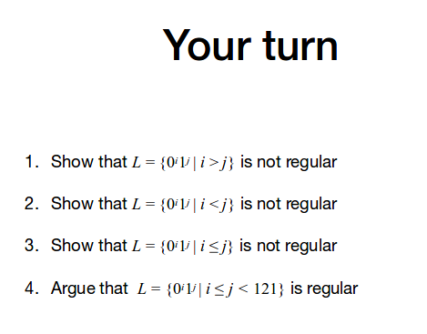

# Pumping Lemma
If _L_ is a *regular* language, then there is a natural number _p_ (the pumping length) for which the following holds:
 
 
If _s_ is any string in _L_ of length at least _p_, then _s_ can be divided into _s_ = _xyz_ satisfying
  1. for each _i_>=0, _xy^iz_ is in _L_
  2. the length of _y_ must be greater than 0 (ie. _y_ cannot be the empty string
  3. the length of _xy_ must be less than or equal to _p_

# Proving the Pumping Lemma
  - uses the Pigeon hole principle
  - let _p_ be the number of states in a DFA _M_
  - given a string _s_ which is at least length _p_, let's say has length _n_, then we know the sequence of states required to compute _n_ has length _n+1_.
  - this means that we must repeat at least one state in the sequence
  - let's call the repeated state _q*_.
  - then _x_ is the substring of _s_ appearing before reaching _q*_, _y_ is the substring between the first two appearances of _q*_ and _z_ is the suffix
  - we can prove:
    1. _xy^iz_ is in _L_ for all _i_>=0 
    2. _y_ cannot be empty string since no state in the DFA can be repeated wihout processing at least one symbol
    3. the length of _xy_ <= _p_. if the lengh was greater than _p_ then computing the first _p+1_ symbols results in state repetition of _q*_. The whole string is length _p_, so if _xy_ length was greater than _p_, it makes no sense.

