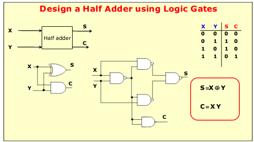
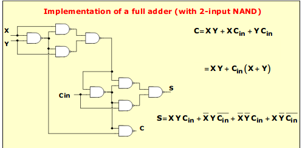

# Combinational Circuits and 6 Variable KMaps

## Adders
adder | description
--- | ---
half adders | do not consider carry input
full adders | include a possible carry input
both | sum and carry output

You can also implement a full adder using XOR, AND and OR gates.

### Example from an old midterm
Design the circuit for a half subtractor, that is, a circuit which performs the subtraction of 2 bits, X - Y, without any incoming borrow.

a) draw the truth table
b) show the expressions for D and B in SOP
c) draw the circuit

