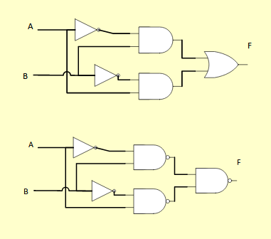
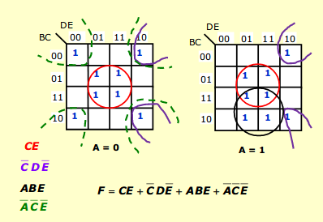
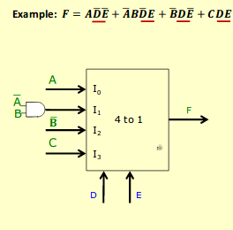

# Consensus, XOR, 5 variable k=map, multiplexer

## Consensus
AB + !AC + BC = AB + !AC

## XOR

## 5-variable k-maps

## Multiplexers
- selects information from one of many input lines and directs it to an output line
- n control inputs (selection inputs)
- 2^n information inputs (I0, I1, ...)
- and 1 output (Z)

