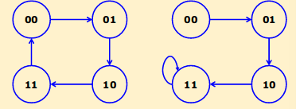
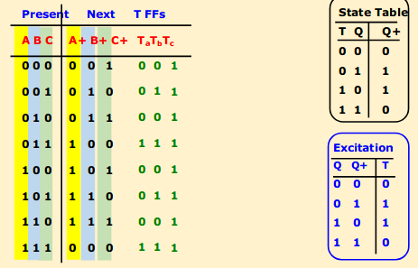
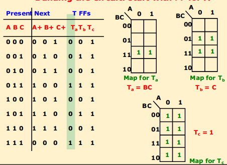

# Finite State Machines: Counters

What is a counter?
- sequential machine that counts up or down
- state changes occur simultaneously
- states of counter are the states of the flip flop
- may go up and then count back down, or might just stay at largest value until reset
  - also could stay at 00 until reset

Examples:

## Design a synchronous counter
- first, design the FSM
- next, draw the state table with Current State and Next state (and any inputs / outputs)
- you will likely be asked to implement with a specific flip flop
  - draw out the state table for the flip flop
- now use the excitation table and kmaps to get the input equations for the flip flop**

** this is the harder part

### How to construct an excitation table
- grab yo' state table
- look at the present and next state
- determine what the inputs are for these combinations

Example:

State Table for T
T | Q | Q+
--- | --- | ---
0 | 0 | 0
0 | 1 | 1
1 | 0 | 1
1 | 1 | 0

Exitation table for T (constructed from state table)
- when Q = 0 and Q+ = 0, T is 0
- when Q = 0 and Q+ = 1, T is 1
- etc.

Q | Q+ | T
--- | --- | ---
0 | 0 | 0 
0 | 1 | 1
1 | 0 | 1
1 | 1 | 0

### How to use the excitation table
- now you have your excitation table -- great!
- go back to your finite state table
  - for each state, separate digits into columns
  - ie. state 00 becomes A=0, B=0
  - eg. state 110 becomes A=1, B=1, C=0
  - next states are denoted with + signs
    - eg. A+, B+
- now, IF THERE ARE NO INPUTS, we can simply read the excitation table and translate the present and next states into input states.

### Put translated states onto a kmap
I really don't know how to explain this
- take your present state names and construct a kmap with them as the axis
- take your translated states and put them on the maps
- solve for translated states (inputs to flip flop)

