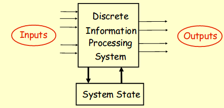
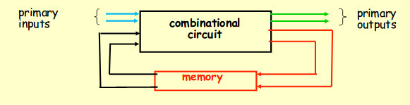

# A digital system
- converts a set of inputs into a set of outputs

## A switching network
- switching: once based on switches, open and closed
- combinational: current output of the network depends entirely on current input => no memory
- sequential: network with memory of any type => output depends on current inputs plus previous state of inputs

For this course, we'll focus on Combinational Logic (no memory)

### Signal
A signal is a variable that represents a physical quantity.
- two discrete levels, or binary values, are the usual in digital systems
  - binary digits: 0 or 1
  - labels: false or true
  - heights: low or high
  - switch values: off or on

### Boolean Algebra Logical Operators
Boolean Algebra: the branch of algebra in which the values of the variables are the truth values true and false.

## Digital vs Analog Systems
- digital: only assumes discrete values
- analog: values vary over a broad range continuously
