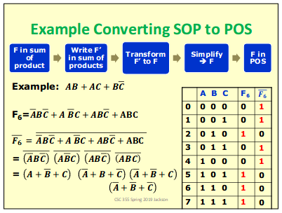
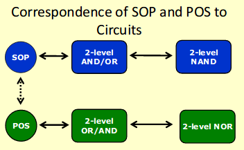

# Minterm

- Minterm: a term using the AND operator where every variable is present in either its true or complemented form
- since every variable may appear in one of two forms, there are 2^n minterms for n variables
- ex: AB

## Canonical forms: Sum of Minterms + Sum of Products
- sum of products is more generic
  - any form of WX + YZ or some addition of products
- sum of minterms is more specific
  - need only minterms!
- to convert from SOP to SOM, apply boolean logic rules like (B+!B) = 1 to get everything into minterms

# Maxterm
- Maxterm: a term using the OR operator, where every variable is present in either its true or complemented form
- there are also 2^n maxterms
- ex: A + B

## Canonical forms: Product of Sums + Product of Maxterms
- product of sums is more generic
- product of maxterms is more specific
- to convert from sum of products to product of sums, chart the minterms and take the maxterms that are true (these are the same as the minterms that are false)
  - then apply de morgan's law to get product of sums

