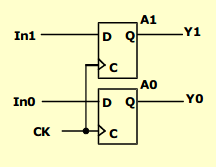

# Registers

What is a register?
- a collection of binary
- technically could be a FSM
  - each state is a possible value the register could hold

What do we want to do with registers?
- load
- store
- clear
- add / substract
- and / or / invert
- compare
- shift / rotate

## Methodology
- there is a large number of possible states / input combinations
  - for this reason, a FSM is not feasible or practical
- instead, we can add predefined combinational circuits to registers
  - eg. to count up, connect register flip-flops to an incrementer
- output is the state variable

### Load and Store
Expectations:
- a register can store information for multiple clock cycles
- lock and store commands controlled by a signal

Reality:
- a D flip-flop register loads information on every clock cycle

Realizing expectations:
- use a signal to control feedback of the output of the register back to its inputs
- additionally, have a load signal to control loading
  - load = 1: load values into data inputs
  - load = 0: keep current values in register (hold)

