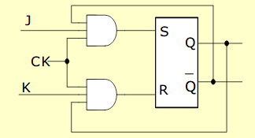
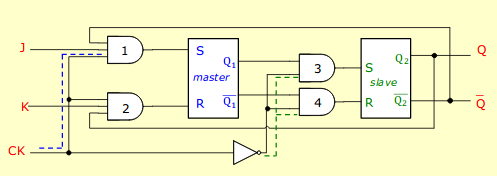
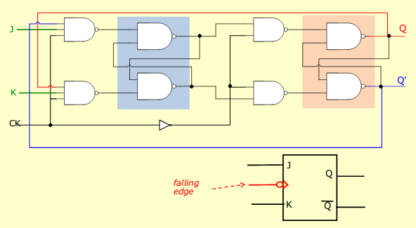
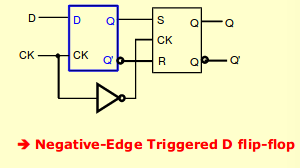

# SEQUENTIAL CIRCUITS

## Synchronous and Asynchronous
There are two types of sequential circuits
- synchronous:
  - changes in output at discrete instants of time
  - a clock synchronizes all circuit elements
- asynchronous
  - behaviour directly controlled by input changes
  - no clock
    - no wait for clock pulses (potentially faster)

## S-R Latch
- single bit storage device
- S = set
- R = reset
- undefined when both S and R are 1

State Table

S(t) | R(t) | Q(t) | Q+
---|---|---|---
0 | 0 | 0 | 0
0 | 0 | 1 | 1
0 | 1 | 0 | 0
0 | 1 | 1 | 0
1 | 0 | 0 | 1
1 | 0 | 1 | 1
1 | 1 | 0 | X
1 | 1 | 1 | X

### Developing a characteristic equation
Put the state table on a K-Map to determine the Q+ (characteristic) equation. Here, Q+ = S + !RQ, SR=0

### Clocked S-R Latch (S-R Flip Flop)

Inputs must wait until clock is 1 before they can be passed onto the rest of the circuit. When clock is 0, S and R are both 0 (state of the circuit is held)

If you make the SR latch with NAND gates instead of NOR gates, it changes it to an active low (low control) circuit. Thus, S and R are active when they are 0 instead of 1. Undefined behaviour when S and R are both 0.

## Toggle T Latch
- T = 0 , no change
- T = 1 , flip state

State Table

T | Q | Q+
--- | --- | ---
0 | 0 | 0
0 | 1 | 1
1 | 0 | 1
1 | 1 | 0

Characteristic Equation: 
Q+ = !TQ + T!Q = T XOR Q

## D Latch
- Transfers data into a latch after clock pulse
- characteristic equation:
  - Q+ = D

You can also build the D Latch from an SR flip flop.

## JK Latch
- combination of SR and T latches so that it eliminates any invalid inputs.
- when J and K = 0, stable (no change)
- when JK=1, toggle
- when J xor K, it acts like the SR

Characteristic Equation: 
Q+ = !KQ + J!Q

To find the characteristic equation, simply may out JK and Q on a Kmap and circle to minimize the expression for Q+.

To build the JK Latch from the SR Latch
- add 2 3-input AND gates connected to J, K, Q+ and the clock

## Characteristic Equations

S-R: Q+ = !RQ + S  (SR=0)

T: Q+ = !TQ + T!Q

J-K: Q+ = !KQ + J!Q

D: Q+ = D

## Master Slave JK Flip Flop

- before there were edge-triggered flip flops, people used master-slave flip flops
  - this protected against sudden changes in the input while the clock was still high
- when CLK = 1, only the master can operate
- when CLK = 0, only the slave can operate
- one is always isolated (in hold state)
- not that Q1 changes at the clock's raising edge while Q2 changes at the clock's falling edge
  - that is, master operates at raising edge
  - slave operates at falling edge
- output (Q) is read at falling edge

The synchronous JK Flip flop

## Synchronous FF with Direct (Asynchonous Inputs: Preset and Clear)
- at power up, reset all or part of circuit
  - this initialization usually happens outside of clocked behaviour (aka asynchronous)

## Edge-triggered D flip-flop
- formed by either
  - replacing the first clocked S-R latch with a clocked D latch
  - adding a D input and inverter to a master-slave S-R flip flop
- the change of the D flip-flop output is controlled by the negative (falling) edge of the clock

You can make a positive-edge triggered D flip-flop by inverting the clock for the D latch.

## Latches vs Flip Flops
Type | Inputs Sampled | Outputs Valid After
--- | --- | ---
Unclocked latch | always | delay from input change
Level sensitive latch | clock high | delay from input change 
Positive edge flip-flop | When clock lo-to-hi | delay from rising edge
Negative edge flip-flop | When clock hi-to-lo | delay from trailing edge
Master/slate flip-flop | On rising edge | delay from trailing edge

## Extras
- because changes have to wait for the clock pulse, this makes the circuit slower
- inputs can change when the clock is 1
  - this is called "One's catching"
  - can cause timing problems
- avoid using edge-triggering instead of latches or master-slave or vice versa
  - do not mix and match
- an edge-triggered flip-flop ignores the clock pulse while it is at a constant level and triggers only during a transition of the clock signal
