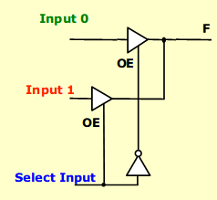
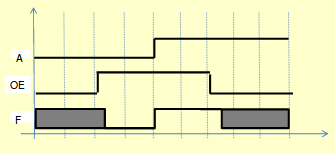
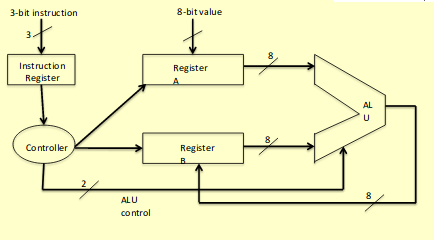
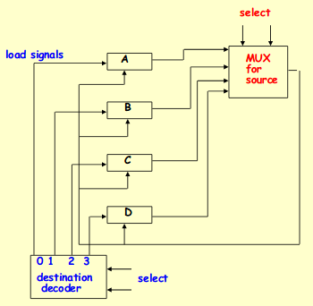

# The Tri-State Buffer and Making A Bus

## Buffer
A buffer is a simple gate that has the same output as input
  - in other words, its function is f(x) = x

Why bother using it?
- it can be an electronic amplifier
  - boost voltage levels over long distances
- can be used when gate fan-out is insufficient

## Tri state logic and buffers
- tri state = three states
  - 0 , 1 and High-impedance (aka Hi-Z, aka disconnected)

Truth Table
OE | IN | OUT
--- | --- | ---
0 | X | Hi-Z
1 | 0 | 0
1 | 1 | 1

where
  - IN: input data
  - OE: output enable, the control input

There are some variations:
- can have inverted input
- or inverted enable

You can use tri-state gates to implement an economical 2:1 multiplexer

### Active low tri-state
- gate is enabled on low
- and the output is inverted
- so technically, it is a tri-state inverter

### A lil tri-state summary
- logic values are "0", "1", and "Z"
- gates need an input and output enable
- when OE is high, this is a non-inverting buffer
- when OE is low, it is as though the gate is disconnected from the output
- this allows multiple outputs to all fan into one output wire!
  - just as long as only one has its output enabled at any time

Non-inverting buffer timing diagram

## Moore's Law
- transistors get 2x smaller about every 2 years
- can fit twice as many tansistors per chip
  - its an observation tho, not actually a law

Why does it matter? There are two effects
  - capacity doubles
  - keeping capacity constant, chips get smaller and cheaper every 2 years
  - this is why computers are now in everything

## And now, busses!
Here's the small ALU we built in lab 6.

Why buses are needed:
- within the CPU there is a lot of data transfer between registers
- this is usually for data transfer INSIDE the CPU
- in a general system, there is freedom to do data transfers between any two registers
- data transfer is usually parallel
- if every register is wired to every other register, it can be a mess of wires

Instead, we use transfers.
- Multiplexer-based transfers
  - multiple inputs are selected by a multiplexer dedicated to the register
- bus-based transfers 
  - multiple inputs are selected by a shared multiplexer driving a bus that feeds inputs to multiple registers
- three-state bus
  - multiple inputs are selected by 3-state drivers with outputs connected to a bus that feeds multiple registers
- other transfer structures
  - use multiple multiplexers, buses, and combinations of all the above

A register diagram using direct wires (direct register-to-register transfers)

What ARE busses?
- a bundle of wires used for communication between modules
  - used for commincation between registers inside the CPU

Advantages | Disadvantages
--- | ---
fewer wires | only 1 item at a time can be transferred
less control logic | slower
flexible - easy to add devices | large machines may have > 2 buses

### The Tri-State Bus
- the 3-input multiplexer can be replaced by a 3-state node (bus) and 3-state buffer
