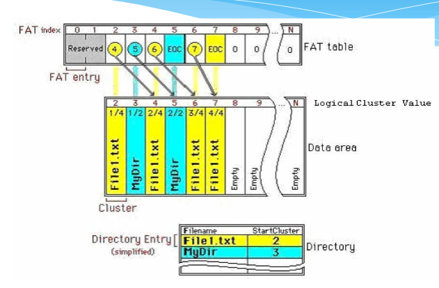

# FAT-12 Disk Organization

Can be divided into four sectors (roughly)
  1. Boot sector (sector 0)
  2. FAT tables
    - FAT1 (sectors 1-9)
    - FAT2 (sectors 10-18)
  3. Root directory (sectors 19-32)
  4. Data area (sectors 33-2879)

##Root directory
Can store files (pure files, subdirectories). Each are represented by a directory entry.

##FAT tables
Correspond to each cluster in the data sector.
  - the index of all the content in your file system
  - composed of a number of FAT entries
  - each FAT table contains 9 sectors
  - each FAT entry is 12 bits

###FAT entries
| Value | Meaning|
| ------ | ------ |
| 0x00 | Unused |
|0xFF0 - 0xFF6 | Reserved cluster |
| 0xFF7 | Bad cluster (damaged) |
| 0xFF8-0xFFF | Last cluster in a file |
| (anything else) | Number of the next cluster in the file |

  - each file is not stored continuously in the disk. example, file one may occupy sector 1, sector 3, and sector 5.
  - we know the file is ended by looking up the FAT entry for sector 5. If the FAT entry for sector 5 is 0xFF8-0xFFF, we know it is the last sector in the file.
  - the value of FAT entry for the first cluster should be the third cluster (3), as it should point to the next cluster of the file
  - note that FAT entries at positions 0 and 1 are reserved, so we start counting from 2 (but FAT at position 2 still corresponds to sector 2).

##Boot sector
  - contains basic disk information
    - how many copies of FAT tables (here it is 2)
    - boot sector is exactly 512 bytes
    - can see which bytes correspond to what
    - total sector count
      - takes into account all four parts
    - may need to print out boot signature, volume id, volume label for next assignment

##Directories
  - includes the root directories
  - in each directories, we store subdirectories or pure files
  - each sector of a directory contains 16 directory entries (each of which is 32 bytes long)

### Directory Entry
  - like the index of a file
  - contains following information:
    - filename
    - extension
    - attributes (this is a read-only file, or this is a subdirectory, or this is a pure file)
      - attributes part is 1 byte (8-bits) which is used to designate the following
        - read-only (if 1, it is read-only)
        - hidden
        - system
        - volume label
        - subdirectory
        - archive 
        - etc.
    - reserved (right now, this is not used)
    - creation time
    - creation date
    - the first logial cluster (most important part!)
      - where does this file start? for our previous example, this would be 1 (since our file starts at sector 1). Then you can rely on FAT entries to find the following clusters in the file.
    - etc.

## Example

#FAT Packing
  - the space on a floppy disk: 1.44Mbytes
  - number of bytes in a sector = 512
  - number of sectors in 1.44 Mbytes = x -> 2812

Therefore, the minimum number of bits required to address "x" sectors = 12 bits (since 2^11 < 2812 < 2^12).

# Reading in 12 bits
  - may have to do some bitwise operations
  - ex. val = 0xA310; val >> 4; or val & 0x0FFF; to get rid of the A
