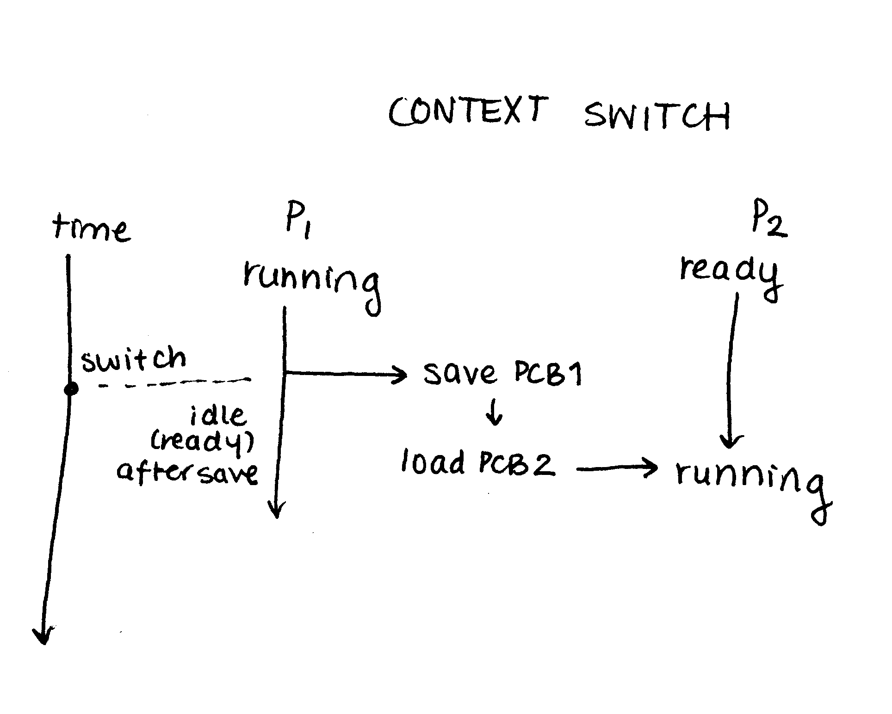

# Introduction to Computer Organizaion and Operating System

## Batch Processing vs Time Sharing
- Batch processing
  - load a pool of jobs
  - execute one job until it terminates or it is blocked
  - pick next job to run (via job scheduler)
- Time sharing
  - execute one job up to a certain time (called a time slice)
  - switch to another job
  - switch is decided by the CPU scheduler

## Interrupts vs Trap
  - interrupt: external control stops a process
  - trap: like a try-catch in Java; process is stopped internallylike an exception

## Direct Memory Access (DMA)
  - for transferring large size of data, it is wasteful to ask CPU to do the job
  - special type of processor
  - the job for CPU is to tell the DMA the source address of the data, the destination address for the data, and the size of the data
  - after setting up buffers, pointers, and counters for the I/O device, the device controller transfers an entire block of data from its own buffer storage to memory (or vice versa), with no intervention by the CPU

## Mode Switch
- mode bit is set to 1 when in user space
- mode bit set to 0 when in kernel space

For example:
```c
printf('run here'); /* user space, mode bit = 1 */
|
|
v
... {
  print(); /* kernel space, mode bit = 0 */
}
```

## Context Switch

- switch between two processes
- process 1 is running
- save process 1 PCB
- load process 2 PCB
- run process 2


