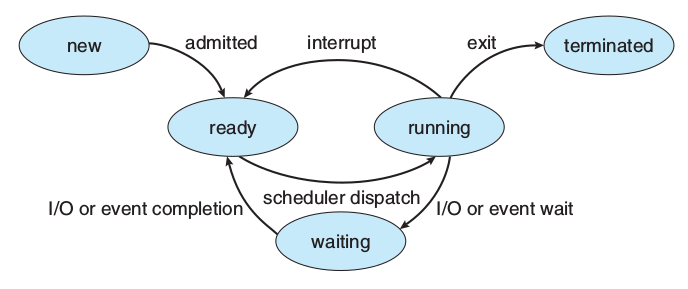
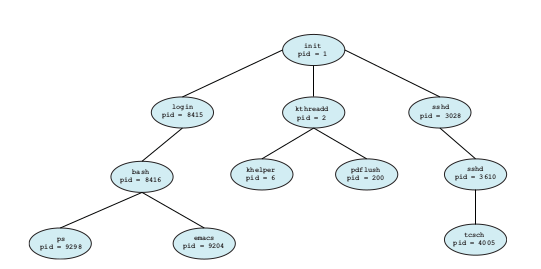
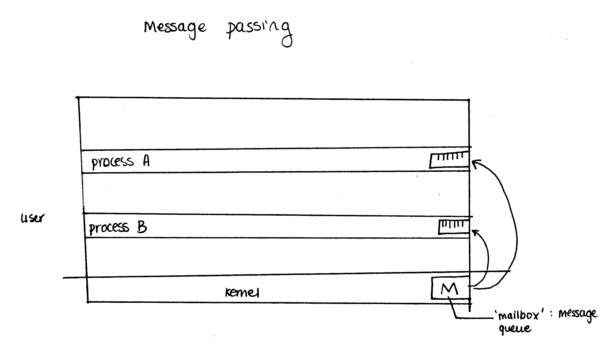
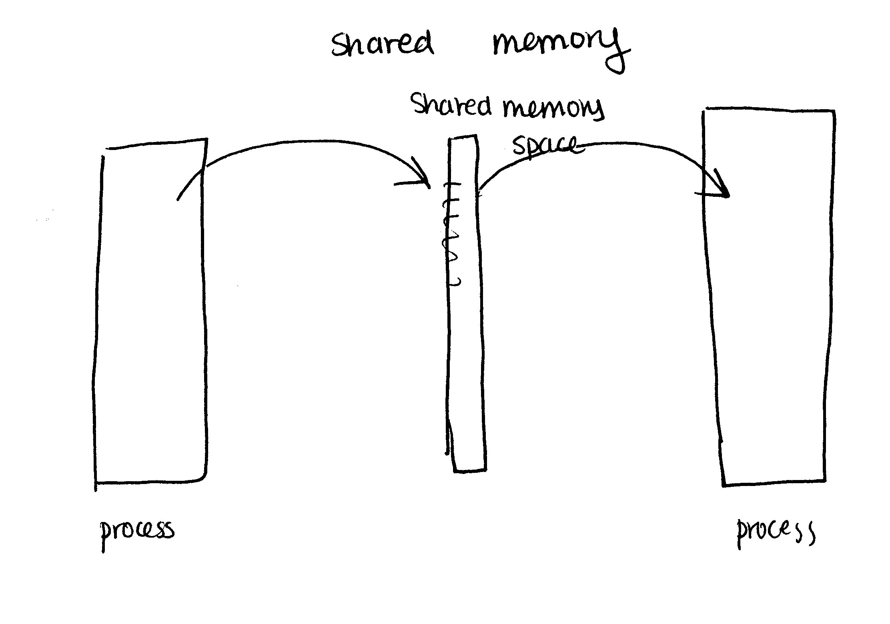
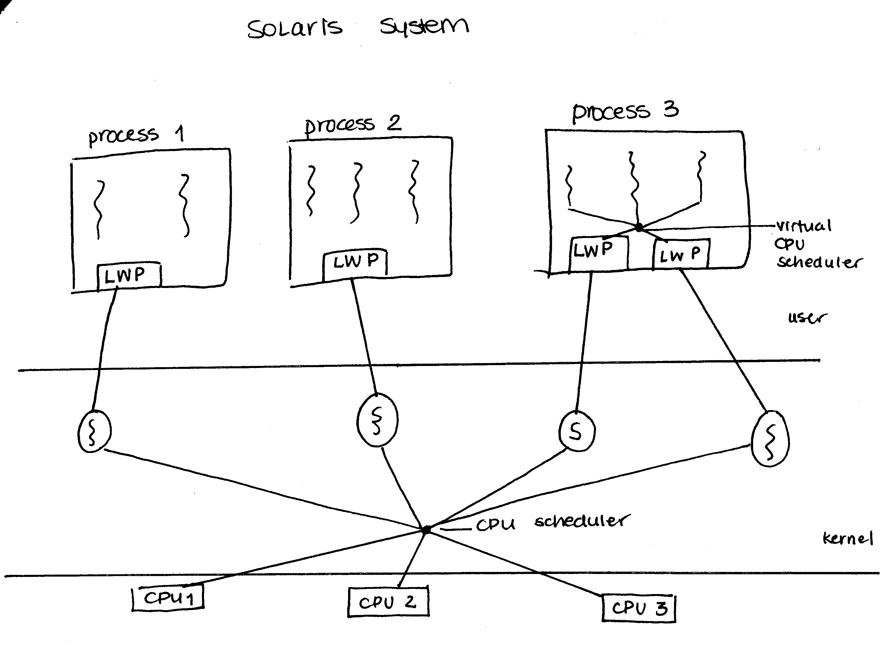

# Processes + Threads

## Process States
  - new: the process is being created
  - ready: the rocess is waiting to be assigned to a proccessor
  - running: instructions are being executed
  - waiting: the process is waiting for some event to occur (such as I/O completion or reception of a signal)
  - terminated: process has finished execution



## Process Tree
During the course of execution, a process may create several new processes. Each of these new processes may in turn create other processes, forming a tree of processes.

Can use the `ps` command on UNIX and Linux systems to view listing of processes. Can use `pstree` to see it formed as a tree.



## IPC (Inter-Process Communication)
Any process cannot write something out to another processes' memory space. Thus, two processes cannot write/read to the same space. However, sometimes child and parent processes want to do something together.

### IPC with message passing
Each process has a "mailbox".
  - mail goes from Process A to the kernel
  - mail waits in kernel message queue
  - mail gets send from kernel to Process B
  - this is more useful if the size of the message is small



### IPC with shared memory
  - OS allocated a dedicated memory space for IPD
  - shared memory in user space but managed by the kernel
  - useful if the size of the message data is large




### `shmget()`
```c
int shmget(key_t key, size_t size, int shmflg);
```

`shmget()` returns the ID of the memory segment associated with the value of the argument _key_. It may be used to either obtain the identifier of a previously created shared memory segment (when _shmflg_ is 0 and _key_ does not have the value `IPC_PRIVATE`), or to create a new set.

#### _shmflg_
Should be IPC_CREAT to create a new segment. If this flag is not used, then `shmget()` will find the segment associated with _key_.

#### Return values
On success, a valid shared memory identifier is returned. On error, -1 is returned.

### `shmat()` and `shmdt()`
```c
void *shmat (int shmid, const void *shmaddr, int shmflg);

int shmdt(const void *shmaddr);
```


`shmat()` attaches the shared memory segment identified by _shmid_ to the address space of the calling proccess. If _shmaddr_ is:
  - NULL: system chooses an unused address at which to attach the segment


`shmdt()` detaches the shared memory segment located at the address specified by _shmaddr_ from the address space of the calling process.

## Threads
Motivation:
  - reduce the number of context switches
  - every thread has its own running environment
    - own stack
    - own registers
  - each thread shares
    - process code
    - process data
    - process files

Notes
  - OS has no control over which thread is run, only which process is run

### User threads and kernel threads
If we link a kernel thread to a user thread, we can implicitly control how much time is given to a user thread. This is highly OS dependent.

### Thread Model: Solaris


#### Light-weight process (LWP)
  - think of it as a virtual CPU
  - an intermediate data structure between user threads and kernel threads
  - from the user thread's point of view, LWP appears to be a virtual processor (like a virtual CPU) on which the application can schedule a user thread to run

### `pthread_create()`
```c
int pthread_create(pthread_t *thread, const pthread_attr_t *attr, void *(*start_routine) (void *), void *arg);


/* usage */
pthread_t CLERK1_THREAD;
int err = pthread_create(&CLERK1_THREAD, NULL, &clerk_runner, &args);
```

The `pthread_create()` function is used to create a new thread with attributes specified by _attr_ within a process. If _attr_ is NULL, default attributes are used.

#### Return values
If successful:
  - returns 0
  - otherwise, errno is set

#### Notes
  - can use `pthread_exit(&exit_value)` to exit the thread

### `pthread_join()`
```c
int pthread_join (pthread_t thread, void **value_ptr);

/* usage */
pthread_join(CLERK1_THREAD, &return_value);
```

The `pthread_join()` function suspends execution of the calling thread until the target thread terminates, unless the target thread has already terminated.

#### Return value
If successful:
  - returns 0
  - otherwise, errno is set

### Thread Issues
If you use threads together with fork: what happens if a thread calls `fork()`?

Either all the threads are copied or it will only copy the calling thread. This depends on the OS. 
  - if you are running Solaris (before version 10) and use Solaris threads API, `fork()` will duplicate ALL threads
  - but OS provides another function `fork1()` to duplicate the calling thread only
  - if you are using the POSIX thread API, no matter whether `fork()` is called in the process or in the thread, only one thread will be copied into a new process

Where should a signal be delivered?
  - deliver the signal to the thread to which the signal applies
  - deliver the signal to every thread in the process
  - deliver the signal to certain threads in the process
  - assign a specific thread to receive all signals for the process
