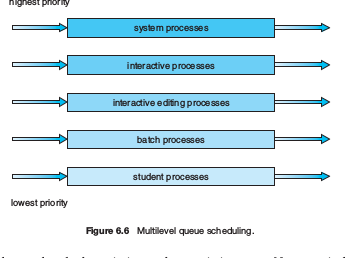
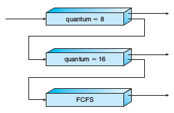

# CPU Scheduling

## Intro: What is CPU scheduling?
CPU Scheduling is a short-term schedule. It aimts to answer the question: when the CPU is idle, which process should be run next?

The goal is to maximize
  - CPU utilization / throughput

and minimize
  - response time
  - turn around time

## CPU and Dispatcher
CPU scheduling is a mechanism which consists of 2 modules:
  1. CPU scheduler: the algorithm to decide which process is next to run
  2. Dispatcher: after a process is selected by the CPU scheduler, the dispatcher performs the following tasks:
    - context switch
    - mode switch
    - start to execute the newly selected process

## Scheduling algorithms
  1. First Come, First Serve (FIFO)
  2. Shortest Job First (SJF)
    - this is the optimal average
    - always gives minimum average waiting time for a given set of processes
    - but, impossible to implement
      - impossible to accurately guess the run time duration of a process
      - however, we can use EWMA (Exponentially Weighted Moving Average) to guess CPU burst time
  3. Priority Scheduling
    - managed by two or more priority queues
      - ex. high priority queue and low priority queue
    - preemptive vs non-preemptive:
      - preemptive: if CPU is running a low-priority process and a high priority process arrives, CPU with stop and switch
      - non-preemptive: CPU cannot be interrupted
  4. Round-robin
    - run each job for a set amount of time
  5. Multi-level queue
    - multiple priority queues which each receive a different percent of CPU time allocation
    - 
    - could be preemptive: no lower priority process can run until higher priority queues are empty
    - could be time slice: eg. system processes gets 80% of CPU time while student processes only gets 5%
  6. Multi-level feedback queue
    - can be preemptive or non-preemptive
    - 
    - idea: separate processes according to the length of their CPU bursts
    - if a processes uses too much CPU time, it will be moved to a lower-priority queue
    - top queue is highest priority and bottom queue is lowest

## Examples
Assume SJF + priority non-preemptive. Draw the Gantt chart for the following processes.

| process | arrival time | burst time |
|---|---|---|
| p1 | 0 | 7 |
| p2 | 2 | 4 |
| p3 | 4 | 1 |
| p4 | 5 | 4 |

## Eamples
Assume multi-level feedback queue where first queue quantum = 8, middle queue quantum = 16, and last queue is FCFS. Draw the Gantt chart for the following processes.

| process | arrival time | burst time |
|---|---|---|
p1 | 0 | 25
p2 | 5 | 7
p3 | 8 | 17
p4 | 10 | 26
p5 | 30 | 5
