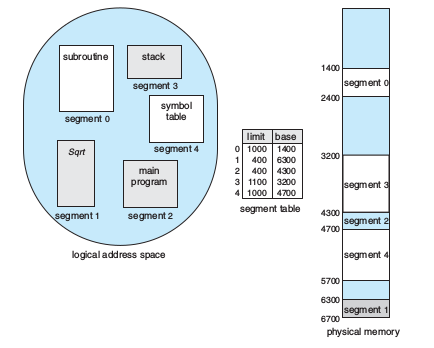
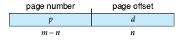
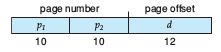
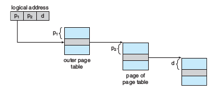
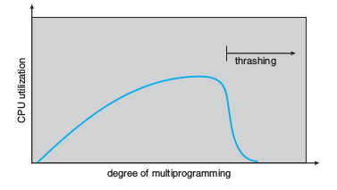
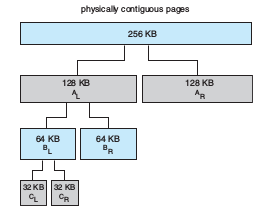

# Memory Management and Virtual Memory

## Logical vs Physical Addresses
**Logical Address**

An address generated by the CPU is referred to as a logical address (also known as a _virtual address_). 

**Physical Address**

An address seen by the main memory unit is known as a physical address.

**What the textbook says**

If address-binding is done at compile-time or load-time, logical and physical addresses are identical. However, execution-time address-binding results in different logial and physical addresses.

## Paging
In order to get into paging, we must talk about segmentation.

### Segmentation
Programmers think about their programs as a bunch of segments existing somewhere in memory space.



Each segment has a name and a length. Thus, a logical address consists of a two tuple:

<p align="center"> &lt;segment-number, offset&gt; </p>

### Translate logical address to physical address
Segmenetation allows the physical address space of a program to be non-contiguous. The basic method for paging involves breaking physical memory into fixed-sized blocks called framges. Similarly, we break the logical memory into blocks of the same size called pages.

When a process is to be executed,
  - its pages are loaded into any available memory frames form their source (ie. file system or disk)

Every logical address is divided into two parts:
  1. a page number
  2. a page offset

The **page number** is used as in index for the **page table**. For example, a page number of 3 would correspond to entry 3 of the page table, or `page_table[3] = f` where f is the corresponding frame.

The page size is defined by hardware. The size of a page is a power of 2 and depends on computer architecture.

- if the size of the logical address space is 2<sup>m</sup> and a page size is 2<sup>n</sup> bytes, then the address is as follows



- _p_ is an index to the page table and _d_ is the displacement within the page

### Support for the page table (TLB)
- when a page table is very small, the OS can use _registers_ to store the page table (very fast)
- when a page table is big, the OS usually uses main memory to store the page table (slow)
  - pointer to page table in the OS kernel
  - thus, for one address, we need to do 2 main memory accesses
    - one for the page table (find the frame in the page table)
    - another to go to that frame 
    - this is quite slow!
- use a special, small, fast look-up table called the Translation Lookaside Buffer (which is on special hardware located in the motherboard)

How to use TLB
  1. Search the TLB for the page
  2. If miss, must look in the page table (2 memory access + 1 TLB time)
  3. If hit, got to frame in main memory (1 TLB + 1 main memory access time)

Note: the TLB has two sections in it, one for page number and one for frame number (unlike the page table).

**TLB**

| p | f |
|---|---|
| 2 | 0 |
| 4 | 1 |
| 5 | 2 |
| 6 | 3 |
| 1 | 4 |

**Page table**

| frame |
|------|
| 8 |
| 4 |
| 0 |
| 7 |
| 1 |

### An example question
Assume that it takes 100ns to access main memory. Assume the TLB lookup time takes 10ns. Define the effective memory access time as the expected time needed to find the physical address for a logical address.

Q: What is the hit rate for the TLB such that the effective memory access time is 150 ns?

A: 60%

### Structures for page table

#### Single Layer Page Table
There is only one page table. Assume that the page table is an array.

| frame | other information (like valid bit) |
|---|---|
| ... | ... |
| ... | ... |

#### Hierarchical Paging
There are multiple layers to the page table. For example, 2 layers.

- logical address now split into three parts- 
  - _p1_ is the index to the outer page table
  - _p2_ is the displacement within the page of the innter page table



#### Sample questions
Q: What is the total size of all the page tables?

A: 2<sup>11</sup> entries in the other page table * 4 bytes per entry + 2<sup>11</sup> * 2<sup>11</sup> * 4 bytes

Q: How many page tables are required?

A: 1 + 2<sup>11</sup> page tables needed

Q: What is the total space required for a single layer page table?

A: 2<sup>22</sup> * 4 bytes required

### Some more example questions...
Assuming 1KB page size, what are the page numbers and offsets for the following logial addresses if single-layer paging is used?

1. 0x1040
2. 0x0150

### Hashed page table

  1. Hash the page number (eg. for a page number 2, put into hash function: _h_(2) = 5
  2. Look up index 5 of the hash table
  3. Check if the page number matches. If it does, go to the frame number.

**Hash table**
```
Hash table
| null | 
| null | 
|  ------> | page | frame | next link|
           | 4    | 1     | -----------> 
                     | 0    | 2   | ^ (end of linked list) |
```

### Inverted page table
  - whole system uses one page table (instead of each process gets own page table)
  - need to keep track of process ID

**Logical address**

| process id | page | offset | 


**Page table**

| process id | page |

- present the page table with a page number and pid
- search the page table for that page number and process id
- if found, say at entry _i_, then physical address &lt;_i, offset_&gt; is generated
- if not found, illegal address access error

## Some example questions
Assume a system has a 32-bit virtual memory address-space and a page size of 2048 bytes. At a time _t_, a process _p_ has the following page table in the format (page, frame).

| page | frame |
|---|---|
| 0 | 4 |
| 2 | 6 |
| 3 | 2 |
| 8 | 5 |
| 10 | 3 |

Assume that we use a single layer page table.

Q1: What is the maximum number of page table entries per process in the system?

Q2: Calculate the physical address of the virtual address 0x00001245 in _p_ (write "unknown" if page fault).

A1: 2<sup>21</sup> maximum number of page table entries

A2: 0x00003245

Q3: What is the physical address of the virtual address 0x00007700?

A3: "page fault interrupt" </br>
Need to do the following steps:
1. Generate page fault interrupt
2. Swap out frame in main memory (if all frames are being used)
3. Swap in page from disk to main memory
4. Resume the process


## Demand paging
Definition: load page on demand; only when page is used and not before!

**What the textbook says**

For each page fault, we must:
1. Service the page-fault interrupt
2. Read in the page
3. Restart the process

### Performance
Effective access time = (1-_p_) * T<sub>m</sub> + _p_ * T<sub>f</sub> , where _p_ is the probability of a page fault occurring.
  - T<sub>f</sub> is the page fault time; the time to geterate a page fault interrupt + time to swap out the page (if needed) + time to swap in new page + time to restart the process
  - T<sub>m?</sub> is the access time when there is no page fault
    - 2 * memory access time , single layer page table
    - 3 * memory access time, 2-layer page table


## Copy-On-Write
We know the behaviour of `fork()` to be that it copies the parent process to make a new child process complete with its own PCB block.
  - however, the OS will only copy child to new memory space if code after `fork()` writes to memory
  - `vfork()` is exactly that
    - the parent process is suspended
    - the child process starts to run using the same memory space (no memory copy!)
  - as the programmer, you must make sure your code does not modify the address space of the process
  - there is no point in using `vfork()` ! `fork()` has the same performance and `vfork()` can introduce errors if you are not correct

## Algorithms for page replacement

  1. FIFO : first in, first out
    - this can cause Belady's anomaly
    - increasing the number of page entries increases the number of page faults
  2. Optimal algorithm
    - Replace the frame that will not be used for the longest period of time
  3. LRU (Least Recently Used)
    - approximation for the optimal algorithm
  4. Approximate LRU
    - if a page has been used, set a reference bit as 1 and shift all bits to the right >>
    - then, the higher the value of the 8-bit reference value mean the page was more recently used
    - the lower the value, the longer the page hasn't been used
  5. Counting-based page replacement
    1. LFU: Least frequently used: Page whichas been least frequently used is replaced.
      - an actively used page should ae a large reference count
      - could be a page is used heavily during the initial phase of a process but then is never used again
      - solution: shift the counts right by 1 bit at regular intervals (exponentially decay average usage count)
    2. MFU: Most frequently used: Page which has been most frequently used should be replaced.
      - idea: page with the smallest count was probably just rbought in has yet to be used

### Note
Given a page replacement algorithm, calculate the number of page faults and the sequence of pages uploaded to main memory.

## Frame allocation
How many frames should a process be allocated?

Possible solutions:
  1. OS equally splits the memory to the active processes (ie. 4 frames and 4 processes, each process gets 1 frame)
  2. OS assigns the number of frames to a process proportional to the process priority level

For the next two examples, use this table

| process number | priority value |
|---|---|
|p1|1|
|p2|2|
|p3|3|
|p4|4|
|p5|5|

### Assume higher priority value means higher priority
Assume 100 frames and 5 processes.

- p1 --> 100 * 1/9 
- p2 --> 100 * 2/9
- p3 --> 100 * 2/9
- p4 --> 100 * 3/9
- p5 --> 100 * 1/9

### Assume higher priority value means lower priority

- p1 --> 100 * ((1/1) / (1/1+1/2+1/2+1/3+1/1)) 
- ??? TODO

## Thrashing
Definition: Very high paging activity is called thrashing. A process is thrashing if it is spending more time paging than executing.

Causes:
  - Number of frames allocated to a process is too small
  - degree of multi-programming too high
  - look at any process that does not have "enough" frames
  - if the process does not have the number of fames it needs to support pages in active use, it will page-fault
  - then it must replace soe page
  - but all pages are in active use
  - so it replaces a page that is needed again right away
  - and this repeats

Thrashing highly related to the degree of multiprogramming



## Allocation for kernel memory: the buddy system

  - when a process running in user mode requests additional memory, pages are allocated from the list of free page frames maintained by the kernel
  - manage free memory that is assigned to kernel processes



  1. Kernel requests memory of size _
  2. We have a contiguous physical memory segment of size _
  3. Segment is repeatedly divided into buddies until we satisfy initial request size
  4. Assign request size to smallest buddy

 - pros: adjacent buddies can be combined to form larger segments quickly using a technique known as **coalescing**
    - in the figure, once the kernel releases Cl, we can coalesce Cl and Cr back into a 64 kB segment
    - ultimately, we can keep coalescing until we have back out 256 kB contiguous segment
  - cons: rounding up to the next highest power of 2 is very likely to cause fragmentation (ie. when a process does not fill up the full page and thus there is a "small hole")
    - cannot even guarantee that less than 50% of the allocated unit will be wasted

Assume request:
  - A, 30 kB
  - B, 64 kB
  - C, 50 kB
  - D, 150 kB
