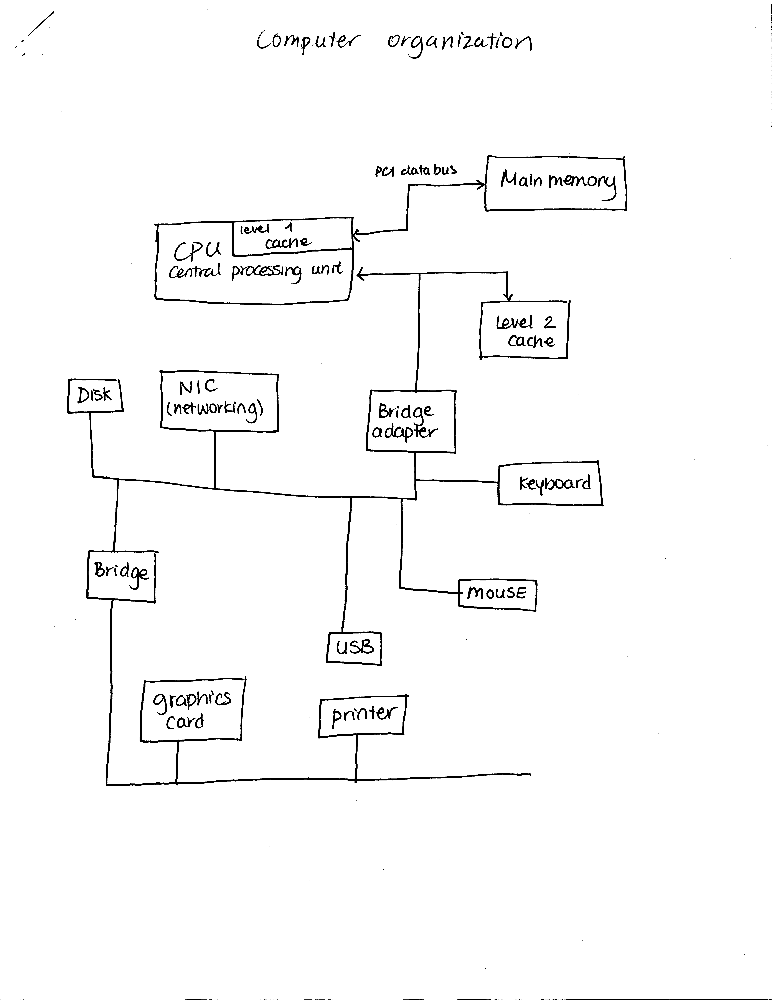
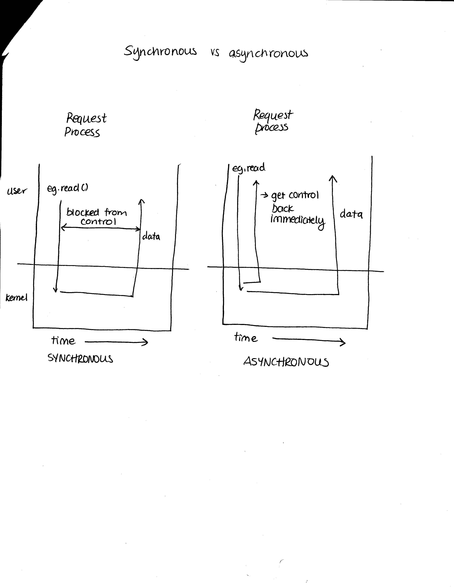

# Part 1: Review of computer organization
1. [Computer organization] (#1-computer-organization)
2. [CPU] (#2-cpu-central-processing-unit)
3. [Memory] (#3-memory)
4. [I/O] (#4-inputoutput)
5. [Different architectures] (#5-different-architectures)

## 1. Computer organization

## 2. CPU (Central Processing Unit)
  - made up of:
    - ALU (Arithmetic + Logic Unit)
    - PC (program counter)
    - level 1 cache
    - registers
    - clock
    - FPU (floating point unit)

## 3. Memory
* Note that network storage is difficult to compare right now. It is normally slower, but in the future, it could easily be faster than a CD.

![main memory] (images/main_memory.png)

## 4. Input/Output
### 4.1 Access
  - need to give address (port #, what interrupt, pin numbers)
  - need to know if we're using interrupts or DMA (direct memory access)

### 4.2 Synchronous vs asynchronous

### 4.3 Interrupt vs trap
  - interrupt: external control stops a process
  - trap: interally stop a process, like an exception (kind of like a try-catch in Java)

### 4.4 Direct memory access (DMA)
  - for transferring large sizes of data, it is wasteful to ask the CPU to do the job
  - special type of processor
  - the job for the CPU is to tell the DMA the source address of the data, the destination address for the data, and the size of the data

## 5. Computer architectures
  - single-processor systems (single-CPU)
  - multi-processor systems
    - OS determines which CPU is designated which job
  - cluster systems
    - multiple computers in one area
  - distributed systems
    - different computers in multiple areas using internet to connect

