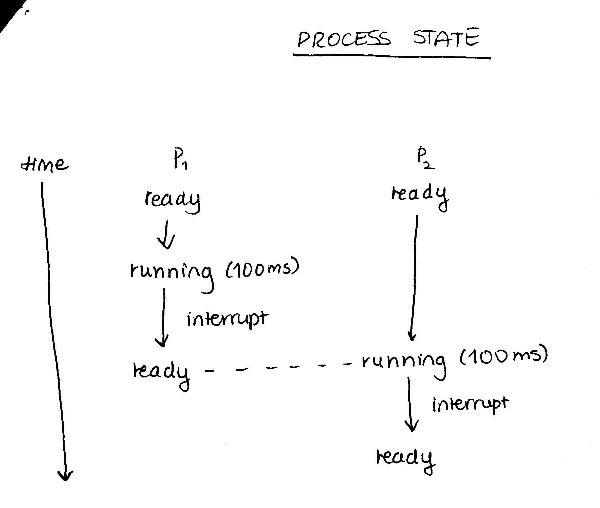
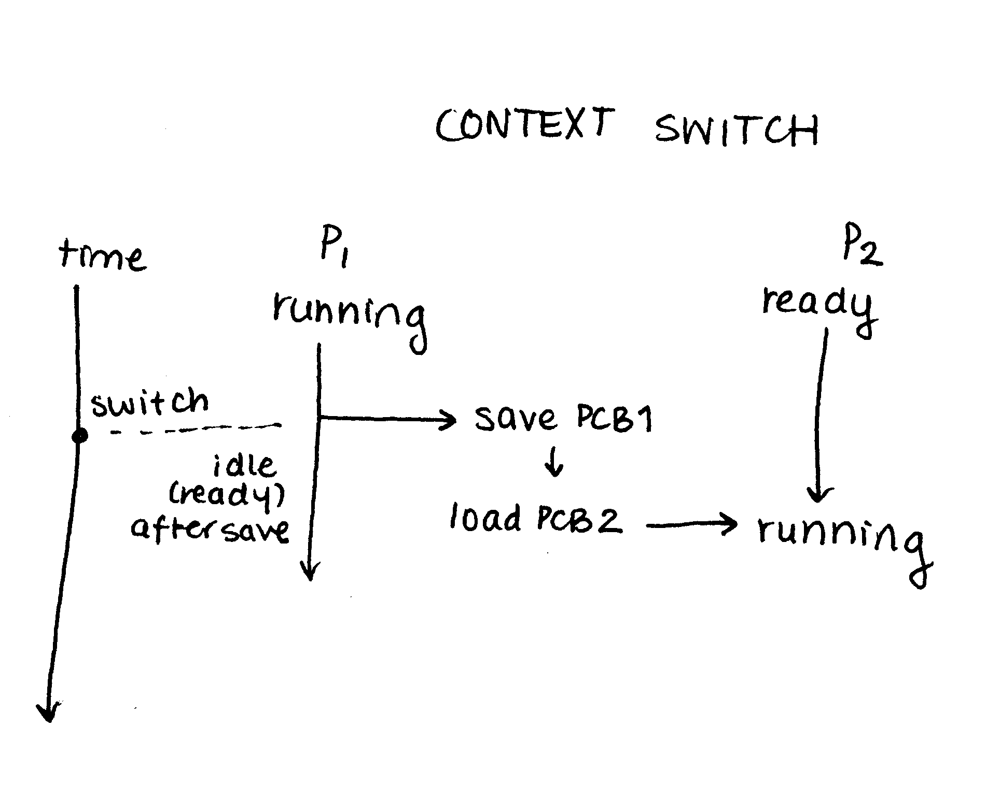
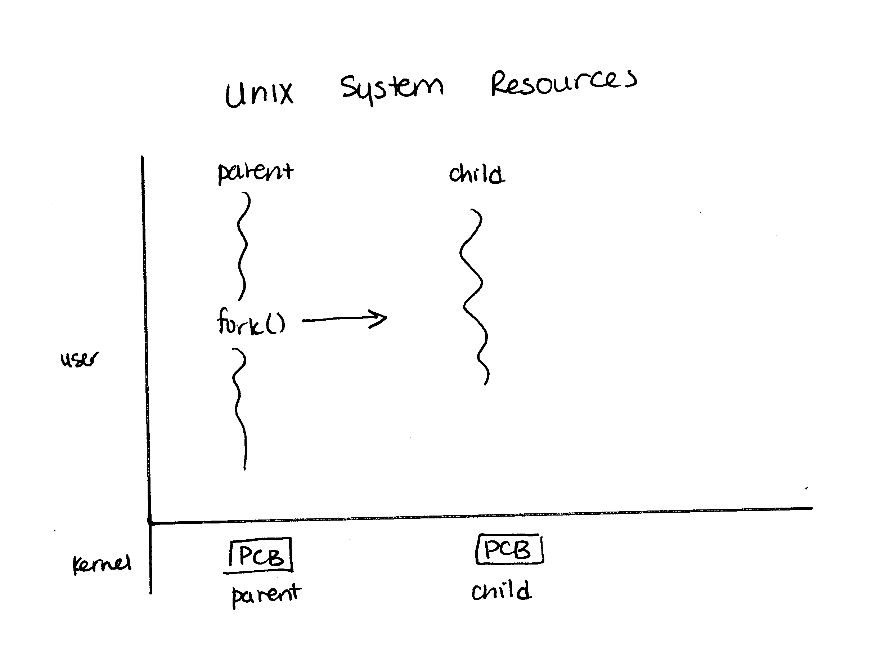
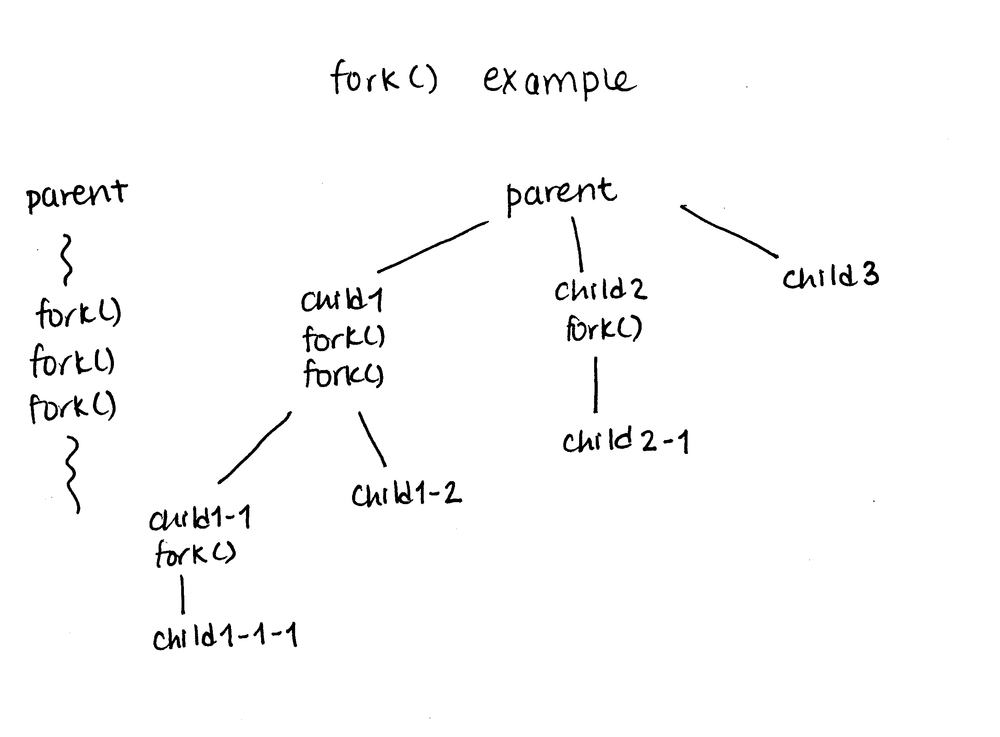

Note: You may notice there is not part 4. Part 4 is OS structures and not covered by this course.

# Part 5: Process

## 1. What is a process?
A process has the following features:
  - process ID (PID)
  - running state / status
  - process control block (records process information; like a log file; it's a data structure)
  - process scheduling
  - inter-process communication (IPC)

Note that _all_ PCB information is always stored in kernel space, even if the process is running in the user space.
  - stored in `/proc` (short for processes)
  - `% cd /proc` from anywhere

```
% ls -la
  1235  // a directory for a running process with pid 1235

% cd 1235
% ls -la
  stat status // these have size 0 since they are just a pointer to the PCB in the kernel space; therefor you cannot edit the information!
```

## 2. Process states
  - new
  - ready
  - running
  - waiting 
  - terminated


Above: after a scheduled time block (eg. 100ms), the process running is interrupted to run other processes.
If process ness I/O, it goes into waiting state until it has I/O completion.

## 3. PCB
- explore `% cd /proc` with `inf.c`

## 4. Context switch


## 5. Process scheduling
### 5.1 Queueing system
Processes are kept in multiple queues
  - processes in main memory that are ready and waiting to execute are put into ready queue
    - queue is a linked list that points to PCBs
  - device queue: processes that are waiting to talke to an I/O device
    - I/O device may be busy responding to other devices
    - each device has its own queue

Processes that are executing can do:
  - the process could issue an I/O request and be placed in an I/O queue
  - the process could create a new child process and wait for the child's termination
  - the process could be removed forcibly from the CPU, as a result of an interrupt, and be put back in the ready queue

A process continues to switch from waiting state to ready state, being replaced in the ready queue, until it terminates, a which time it is removed from all queues and has its PCB and resources deallocated.

## 5.2 Scheduling algorithms
Long-term scheduler (also called job scheduler):
  - selects jobs from a pool of jobs and loads them into main memory for execution
  - main purpose of long-term scheduler is to control the degree of multi-programming

Short-term scheduler (CPU scheduler):
  - selects a process from the processes that are ready to execute and allocates the CPU to the selected process

Medium-term scheduler:
  - part of swapping
  - it "removes" some process from main memory to give more memory space for other processes to run
    - here, "remove" means record process state in PCB then stop the process to free up memory
  - for example, maybe we want to upload the program `test()` to main memory from disk, but there is not enough memory for `test()`
  - then we need to "remove" some processes (ie. save and stop) so we can run `test()`

# 6. Process creation
## 6.1 Tree structure of parent/child structure
Use the command `% pstree` to see a tree of all processes

## 6.2 Resource sharing
Q. How are resources allocated to a child process?
A. No standard answer - this depends on OS.

1. The child process may obtain its resources directly from the OS (case of Linux/Unix)
    -  
    - note that `fork()` means:
      - CPU creates a new child process (P1-1) an copies everything over to this new process; the new process gets its own PCB

2. The child process is constrained to a subset of resources of the parent process


## 6.3 Examples
`fork()` example:


# 7. Process termination
  - terminates itself with `exit()`
  - report status to parent process
  - release allocated resources

# `exec*()` family
`Exec*()` tells the operating system kernel to replace the current program with a new program. The kernel roughly
  1. Save a copy of the new `argv` array and a copy of the environment
  2. Frees any private memory area
  3. Disconnects the process from any shared memory area including a shared text segment and any shared libraries

At this point, any code following the `exec()` call no longer exists in the process. The same is true for any code prior to the  `exec()` call and even the `exec()` call itself. It's all gone!

  4. Reads in the `exec`'ed program and reconstructs a working program. The environment and the arguments are copied into the new program
  5. Inherit the attributes from the calling process (PID, PPID, NICE, etc.)
  6. Transfers control to the newly created program

# `wait()`
If you call `wait` and the child process has already returned, then `wait` gets the return value of the terminated child immediately

# Possible exam question
```c
int val = 1;
if (fork()) {
  val++; fork(); val+=3;
} else {
  val +=5; fork(); val+=7;
}

printf("%d\n", val)
```
What will be the output?

```c
int val = 1;
if (fork() /* this is the parent process */) {
  val++ /* val = 2 */; fork(); val+=3 /* val = 5 */;
} else /* this is the child process */ {
  val +=5 /*val = 6 */; fork(); val+=7 /* val = 13 */;
}

printf("%d\n", val) /* prints 5, 5, 13, 13 in any order */
```

# Commands
Use
```
% ps -a
```
to show running processes.
