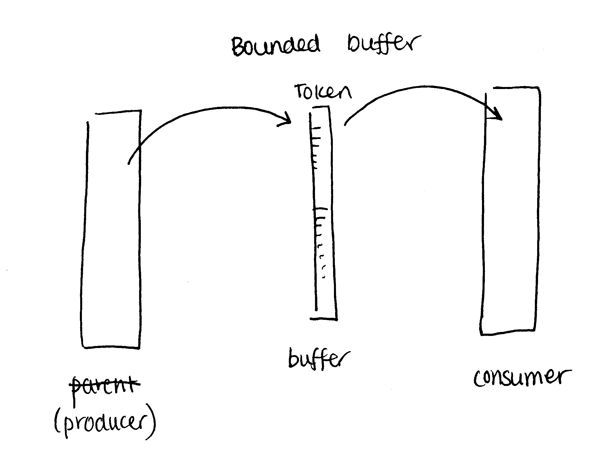

# Part 6: Inter-process communication (IPC)

## 1. Why do we need IPC?
Any process cannot write something out to another process' memory space, but sometimes, child and parent want to do something together

## Bounded buffer (producer-consumer problem)


## 2. Shared memory vs message passing

### Shared memory

  - useful if the size of the data is big
  - OS allocates a dedicated memory space for IPC
  - shared memory in user space but managed by the kernel

### Message passing

  - say process A wants to send a message to B
  - mail goes from A to the kernel and then from the kernel to B
  - mail is stored in kernel in a "message queue"
  - this is more useful if the size of message data is small

## 3. Different communication structures
  - graphs
  - message passing/mailbox
    - one to many processes
  - buffer

### Shared memory commands
```c
int shmget(key_t key, size_t size, int shmflg);
/*eg*/
if (shmget(key, SHMSZ, IPC_CREAT|0777))<0)
```
  - allocates a system V shared memory segment
  - returns the identifier of the system V shared memory segment associated with the value of the argument key
  - on error, -1 is returned
  - `IPC_CREAT`: flag to create a new segment
 

```c
void *shmat(int shmid, const void *shmaddr, int shmflg);
/* eg */
shmat(shmid, NULL, 0);
```
  - map shared memory
  - after a shared memory ID is returned (from `shmget`), the next step is to attach it to the address space of a process
  - attaches the indicated shared memory to the program's address space
  - you can specify the address with shmaddr
    - if 0, system will  pick an address itself
  - returns address at which the shared memory segment has been mapped if successful; or -1 if error

```
ipcs
```
use this command to see all shared memory

```c
int shmctl(int shmid, int cmd, struct shmid_ds *buf);
/*eg*/
shmctl(shmid, IPC_RMID, NULL);
```
Call this in client or server to destroy memory space if no one else is going to use it
  - `IPC_RMID`: remove the shared memory segment specified by shmid and destroy the data associated with it
  - returns 0 if successful, -1 if error

```c
int shmdt(const void *shmaddr);
```
`shmdt()` detaches the shared memory segment located at the address specified by _shmaddr_ from the address space of the calling process
  - the to-be-detached segment must be currently attached with _shmaddr_ equal to the value returned by the attaching `shmat()` call
  - if successful, returns 0. returns -1 if error


```
ipcrm -m shmid
```
to destroy memory as well (from command line)

## Examples
shmserver.c and msgsend.c
