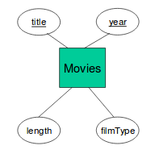

# From E/R diagrams to relations

## Terminology
- attributes are atomic (can only store one value)
- relation schema: relation name + attribute names + attribute types
- relation instance: set of tuples (all tuples must be unique)
- database schema: set of relation schemas (aka. a bunch of tables)
- database instance: a relation instance for every relation in the schema (aka. at least one table per described in the schema)

## ER to relations
- entity sets become relations with the same set of attributes
- many-many relations become relations whose attributes are only:
  - keys of the connected entity sets
  - attributes of the relationship itself (if any)
- many-one relationships usually don't need separate tables
  - the key of the "one" side is included as an attribute in the relation of the "many" side
- one-one relationships are similar to the many-one relationships
  - i guess it's just up to the judgement of the designer
- ternary (or higher) relationships need separate tables with keys of the participating entity sets
  - the key is the union of keys from the "many" sides
- weak entity sets must include attributes for its complete key as well as its own attributes
  - the double diamond is redundant and does not need to become a relation
- isa relations take the ER approach where every subclass has its own relation
  - subclasses take on inherited attributes (in addition to their own attributes)
  - do not need to do combinations of subclasses!

### Example

becomes Movies(**title**, **year**, length, filmtype)

Note: I'm using **bold** to denote keys because github markdown doesn't support underlines.

### Example: is-a
Movies (**title**, **year**, length, filmType) 
Cartoons (**title**, **year**, length, filmType)  
MurderMysteries (**title**, **year**, length, filmType, weapon) 
Voices (**title**, **year**, starName)

Note that we cannot merge Cartoons with Movies because we then loose information about which movies are cartoons.But, we don't need to have Cartoon-MurderMystery because if a movie is both, it will be found in both Cartoons and MuderMysteries.

Further, note that Cartoons has a schema that is a subset of the schema for the relation Voices. That is, information about Cartoons can be stored in what star voices in what cartoon (note that we get information about the movie too because the Star stars-in the movie).

However, with this approach, if there are any silen cartoons we will lose information on them.

### Comparison of OO and ER approaches
OO drawback | ER drawback | OO advantage | ER advantage
--- | --- | --- | ---
Too many tables! Need 2^n tables!! | Need to look in several relations to gather information about a single object | all properties of an object are kept together in one relation | allows us to find tuples from all classes in the hierachy in one relation

- What movies of 2009 were longer than 150 minutes?
  - this can be answered directly in the ER approach
  - in OO, we need to examine all the relations
- What weapons were used in cartoons of over 150 minutes in length?
  - in OO we just look in the Cartoon-MurderMysteries table
  - in ER it's more complicated
    - first find all movies over 150 mins
    - then look in Cartoons to see which one are cartoons
    - then look in MurderMysteries to find the weapon

## Null values to combine relations
- if we are allowed to use NULL in tuples, we can handle a hierarchy of classes with a single relation
  - anything that isn't a cartoon or murder mystery will have NULL for voices and weapon
  - applying this to the Movie hierarchy, we could technically create a single table whose schema is Movie (**title**, **year**, length, filmType, studioName, starName, voice, weapon)

This allows us to find all the information about an object in one relation. However, depending on the data, there could be too many NULLs, which could crash our program when we try to read values that aren't there.
