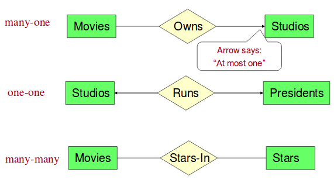
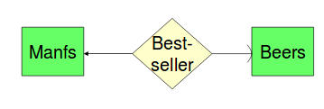
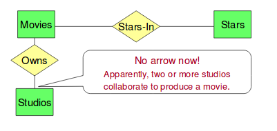
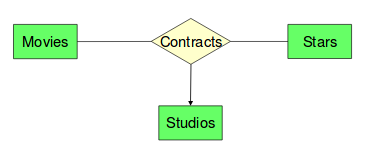
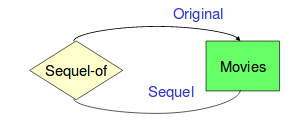
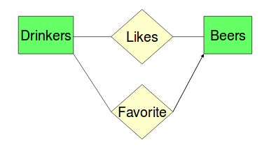
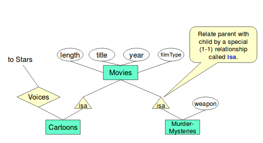
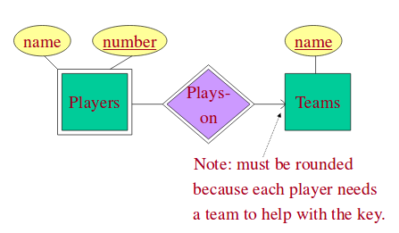

# Entity-Relationship Models

## Components
Component | Shape
---- | ---- 
Entity sets | rectangle
Attributes | oval
Relationships | diamond

## Multiplicity of Relationships
- many to one: ---<>-->
  - arrow says: "at most one"
  - eg. a movie is owned by at most one studio
- one to one: <----<>---->
- many to many: ----<>----
- there is also an "exactly one" arrow, which is slightly curved.

## Binary relationships
Sometimes binary relationship aren't enough. In a Movies-Studios-Stars relationship, a ternary relationship would be better. If only a binary relationship, then two or more studios could collaborte to produce only one movie. 

The solution is to use a ternary (three-way) relationship.

## Attributes
Attributes can extend off of entity sets or relationships. For example, the contracts relationship in the image above might have a "salary" attribute.

## Relationship roles
An entity set can appear more than once in a relationship. Each line to an entity set represents a different role.

## "Bars-Beers-Drinkers" example
Create an E/R diagram based off of the following descriptions:
- bars sell some beers
- drinkers like some beers
- drinkers frequent some bars

### BBD multiway relationship
Now suppose that drinkers will only drink certain beers at certain bars...

## Multiple relationships between entity sets
Two entity sets can have multiple relationships.

## Exercises
1. Design a database for a bank, including information about customers and their accounts. Information about a customer includers their name, address, phone, and SIN number. Accounts have numbers, types, and balances. We also need to record the customer(s) who own an account. Draw the E/R diagram for this database
  - modify your solution:
    - change your diagram so that accounts can have only one customer
    - customers can have a set of addresses and a set of phones
    - customers can have a set of addresses, and at each address there is a set of phones
2. Give an E/R diagram for a database recording information about teams, players, and their fans. For each time, its name, its players, its team captain (one of its players), and the colours of its uniform must be captured. Players have names. Fans have names, favourite teams, favourite players, and a favourite color.
  - Suppose we wish to add a relationship "led-by" among two players and a team. The intention is that this relationship set consists of triples (player1, player2, team) such that player1 played on the team at a time when some other player2 was the team captain.

## Keys
A key is a set of attributes such that no two entities are the same on all the attributes of the key
- in E/R, we underline the key attribute(s); there may be more than one

### Surrogate keys
Often, people introduce attributes whse role is to serve as a key for classes. Examples:
- employee ID
- SIN
- student ID
- driver's license number

## Entity sets vs attributes
In general, an entity set should fall into at least one of the following two categories:
  - it has at least one nonkey attribute
  - is is "many" in a relationship

This means: if there is at least one nonkey attribute, then the set should be an entity set. Ex: Manufacturers should be a set, not an attribute, because of the nonkey attribute "addr".

Alternatively, Beers should be an entity set because it is many in the many-one relationship "ManufacturedBy"

## Subclasses
- is-a relationship denoted with a triangle.
- also known as inheritance

Example: Roger Rabbit is a catoon and a murder-mystery. Thus, it will have components in all three entity sets.
- it will have length, title, year, and filmType from Movies
- weapon from Muder-Mysteries
- voices from Cartoons

### Keys for subclasses
Subclasses take the key of the root. Thus, there is only one key for Roger Rabbit, and that is the title and year (key of Movies)

## Weak entity sets
An entity set E is said to be week if we need to follow one or more **many-one** relationships from E to find the key for E
- the key for E spans one or more **many-one** relationships
  - this mean, yes, one arrow must be rounded (exactly one)
- the relationship will get a "double diamond"
- the weak entity set will also be double-outlined

### Example
- name could be a key for football players, but what if there are two football players with the same name?
- number can't be the key because different teams all use the same numbers
- but together: team name and number should make a good team

