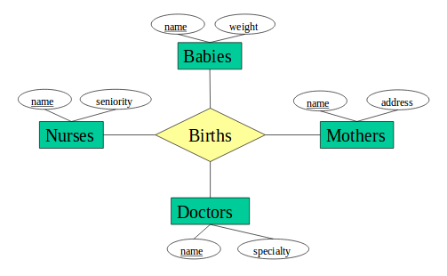
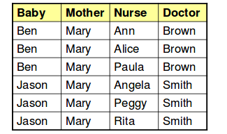
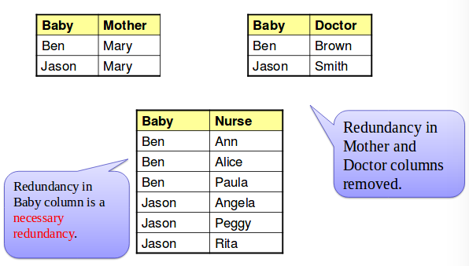
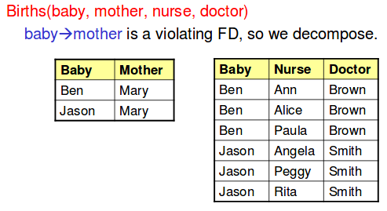
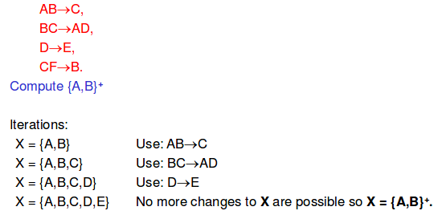
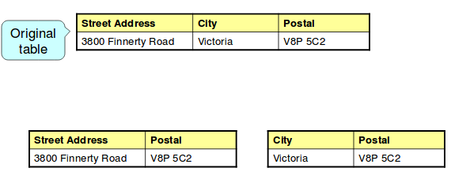
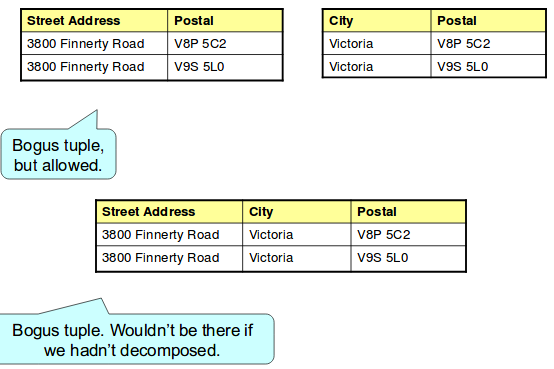

# Functional dependencies

Consider the following Babies schema.



The following is the Births table:
```
Births(baby, mother, nurse, doctor)
```

Some facts and assumptions:
1. for every baby, there is a unique (1) mother
2. for every existing combination of a baby and a mother, there is a unique (1) doctor
3. there can be many nurses assisting in a birth

## Redundancy
Information may be repeated unnecessarily in several tuples.



### A fix


## Functional dependencies
Convention
- X, Y, Z represent sets of attributes; A, B, C represent single attributes
- will write just ABC rather than {A, B, C}
- X -> A for a relation R says that
  - whenever two tuples of R agree on all the attributes of X, then they must also agree on attribute A
  - or, given we know the attributes X, then we know what A is (A can be only one thing)

Examples:
- baby -> mother
- baby mother -> doctor

Another example:
```
Drinkers (name, addr, beersLiked, manf, favBeer)
```

Reasonable FD's to assert:
1. name -> addr
2. name -> favBeer
3. beersLiked -> manf

### Functional dependencies with multiple attributes
- no need for FD's with more than one attribute on the right
  - but convenient in order to combine FD's as a shorthand
  - eg. name -> addr and name -> favBeer become name-> addr favBeer
- more than one attribute on the left may be essential 

## Keys of relations
- K is a superkey for relation R is K functionally determines all of R's attributes
- K is a key for R if
  - K is a superkey,
  - but no proper subset of K is a superkey

Example:
- Attributes {name, beersLiked} form a key for the previous Drinkers relation. Why? Because neither name nor beersLiked are a superkey.

## Trivial dependencies
- a functional dependency A1A2..An-> B is said to be trivial if B is one of the A's
- for example: bar beer -> beer is a trivial dependency

## Boyce-Codd Normal Form
- BCNF: simple condition under which the anomalies can be guaranteed not to exist
- a relation R is in BCNF is:
  - whenever there is a nontrivial dependency
  - A1..An -> B1..Bm for R
  - A1..An must be a superkey!
  - tldr: left side must be a superkey.

### Decomposition into BCNF
- replace FDs that violate BCNF by putting all the attributes in the FD in a table
- and all the left side + all other attributes not in the FD in another table
- by repeatedly choosing suitable decompositions, we can break any relation schema into a collection of smaller schemas in BCNF



## Closures
- starting with the given set of attributes, repeatedly expand the set by adding the right sides of FD's as soon as we have included thir left sides
- eventually, we cannot expand the set any more, and the resulting set is the closure



{A, B}+ = {A, B, C, D, E}

This is called "baby functionally determines doctor". If an attribute or set of attributes functionally determine ALL attributes, they the original set of attributes is a superkey.


## Recovering info from a decomposition
- projections of the original tuples can be joined again to produce all and only the original tuples
- we join back up on the original left hand attribute(s) we split on
  - ie. when these agree across tables, we merge them "natural join!"
- question: do we also get back false tuples?
  - the answer is no.
  - however, if there are any functional dependencies that are not adhered to (either before or after split), then we could end up with false tuples

## Third Noraml Form
- there is one structure of FD's that causes trouble when we decompose
- AB -> C and C-> B

Example:
- A = street address
- B = city
- C = postal code
- there are two keys, AB and AC
- C -> B is  BCNF violation, so we might think to decompose into AC, BC



The problem now is that we cannot enforce FDs once the relations are decomposed.
  - in particular, we can't enforce `street city -> postal`



## 3nf lets us avoid this problem
- 3rd normal form modifies the BCNF condition so we do not have to decompose in this problem situation
- an attribute is **prime** if it's a member of some key
- X -> A violates 3NF if and only if X is not a superkey, and A is not prime

Example
- in our problem situation with FDs
  - AB -> C
  - C -> B
  - and keys AB and AC
  - thus, A B and C are each prime
  - so although C - > B violates BCNF, it does not violate 3NF

## Other normal forms
- first normal form requires that the attributes of a relation be atomic
- second normal form is less restrictive than 3NF and BCNF
  - a realtion is in 2NF if it is in 1NF and every non key attribute is fully functionally dependent on the primary key (not just a part of it)
