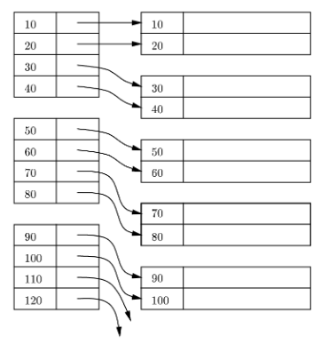
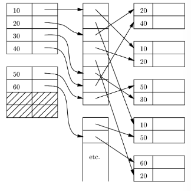

# Indexes

## Create index
```sql
CREATE INDEX indedx_name ON table_name(column_name)
```
- these indexes are created automatically if you declare the column to be a primary key

## Primary indexes
Primary indexes are indexes on a sorted file for the sorting attribute. They can be both Dense and Sparse

### Dense indexes
- key pointer pairs for **every** record
  - can make sense because records may be much bigger than key-pointer pairs
  - index can fit in memory, even if data file does not
  - faster search through index than data file
- lookup:
  - find key K in the index
  - simply follow the pointer to get to the memory address location



### Sparse indexes
- key pointer pairs for the first record of each block
  - this saves index space
- lookup: find largest key <= K in sparse index
  - follow pointer

Dense vs sparse indexes:
- the dense index can answer "Is there a record with key K?"
- the sparse index cannot! it needs to examine a block

## Example of dense index
Say we have a data file with 10 million tuples, with 100 tuples per block of 16K.
- There are 100 000 blocks in total, so this means our file is 1.6GB
- Index file: for typical values of key = 20 bytes, and pointer = 20 bytes, we can fit 16 384/(20+20) =~ 400 (key, pointer) pairs in a block
- thus, we need about 25 000 blocks = 400 MB for the index file. (this could fit into the available main memory)

### Example of a sparse index
Say we have the same data file and block sizes as before
- there is only one (key, pointer) record for the first record of every block
- Index file: 100 000 (key, pointer) pairs = 100 000 x (20+20) bytes = 4 000 000 bytes = 4 MB
- index file easily fits in main memory
  - 1 disk I/O needed to find record given the key

## Cost of Lookup
- since indexes are sorted, we can do binary search
- this takes log2(number of index blocks) I/Os to find the desired record
- all binary searches will start at the block in the middle, then at the 1/4 and 3/4 points, etc
  - if we store some of these blocks in main memory, the I/O count will be significantly lower

## Secondary indexes
A primary index is an index on a sorted file. Such an index controls the placement of records to be "primary".

A secondary index is an index that does not control placement. Note that sparse secondary indexes make no sense.

## Indirect buckets
To avoid repeating keys in an index, use a level of indirection, called buckets.



## BTrees
- deletions and insertions are problematic for flat indexes
- eventually, we need to reorganize entries and records
  - this is where BTrees come int!

### Insertion
- we try to find a plae for the new key in the appropriate leaf, and we put it there if there is room
- if there is no room in the proper leaf, we split the leaf into two and divide the keys between the two new nodes, so each is half full or just over half full
  - split meaning add a new block"
- the splitting of nodes at one level appears to the level above as if a new key-pointer pair needs to be inserted at that higher level
  - we may thus apply this strategy to insert at the next level
  - if there is room, insert it; if not, split the parent node and continue up the tree
- as an exception / base case, if we try to insert into the root and there is no room, then we split the root intwo two nodes and create a new root at the next higher level
  - the new root has two nodes resulting from the split as its children

## Deletion
- if, after deleting our value, the node where the value was is less than half full, it will borrow keys from its left sibling
  - don't forget to also update the parent key too!
- if there are not enough siblings with keys to borrow, we will merge the node and the node to the left
- the parent node will then borrow a pointer from its sibling to the right

## Structure of B-trees with real blocks
- degree *n* means that all nodes have space for *n* search keys and *n+1* pointers
  - node = block

Let
- block size = 16 384 bytes
- key = 20 bytes
- pointer = 20 bytes

Solve for n:

20n + 20(n+1) <= 16384<br/>
-> n <= 409

so n=409. However, a typical node has 300 keys. At level 3, we ave:
- 300^2 nodes, which means 300^3 =~ 27 000 000 records can be indexed
- suppose record = 1024 bytes -> we can index a file of size 27 GB
- if the root is kept in main memory, accessing a record requires only 3 disk I/Os
