# Query Evaluation

## An SQL query and it's relational algebra equivalent

<span style="color:red">Employees</span>(sin INT, ename VARCHAR(20), rating INT, address VARCHAR(90))<br/>
<span style="color:red">Maintenances</span>(sin INT, planeId INT, day DATE, desc CHAR(120))

```sql
SELECT ename
FROM Employees NATURAL JOIN Maintenances
WHERE planeId = 100 AND rating > 5;
```

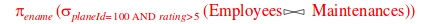

- RA expressions can be and are represented by an expression tree
- an algorithm is chosen for each node in the expression tree

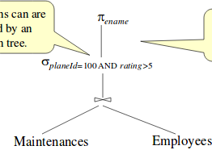

## Query optimizaion
- SQL queries are translated into RA
- query evaluation plans are represented as trees of relational operators
  - with labels identifying the algorithm to use at each node
- initial trees can be transformed to "better" trees
  - this process of finding good evaluation plans is called query optimization

## Clustering / non-clustering indexes
- <span style="color:red">clustering index (or clustered):</span> tuples are stored in the same order as the key-value pairs in the index
  - same as "primary"
  - typically B-Tree with records in the leaves
- <span style="color:red">non-clustering index (or non-clustered):</span> tuples are stored randomly, not controlled by the index
  - same as "secondary"
  - typically B-Tree with key-pointers in the leaves (not the records themselves)

## Airline example
- Assume for Maintenances that
  - a tuple is 160 bytes
  - a block can hold 100 tuples (16K block)
  - we have 1000 blocks of such tuples
- Assume for employees
  - a tuple is 130 bytes
  - a block can hold 120 tuples
  - we have 50 blocks of such tuples

## Algorithms for selection
Suppose we want to select some relationship attribute, R.attr, when it is equal to some value.

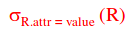

- if no index is on R.attr, just scan R
  - on average, R occupies half the number of blocks allocated to it
    - eg. if R is maintenances, there will need to be 1000/2 block reads (I/Os)
- if there is an index on R.attr, use the index
  - typically this will take 3 disk accesses
  - assumes non-clustering B-Tree with 3 levels and the root in main memory

Now suppose that we want to select an attribute when it is less than or greater than some value.

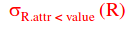

- if we have a non-clustering index, we may still want to scan the table instead of using the index
- however, if it is a clustering index, we will use it

## Algorithms for projection
- given a projection, we have to scan the relation and drop certain attributes of each tuple

## Algorithms for joins
- joins are both expensive but also common
- condsider the natural join of Maintenances and Employees
- Suppose Employees has an unclustered index (B-Tree) on the SIN column

Index nester loops join:
- scan Maintenances and for each tuple proble Employees for matching tuples (using the index on Employees.SIN)
- analysis:
  - for each of the 100 000 maintenance tuples, we try to access the corresponding employee with 3 I/0s (via the index)\
  - that means 100 000 * 3 = 300 000 I/Os!

Sort-merge join
- sort both tables on the join column, then scan them to find matches
- sort Maintenances and Employees with 2PMMS
  - cost for sorting is 2 * 2 * 1000 = 4000 I/0s for Maintenances
  - and 2 * 2  50 = 200 I/Os for Employees
- then we merge join
  - this requires an additional scan of both tables
  - so that is 1000 + 50 = 1050 I/Os
- thus our total cost is 4000 + 200 + 1050 = 5250 I/Os

Why even bother with index nested loops join?
- it has the nice property that it is incremental
  - the cost of our example join is incremental in the number of Maintenances tuples that we process
- If some additional selection in the query allows us to consider only a small subset of Maintenances tuples, we can avoid computing the full join of Maintenances and Employees
  - suppose we only want the result of the join for plane 100 on March 8, 2017, and there are 2 such maintenances
  - for each of these two tuples, we probe Employees and then we are done
  - this is 2 x 3 = 6 I/Os.

## Optimization
- observe the choice of index nested loops join is based on considering the query as a whole, including the selection on Maintenances, rather than just the join operation by itself
- tldr: sometimes you gotta look at the whole query first before you know what algorithm you should pick for each part
- this leads us to the next topic, query optimization, which is the process of finding a good plan for the entire query

### Query evaluation plans
- a query evaluation plan consists of an RA tree, with indications at each node for the method / algorithm to use

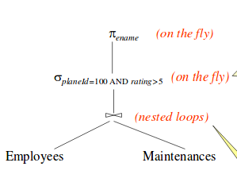

- Sometimes it might be possible to *pipeline* the result of one operator to another operator without creating a temporary table for the intermediate result
  - this saves in cost
- when the input to a unary operator (sigma or pi) is pipelined, we say the operator is applied **on-the-fly**

### Alternative query evaluation plans
- let's look at two (naive) plans

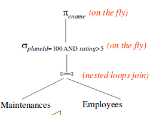

The cost for this plan is:
- 300 000 I/Os for the join
  - the select and project are done on the fly, so no I/O cost for them

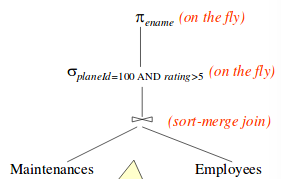

The cost for this plan is:
- 5250 IOs for the join
- sigma and pi are again done "on the fly" so no IO cost for them

Note that we do not consider the cost of writing the final result, since it is the same for any plan.

### Plan: pushing selections
- a good heuristic for joins is to make the size of the tables to be joined as small as possible before we join them
- one approach is to apply selections early 
  - ie. 'push' the selection ahead of the join

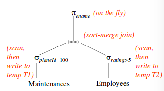

Let's walk through this together.
- the cost of applying SELECT planeId=100 to Maintenances is:
  - we must scan Maintenances (1000 blocks)
  - we must write result to temporary table T1
  - to estimate the size of T1, we can reason as follows:
    - if we know that there are 100 planes, we can assume that maintenances are spread out equally across all planes
    - thus, we estimate there to be 10 blocks for plane 100 (1000/100 = 10)
  - total: 1000 + 10 IOs = 1010 IOs
    - this accounts for scanning all tuples, then writing 10
- the cost of applying rating > 5 to Employees is:
  - we scan Employees (50 blocks)
  - then write out result to temporary table T2
  - if we assume that ratings are uniformly distributed over the range 1 to 10, we can approximate the size of T2 as 25 blocks
    - ie. half will be rated > 5
  - total: 50 + 25 = 75 IOs
- for the sort-merge join of T1 and T2, we must first sort them, then join them
  - 2PMMS for each one:
    - 2 * 2 * 10 = 40 IOs for T1
    - 2 * 2 * 25 = 100 IOs for T2
  - then to join them, we must scan each one
    - 10 + 25 = 25 IOs
  - total: 100 + 40 + 25 = 165 IOs
- the final projection is done on the fly, and we ignore the cost of writing out the final result
- total: (1010 + 75 + 165) = 1260 IOs

Further refinements
- you could go one step further and push projections similarly
- observe that only the SIN attribute of T1 and the SIN and ename attributes of T2 are really required
- when we scan Maintenances and Employees to do the selections, we could also eliminate unwanted columns
  - this on-the-fly projection reduces the sizes of the temporary tables T1 and T2
  - the reduction in the size of T1 is especially notable because only an integer field is retained
  - in face, now T1 fits within 3 blocks (which could all be helf in main memory), so we can perform a block nested loops join with a single scan of T2

### Plan using Indexes

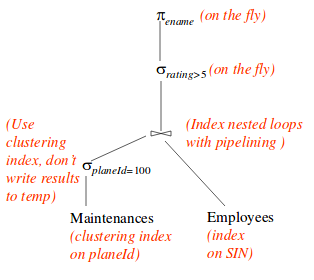

- suppose we have a clustering B-Tree index on the planeId field of Maintenances and another, non-clustering B-Tree index on the SIN field of Employees
- we will use the plan in the figure

The plan:
- assume that there are 100 plans and assume that the maintenances are spread out uniformly across all planes
  - we can estimate the number of selected tuples to be 100 000/100 = 1000
  - since the index of planeId is clustering, these 1000 tuples appear consecturively and therefore the cost is:
    - 10 block IOs + 2 IOs (the 2 IOs are for finding the first block via the index)
- for each selected tuple, we retrieve matching employees tuples using the index on the SIN field
  - the join field SIN is a key for Employees
    - therefore, at most one Employees tuple matches a given Maintenances tuple
    - the cost of retrieving this matching tuple is 3 IOs
    - so, for the 1000 Maintenances tuples, we get 3000 IOs
  - for each tuple in the result of the join, we perform the selection rating > 5 and the projection of ename on the fly
- total: 3000 + 12 = 3012 IOs

Why didn't we push the selection rating>5 ahead of the join? Here's what would happen if we did.

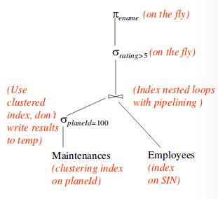

Had we performed the selection before the join, the selection would involve scanning Employees (since no index is available on the rating field of Employees).

Also, once we apply such a selection, we have no index on the SIN field of the result of the selection.

Thus, pushing selections ahead of joins is a good heuristic, but not always the best strategy.
- typically, the existence of useful indexes is the reason a selection is **not** pushed

Suppose that we had a clustering index on Employees.SIN. What would happen then? Well, check out this plan.

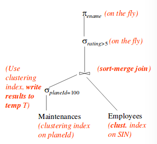

- the size of T would be the number of blocks for the 1000 Maintenances tuples that have planeId = 100
  - ie. T is 10 blocks
- the cost of selecting planeId=100 as before is 12 IOs to retrievve, plus an additional 10 IOs to write T
- then, we sort T on the SIN attribute using 2PMMS. this is 40 IOs
- Employees is already sorted since it has a clustering index on SIN
- the merge phase of the join needs to scan both T and Employees. So, 10 + 50 = 60 IOs
- total: (12+10) + 40 + 60  = 122 IOs

(This improved plan also demonstrates that pipelining is not always the best strategy)
