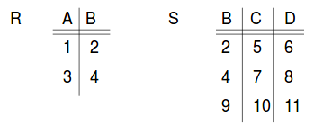
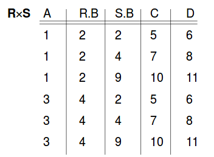
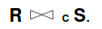
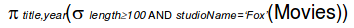
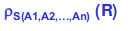

# Relational Algebra

## Operations
- Set operations
  - union
  - intersection
  - difference
- Operations that selects parts of a relation
  - selection
  - projection
- Operations that combine the tuples of two relations
  - cartesian product
    - pairs tuples of two relations in ALL possible ways
  - join
    - selectively pairs tuples from two relations
- Renaming

## Conditions for set operations on relations
We can apply union, intersection, and difference on relations R and S provided that:
1. R and S must have schemas with identical sets of attributes
2. Before applying the operations, the columns of R and S must be ordered so that the order of attributes is the same for both relations.

## Projection
 (<-- that's supposed to be a pi) title, year, length (Movies) will select title, year, and length from the relation Movies

## Selection
 (<-- that's supposed to be a sigma) length>=100 (Movies) will grab all the Movies whose length is greater than 100. It will automatically return all attributes (default is SELECT *)

## Cartesian product






## Joins

### Theta-Join



The result is constructed as follows:
- take the cartesian product of R and S
- select only the tuples that satisfy the condition C

When the condition is equality, we call this "equijoin"

### Natural Join
This is a special case of equijoin when attribute we want to use in the join have the same name in both tables


Tuples that have no match are discarded.

## Combining operations to form queries
What are the title and years of movies made by Fox that are at least 100 minutes long?



```sql
SELECT title, year
FROM Movies
WHERE length>= 100 AND studioName='Fox';
```

### Another example
Find the stars of the movies that are at least 100 minutes long.

- first, join the two relations Movies and StarsIn
- next, select the movies that with length at least 100 minutes
- project onto starName

## Renaming operator
psi (re)name of relation( attributes ) (original relation R)




## Last problem
Product (maker, model, type)<br/>
PC (model, speed, ram, hd, rd, price)<br/>
Laptop (model, speed, ram, hd, screen, price)<br/>
Printer (model, colour, type, price)

1. Which PC models have a speed of at least 1000?
2. Which manufacturers make laptops with a hard disk of at least 30?
3. Find the model number and price of all products of any type made by manufacturer B
4. Find the model numbers of all colour laser printers
5. Find those manufacturers that sell Laptops, but not PCs
6. !Find those hard-disk sizes that occur in two or more PCs
7. !Find those pairs of PC models that have both the same speed and RAM. A pair should be listed once
8. !!Find those manufacturers of at least two different computers (PC or Laptops) with speed of at least 700.
