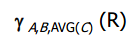

# Extended operators of relational algebra

## Bags
A bag is like a set, but an element may appear more than once (bags are also called "multisets")
- {1,2,1,3} is a bag
- {1,2,3} is both a bag and a set
- order of elements in a bag is unimportant
- SQL is actually a bag language
- SQL will eliminate duplicates, but usually only if you ask it to do so explicitly
  - union, intersection and difference the defaul is "set mode"

### Bag union
{1,2,1} U {1,1,2,3,1} = {1,1,1,1,1,2,2,3}

### Bag intersection
{1,2,1} n {1,2,3} = {1,2}

### Bag difference
{1,2,1} - {1,2,3} = {1}
- an element appears in difference A-B of bags as many times as it appears in A - number of times it appears in B
- but never negative number of times

### Examples of Union, Intersection, and Difference in SQL
```sql
(SELECT * FROM R)
  UNION
(SELECT * FROM S);

(SELECT * FROM R)
  INTERSECT
(SELECT * FROM S);

(SELECT * FROM R)
  EXCEPT          -- MINUS in Oracle
(SELECT * FROM S)
```

You can add the keyword `all` for a bag version of these operators. Only `UNION ALL` exists in Oracle

## Extended algebra


1. delta eliminates duplicates from bags (akin to `DISTINCT`)
2. tau sorts tuples (akin to `ORDER BY`)
3. gamma does grouping/aggregation (akin to `GROUP BY`)

Usage:
1. delta(Relation)
2. tau {sorting attribute(s)} (Relation)
3. extended projection: pi {A+B->C} (R)
4. aggregations (SUM, AVG, COUNT, MIN, and MAX)
  - gamma {list of grouping/aggregation attributes} (R)



First, we group R by A and B, then we write the average of those groups.

### An example
For each star who has appeared in at least three movies, give the earliest year in which he or she appeared

### Another example
Product (maker, model, type)<br/>
PC (model, speed, ram, hd, rd, price)<br/>
Laptop (model, speed, ram, hd, screen, price)<br/>
Printer (model, color, type, price)<br/>

1. Find the manufacturers who sell exactly three different models of PCs.
2. Find those manufacturers of at least two different computers (PC or laptops) with speed of at least 700.

## Outerjoin
When we natural join R and S, there may be tuples which have no match. These tuples are dropped by the natural join. However, we may want to keep these tuples by padding them will a NULL symbol in the result.

To keep all tuples, we use a `FULL OUTER JOIN`

To keep only dangling tuples from the left table, we use a `LEFT OUTER JOIN`

To pad only dangling tuples from the right table, we use a `RIGHT OUTER JOIN`.

Symbols:


