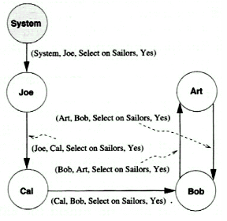
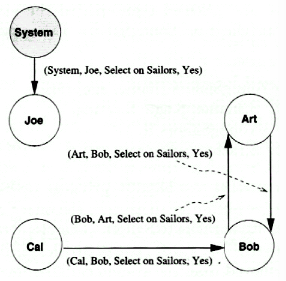

# Security and Authorization

## Introduction to database security
- secrecy
  - users shouldn't be able to see things they are not supposed to
  - eg. any student should only be able to see their own grades
- integrity
  - users shouldn't be able to modify things they are not supposed to
  - eg. only instructors can assign grades
  - furthermore, only the instructor who is currently teaching the course should be able to assign grades
- availability
  - users should be able to see and modify things they are allowed to

## Access Controls
There are two types of access controls:
  - discretionary access control (DAC)
  - mandatory access control (MAC)

### Descretionary access control
- based on the concept of privileges for objects (tables and views)
  - you can grant and revoke privileges
- creator of an object automatically gets all privileges on it
- DBMS keeps track of who has which privileges

#### Grant command
Usage: `GRANT prvileges ON object TO users [WITH GRANT OPTION]`

Privileges can be:
  - `SELECT`: can read all columns, including those added later via the `ALTER TABLE` command
  - `INSERT(column-name)`: can insert tuples with **non-null** or **non-default** values into <column-name> (could be multiple columns)
  - `INSERT`: same as `INSERT(column-name)` but applicable to all columns
  - `DELETE`: can delete tuples
  - `REFERENCES(column-name)` can define foreign keys (in other tables) that refer to <column-name>

If you would like recipients to be able to pass the privilege(s) to others, you can add `WITH GRANT OPTION`

#### Grant examples

Joe has created the following tables:
  - Sailors(sid, sname, rating, age)
  - Boats(bid, bname, color)
  - Reserves(sid, bid, day)

Joe now grants privileges to Yuppy:
```sql
GRANT INSERT, DELETE ON Reserves TO Yuppy WITH GRANT OPTION;
```

Yuppy can now insert or delete the rows in `Reserves` and can authorize other people to do the same.

Joe further executes:
```sql
GRANT SELECT ON Reserves TO Michael;
GRANT SELECT ON Sailors TO Michael WITH GRANT OPTION;
```

Michael can now create a view:
```sql
CREATE VIEW ActiveSailors(name, age, day) AS
  SELECT S.sname, S.age, R.day
  FROM Sailors S, Reserves R
  WHERE S.sid = R.sid AND S.rating > 6;
```

However, Michael cannot grant SELECT on ActiveSailors to others. Why? Because it uses Reserves.

On the other hand, if Michael executes:
```sql
CREATE VIEW YoungSailors (sid, age, rating) AS
  SELECT S.sid, S.age, S.rating
  FROM Sailors S
  WHERE S.age < 18;


GRANT SELECT ON YoungSailors TO Eric, Guppy;
```

then Eric and Guppy can now execute SELECT queries on YoungSailors. However, they cannot directly select anything on the underlying Sailor table.


So now Jor executes:
```sql
GRANT UPDATE (rating) ON Sailors TO Leah;
```

Leah can now update ONLY the `rating` column of `Sailors`. Forexample, she can execute:
```sql
-- Can execute this;
UPDATE Sailors
SET rating = 8;

-- Leah cannot execute this;
UPDATE Sailors
SET age = 25;

-- She also can't do this;
UPDATE Sailors
SET rating = rating-1;  -- this requires her to "read" the rating
-- column so she can use it, but she doesn't have SELECT privilege.
```

So now Joe executes:
```sql
GRANT SELECT, REFERENCES (bid) ON Boats TO Bill;
```

Bill can now refer to the `bid` column of `Boats` as a foreign key in his own tables. For example, he can do:

```sql
CREATE TABLE BillTable(
  bid INTEGER,
  ...
  FOREIGN KEY (bid) REFERENCES Boats
);
```

You might argue that instead of having a special REFERENCES privilege, why not just extend the `SELECT` privilege to include referencing foreign keys?

This is because now JOe is restricted in what he can do with the tuples in his own table.
  - for example, Joe now cannot delete a tuple in `Boats` which is referenced by a tuple in `BillTable`
  - the `REFERENCES` privilege goes beyond the simple `SELECT` privilege as Bill can now contrain Joe with respect to Bill's table.

### Role-based authorization
- privileges can also be assigned to roles
- roles can then be grandted to users and to other roles
- roles reflect how real organizations work

Examples:
```sql
CREATE ROLE some_role;

GRANT SELECT ON Reserves TO some_role;
GRANT INSERT ON Sailors TO some_role;
GRANT UPDATE ON Boats TO some_role;

GRANT some_role TO Michael;
GRANT some_role TO Bill;
```

### Revoking privileges
Usage: `REVOKE [GRANT OPTION FOR] privileges ON object FROM users {RESTRICT | CASCADE}`

Suppose Joe is the creator of Sailors. He executes:
```sql
GRANT SELECT ON Sailors TO Art WITH GRANT OPTION;
```

Art executes:
```sql
GRANT SELECT ON Sailors TO Bob WITH GRANT OPTION;
```

Now Joe revokes privileges from Art:
```sql
REVOKE SELECT ON Sailors FROM Art CASCADE
```

The following will happen:
- Art loses SELECT privilege on Sailors
- Bob loses this privilege as well, as he received it from Art and only Art
  - Bob's privilege is said to be **abandoned**

If CASCADE is specified, all abandoned privileges are also revoked possibly causing privileges held by other users to become abandoned and thereby revoked recursively. If RESTRICT is specified, the command is rejected if revoking privileges causes other privileges to become abandoned.

#### Revoke examples
Consider the following scenariw Joe revokes privileges from Art:
```sql
REVOKE SELECT ON Sailors FROM Art CASCADE
```

The following will happen:
- Art loses SELECT privilege on Sailors
- Bob loses this privilege as well, as he received it from Art and only Art
  - Bob's privilege is said to be **abandoned**

If CASCADE is specified, all abandoned privileges are also revoked possibly causing privileges held by other users to become abandoned and thereby revoked recursively. If RESTRICT is specified, the command is rejected if revoking privileges causes other privileges to become abandoned.

#### Revoke examples
Consider the following scenario:
1. Joe grants SELECT privileges to Art with grant option
2. Joe grants select privileges to Bob with grant option
3. Art also grants select privileges to Bob with grant option
4. Joe revokes select prvileges from Art (with cascade)

Note here that Art will lose his select prviliege (as we would expect). But Bob will not, even those he received his privilege from Art, because he also received it directly from Joe.

Here's another example:l
1. Joe grants the SELECT privilege to Art twice (by accident)
2. Joe then revokes Art's privilege.

Will Art still keep the privilege because he was granted it twice? No. That is silly. Of course, his privilege is revoked.

### Privilege descriptors

When a GRANT is executed, a privilege descriptor is added to a descriptors table.

The privilege descriptor specifies the:
- grantor
- grantee
- type of privilege
- grant option included?

### Authorization Graphs
Consider the following scenario.

1. Joe `GRANT SELECT ON Sailors TO Art WGO`
2. Art grants select to Bob WGO
3. Bob grants select to Art WGO
4. Joe grants select to Cal WGO
5. Cal grants select to Bob WGO

This inspires the following authorization graph:


Now Joe: `REVOKE SELECT ON Sailors FROM Art CASCADE;`

The graph now looks like this:


And now Joe revokes privileges from Cal (with Cascade). The graph now looks like:



### Grant and Revoke on views
You are also able to grant and revoke privileges for views. Suppose that
- Joe, the creator of table Sailors, gave Michael SELECT privilege on the table with grant option.
- Michael created view YoungSailors and gave Eric SELECT privilege on it
- Eric created the view FineYoungSailors as such:

```sql
CREATE VIEW FineYoungSailors (name, age, rating) AS
  SELECT S.sname, S.age, S.rating
  FROM YoungSailors S
  WHERE S.rating > 6;
```

What happens if Joe revokes the SELECT privilege on Sailors from Michael?
- Michael will no longer have the authority to execute the query used to define YoungSailors because the definition referred to Sailors
- Thus, YoungSailors view is dropped
- In turn, FineYoungSailors is also dropped similarly

### Revoking references privilege
Recall the scenario where Joe executed:
```sql
GRANT REFERENCES (bid) ON Boats TO Bill;
```

And Bill used that reference to the bid column of Boats as a foreign key in his own table:
```sql
CREATE TABLE BillTable (
  bid INTEGER,
  ...
  FOREIGN KEY (bid) REFERENCES Boats
);
```

Now if Joe revokes the REFERENCES privilege from Bill, then the Foreign Key constraint referencing the Boat table will be dropped from Bill's table. Aka: BillTable will no longer have the foreign key constraint.

### Problems with DAC
The most notable problem is the Trojan horse problem. Consider the following scenario:
1. Dick creates table Horsie and gives INSERT privilege to Justin (who isn't aware that he now has this privilege)
2. Dick hacks into one of Justin's software applications and makes it so that it will write secret data of Justin's to the table Horsie
3. Dick can now see the secret info

## Mandatory access control
- based on system-wide policies that cannot be changed by individual users
- each DB object is assigned a security class
- each subject (user or user program is assigned a clearance for a security class

### Bell-LaPadula Model
- Objects (eg. tables, views)
- Subjects (eg. users, user programs)
- Security classes:
  - Top secret (TS), secret (S), confidential (C), unclassified (U)
  - TS > S > C > U
- Simple security property: Subject S can read object O only if class(S)>=class(O)
- *-Property: Subject S can write object O only if class(S)<=class(O)


The idea is to ensure that information can never flow from a higher to a lower security level. Example:
- Dick has security class C
- Dick's table, Horsie, has Dick's clearance, C, as well
- Justin has class S
- Justin's secret table has class S
- Justin's application has class S
- thus, the application cannot write into table Horsie since it has a higher clearance than the table

## Statistical Databases
Statistical databases contain information about individuals, but allow only aggregate queries (eg. average age, rather than "Joe's age"). However, it may be possible to **infer** some secret information!

Example
- Suppose sneaky Pete wants to know the rating of the Admiral.
  - Pete knows that Admiral is the oldest sailor in the club.
  - Pete repeatedly queries "How many sailors are older than age X" for various values of X, until the answer is 1
  - Now Pete knows the cutoff for Admiral's age
  - Then Pete can ask "what is the average rating of all sailors whose age is greater or equal to X", which is effectively Admiral's rating


