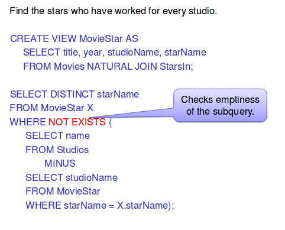
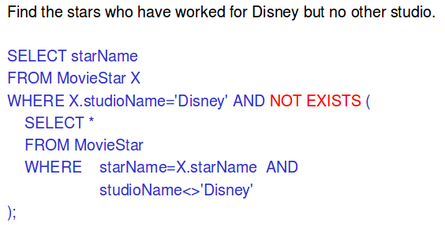
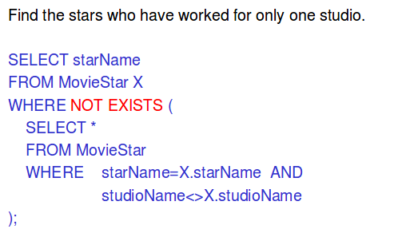
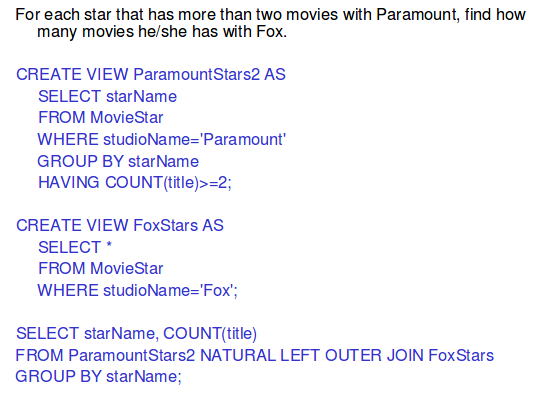
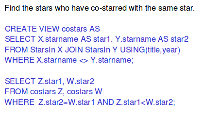
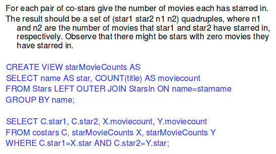

# SQL (2)

## Select-From-Where statements
```sql
SELECT desired attributes
FROM one or more tables
WHERE condition about tuples of the tables

SELECT title AS name, length/60.0 AS length, 'hrs.' AS inHours
FROM Movies
WHERE studioName = 'Disney';
```

### Boolean operators
```sql
AND
OR 
NOT
```

Order of precedence:
1. NOT
2. AND
3. OR

### Patterns
```sql
LIKE -- <Attribute> LIKE <pattern>
NOT LIKE -- <Attribute> NOT LIKE <pattern>
% -- "any string"
_ -- "any character"
```

Example: suppose we remember a movie called "Princess _something_"
```sql
SELECT title
FROM Movies
WHERE lower(title) LIKE '%princess%'; -- lower means toLowerCase
```

### Order by
- ordering is ascending unless you specify the DESC keyword after an attribute


### Product and joins
Example: we want to know the website of the studio of Pretty Woman

```sql
SELECT website
FROM Movies, Studios
WHERE title = 'Pretty Woman' AND studioName = name;
```
Using `FROM rel, rel2` creates the Cartesian product of the relations.

Example 2: we want to know the stars of Paramount movies

```sql
SELECT Stars.name, Stars.birthdate, Stars.birthplace
FROM Movies, Stars, StarsIn
WHERE studio        = 'Paramount'    AND
  StarsIn.title     = Movies.title   AND
  StarsIn.year      = Movies.year    AND
  StarsIn.starName  = Stars.name;
```

This could be done in a much more readable way 

## Natural join with USING
```sql
SELECT *
FROM Movies JOIN StarsIn USING (title, year);
```

### Join with ON
```sql
SELECT *
FROM Movies JOIN StarsIn ON Movies.title=StarsIn.title
  AND Movies.year=StarsIn.year;

-- identical to
SELECT * 
FROM Movies, StarsIn
WHERE Movies.title=StarsIn.title  AND
  Movies.year=StarsIn.year;
```

### Outer joins
```sql
SELECT *
FROM Movies NATURAL FULL OUTER JOIN StarsIn;

SELECT *
FROM Movies NATURAL LEFT OUTER JOIN StarsIn;

SELECT *
FROM Movies NATURAL RIGHT OUTER JOIN StarsIn;
```

- LEFT: pad dangling tuples of Movies only
- RIGHT: pad dangling tuples of StarsIn only
- FULL: pad both

Be wary that you can get unexpected NULL values when using outer joins. In the students example, stdid is NULL because we are grabbing it from the Fexam table, but the student did not write the final exam. We should project both Fexam.stdid and Assig.stdid to make sure we always have the student id.

## Aliases
We can rename tables and attributes on the fly.

Example: Find pairs of stars who have played together in the same movie.

```sql
SELECT S1.starname, S2.starname
FROM StarsIn S1, StarsIn S2
WHERE S1.title = S2.title AND S1.year = S2.year AND
  S1.starname < S2.starname;
```

## Aggregations
SUM, AVG, COUNT, MIN, and MAX can be applied to one column

```sql
SELECT AVG(length)
FROM Movies
WHERE studioName = 'Disney';
```

### Eliminating duplicates in an aggregation
Put `DISTINCT` _inside_ an aggregation.

```sql
SELECT COUNT(DISTINCT studioName)
FROM Movies;

-- average of only the distinct values for length
SELECT AVG(DISTINCT length)
FROM Movies
WHERE studioName = 'Disney';

-- here, distinct is useless
SELECT DISTINCT COUNT(studioName)
FROM Movies;
```

### Grouping
- group according to the listed attributes in GROUP BY
- any aggregation is applied only within each group

```sql
SELECT studioName, AVG(length)
FROM Movies
GROUP BY studioName;
```

Example: find each star's total length of film played.

```sql
SELECT starName, SUM(length)
FROM Movies, StarsIn
WHERE Movies.title = StarsIn.title AND Movies.year = StarsIn.year
GROUP BY starName;
```

#### HAVING clauses
HAVING [condition] may follow a GROUP BY clause

```sql

-- find each star's total length of film played for all stars that have at least one movie before 2000

SELECT starName, SUM(length)
FROM Movies
    JOIN
  StarsIn
    USING (title, year)
GROUP BY starName
HAVING MIN(year) < 2000;
```

HAVING conditions may apply to
- a grouping attribute or
- an aggregated attribute

### SELECT restrictions with aggregation
If any aggregation is used, then each element of the SELECT list must be either:
- aggregated or
- an attribute on the GROUP BY list

## Illegal query example
```sql
-- illegal
SELECT title, MIN(length)
FROM Movies
WHERE studioName = 'Disney';

-- do this instead
SELECT title, length
FROM Movies
WHERE studioName = 'Disney' AND length =
  (SELECT MIN(length)
  FROM Movies
  WHERE studioName = 'Disney');
```

## Exercise
Find the star's total length of film played. We are interested only in Canadian stars who first appeared in a movie before 2000.


Solution:
```sql
SELECT starName, SUM(length)
FROM Movies, StarsIn, Stars
WHERE Movies.title=StarsIn.title AND Movies.year=StarsIn.year
  AND Stars.name = StarsIn.starName
  AND Stars.birthplace LIKE '%Canada%'
GROUP BY starName
HAVING MIN(StarsIn.year) < 2000;
```

## Correlated subqueries
Example: Find the stars who were paid for some movie more than he average salary for that movie

```sql
SELECT starName, title, year
FROM StarsIn X
WHERE salary >
  (SELECT AVG(salary)
  FROM StarsIn
  WHERE title = X.title AND year = X.year);
```

Here, the database must rerun the subquery for each tuple in X. An alternative solution:

```sql
SELECT X.starName, X.title, X.year
FROM StarsInX, (SELECT title, year, AVG(salary) AS avgSalary
                FROM StarsIn
                GROUP BY title, year) Y
WHERE X.salary > Y.avgSalary
  AND X.title=Y.title
  AND X.year = Y.year;
```

## Intersection (INTERSECT)
Find the movies where both Richard Gere and Julia Roberts star.

```sql
SELECT title, year
FROM StarsIn
WHERE starName='Richard Gere'
  INTERSECT
SELECT title, year
FROM StarsIn
WHERE starName='Julia Roberts';
```

## Different (EXCEPT)
Find the movies where Richard Gere stars but Julia Roberts does not.

```sql
SELECT title, year
FROM StarsIn
WHERE starName='Richard Gere'
  EXCEPT -- MINUS in Oracle
SELECT title, year
FROM StarsIn
WHERE starName='Julia Roberts';
```

## Union (UNION)
Find the movies where either Richard Gere or Julia ROberts star.

```sql
SELECT title, year
FROM StarsIn
WHERE starName='Richard Gere'
  UNION
SELECT title, year
FROM StarsIn
WHERE starName='Julia Roberts';
```

## Views
- a view is a "virtual table"
- a relation definted in terms of other tables and views
- it is not stored, but recomputed every time it is used

```sql
CREATE VIEW DMovies AS
  SELECT title, year, length, rating
  FROM Movies
  WHERE studioName='Disney';
```

## Accessing a view
- just use a view as you would a regular table

```sql
SELECT title
FROM DMovies
WHERE year=1990;
```

## Exercises
- Find the stars who have worked for every studio
- Find the stars who have worked for Disney but no other studio
- Find the stars who have worked for only one studio
- For each star that has more than two movies with Paramount, find how many movies he/she has with Fox
- Find the stars who have co-starred with the same star
- For each pair of co-stars, give the number of movies each has starred in. The result should be a set of (star1, star2, n1, n2) quadruples, where n1 and n2 are the number of movies that star1 and star2 have starred in respectively. Observe that there might be stars with zero movies they have starred in.

Solutions:






