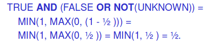
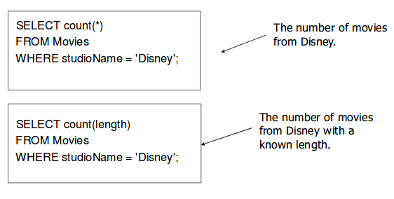

# NULLs, database modifications, data types and updateable views

## NULL values
- tuples in relations can have NULL as a value for one or more components
- meaning depends on context. Two common cases:
  - Missing value
  - Not applicable

### Comparing NULL's to values
- logic of conditions in SQL is really 3-valued logic: TRUE, FALSE, and UNKNOWN
- when any value is compared to NULL, the truth value is UNKNOWN
- a query only produces a tuple in its answer if the truth value for the WHERE clause evaluates to TRUE (FALSE or UNKNOWN tuples are not displayed)

## 3-valued logic
- TRUE = 1
- FALSE = 0
- UNKNOWN = 1/2
- AND = min
- OR = max
- NOT(x) = 1-x

Example


## Surprising example
```sql
SELECT *
FROM Movies
WHERE length <= 120 OR length > 120;
```

We might expect the above query to grab ALL tuples, since it includes all movies whose length are 120, above 120, or below 120. But if we have tuples with NULL values for length, the query will not return those tuples!

## Checking for NULLs
- use `IS NULL`
- and `IS NOT NULL`

```sql
SELECT *
FROM Movies
WHERE length IS NOT NULL;
```

## NULLs in aggregation
- NULLs are ignored in aggregation
- NULL never contributes to a sum, average, or count, and can never be the minimum or maximum of a column
- but if there are ONLY NULLs in a column, the result of the aggregation is NULL

The effect of NULL's is apparent in this example.


## Database modifications
- a modification changes the database in some way
- there are three kinds of modifications
  - insert: a tuple or tuples
  - delete: a tuple or tuples
  - update: the value(s) of an existing tuple or tuples

### Insertion
```sql
INSERT INTO MovieExec
VALUES ('Melanie Griffith', '34 Boston Blvd', 700, 300000);

-- can also add a list of attributes to the relation name
INSERT INTO MovieExec(name, address, cert, netWorth)
VALUES('Melanie Griffith', NULL, 700, 300000);
```

Why might we add the list of attributes to the relation name?
- we forget the stardard order of attributes for the relation
- we don't have values for all attributes

#### Inserting many tuples
- we can insert the entire result of a query into a relation using the form: INSERT INTO [relation] [query];

```sql
INSERT INTO DisneyMovies
  SELECT title, year
  FROM Movies
  WHERE studioName = 'Disney';
```

### Deletion
```sql
DELETE FROM Movies
WHERE studioName='Disney';

-- makes the relation empty
DELETE FROM Movies;
```

### Updating
Example: change the length of 'Godzilla' to 200

```sql
UPDATE Movies
SET length=200
WHERE title='Godzilla';
```

Example: suppose that Tom Cruise's movies have approximately 20 minutes of info before starting. Let's take that 20 minutes off.

```sql
UPDATE Movies
SET length = length - 20
WHERE (title, year) IN
  (SELECT title, year
  FROM StarsIn
  WHERE starName='Tom Cruise');
```

## Data types
- NUMBER(m) or NUMBER(m,n)
  - accepts m digits in total with n being the number of digits after the decimal period
- INT or INTEGER (synonymous)
- FLOAT(p)
  - p is precision, from 1 to 126)
- CHAR(n)
  - fixed length string of n characters
- VARCHAR(n)
  - variable length string of up to n characters
- DATE

### Dates and times
- DATE and TIME are types in SQL
- no TIME type in ORACLE, but DATE also keeps the time

```sql
CREATE TABLE Movies(
  title CHAR(20),
  ...
  release_date DATE, -- or release_date DATE DEFAULT SYSDATE
  ...
);
```

Dates have the format year-month-day. This can be changed if you specify the format.

```sql
INSERT INTO MOVIES(title, year, length, studioName, release_date)
VALUES('Godzilla', 1998, 120, 'Paramount', '1998-02-12');

INSERT INTO Movies(title, year, length, studioName, release_date)
VALUES('Pretty Woman', 1990, 120, 'Touchstone', TO_DATE('13-09-90', 'dd-mm-yy'));
```

To get a date back out, you can put it back `TO_CHAR`

```sql
SELECT TO_CHAR(release_date 'DD-MON-YYYY:HH:MI:SS')
FROM Movies;
```

## Altering (adding/deleting/modifying attributes)
```sql
-- add an attribute
ALTER TABLE StarsIn ADD salary INT;

-- add an attribute with default value
ALTER TABLE Movies ADD phone CHAR(16) DEFAULT 'unlisted';

-- modify an existing attribute
ALTER TABLE Movies MODIFY phone CHAR(18)

-- drop an attribute
ALTER TABLE Movies DROP COLUMN phone;

-- in oracle, rename a column
ALTER TABLE StarsIn RENAME COLUMN title TO movieTitle;
```

## Updateable views with check option
- sort of syntactic sugar to treat a view much like a table, even to the point where you can modify the view
- can ony happen when
  - there is one relation in the FROM clause of the view
  - the list in the SELECT clause includes enough attributes that for every tuple inserted into the view, we can fill the other attributes out with NULL or defaul, and have a tuple that will be inserted into the view

```sql
CREATE VIEW ParamountMovie AS
  SELECT title, year
  FROM Movies
  WHERE studioName='Paramount'
WITH CHECK OPTION;

-- this insertion fails
INSERT INTO ParamountMovie
VALUES('Star Trek', 1979);
```

Why does the insertion fail?
  - if it were allowed, it would insert a tuple with NULL for studioName in the underlying Movie table
  - this doesn't satisfy the condition for being in the ParamountMovie view (ie. this is not a paramount movie!)
  - thus, it shouldn't be allowed to get into the database through the ParamountMovie view

The following insertion succeeds. Note that we need to change our view.

```sql

CREATE VIEW ParamountMovie AS
  SELECT studioName, title, year
  FROM Movies
  WHERE studioName ='Paramount'
WITH CHECK OPTION;

INSERT INTO ParamountMovie
VALUE('Paramount', 'Star Trek', 1979);
```

