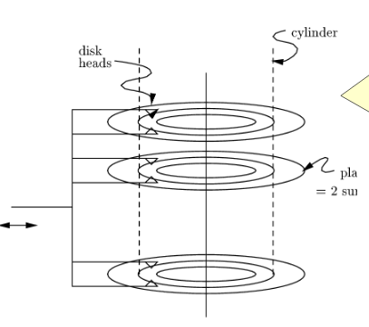

# Storage

## The memory hierarchy
- VM, disk, file system
  - this is what programs and main-memory DBMS's use 
  - access times in the milliseconds (but vary greatly)
  - unit to read or write to is typically a block/page of 16Kb
  - capacity is in the GB or TB!
  - non-volatile: retains memory even when power is shutoff
- main memory
  - under a microsecond
  - random access
  - capacity: a few GB
  - volatile
- cache
  - fastest
  - small
  - volatile

## A table of computer quantities
Symbol | Word | Power of 2 | Roughly
--- | --- | --- | ---
K | Kilo | 10 | 10^3
M | Mega | 20 | 10^6
G | Giga | 30 | 10^9
T | Tera | 40 | 10^12
P | Peta | 50 | 10^15

## Disks
- Platters with two surfaces (top and bottom) rotate around a spindle
- 2 -- 30 surfaces total
- Rotation speed is 3600-7200 rpm
- One head per surface
- all heads move in and out in unison

## Tracks and sectors
- Surfaces are covered with concentric tracks
  - tracks at a common radius = 1 cylinder
  - all data of a cylinder can be read quickly, without moving the heads
- tracks are divided into sectors by unmagnetized gaps (which make up 10% of a track)
  - typical track: 256 sectors
  - typical sector: 4096 bytes
- sectors are grouped into blocks
  - typical block: 16K = 4x4096 byte sectors

### Study: the MEGATRON 747 disk
- 8 platters providing 16 surfaces
- 2^16 or 65 536 tracks per surface
- there are (on average) 2^8 = 256 sectors per track
- there are 2^12 = 4096 = 4K bytes per sector
- capacity: = 16*2^16*2^8*2^12 = 2^40 = 1 TB

## Disk Controller
- schedules the disk heads
- buffers data in and out of disk
- manages the "bad blocks" so that they are not used

## Disk access time
- latency of the disk (access time): the time to bring a block into main memory from disk
- main components of access time are:
  - seek time: time to move heads to proper track / cynlinder
  - rotational delay: time for desired block to come under the head
  - transfer time: the time during which the block passes under head

On average, the desired sector will be about half way around the circle when the heads arrive at the cylinder.

## MEGATRON 747 timing example
- to move the head assembly between cylinders takes:
  - 1ms to start and stop 
  - 1 ms for every 4000 cylinders traveled
- thus, moving from the innermost to the outermost track, a distance of 65 536 tracks, takes about 17.38 ms
- the disk rotates at 7200 rpm, so one rotation is 8.33 ms
- gaps occupy 10% of the space in a track

### MIN time to read a 16 348-byte block
- the minimum time is just the transfer time
  - ie. we are on the correct track and the sector is just about to pass under the head!
- since there are 4096 bytes per sector on the Megatron 747, the block occupies 4 sectrs
  - the heads must therefore pass over 4 sectors and the 3 gaps between them
- recall that:
  - the gaps represent 10% of the track
  - so 36 degrees are occupied by gaps, and 324 degrees by the sectors
  - there are 256 gaps and 256 sectors on a track so
    - a gap is 36/256 = 0.14 degrees
    - a sector is 324/256 = 1.265 degrees
- the total degrees covered by 3 gaps and 4 sectors is 3 * 0.14 + 4 * 1.265 = 5.48 degrees
- thus, the transfer time is (5.48/360) * 8.33ms = 0.13 ms .

### MAX time to read a 16 384 byte block
- this is when the heads are positioned at the innermost cylinder and we want to read the outermost cylinder (or vice versa)
- in this case, it takes:
  - 17.38ms to go across all tracks
  - 8.33 ms to wait one full rotation because we missed the sector start by a hair
  - and then 0.13 ms to actually read the block
  - his takes 25.84 ms

### AVG time to read a block
- transfer time is always 0.13 ms
- average rotational latency is the time to rotate the disk half way around, or 8.33/2 = 4.17 ms
- what about average seek time? the average number of cylinders traveled is n/3, where n is total number of cyliners
  - thus, seek time is 1 + (65536/3)*(1/4000) = 6.46 ms (add a ms (or two) for start and stop)
- Total: 6.46 + 4.17 + 0.13 = 10.76 ms (or about 11ms)

## Disk access model
In most studies of algorithms, one assumes the "RAM model"
  - data is in main memory
  - access to any item of data takes as much time as any other

When implementing a DBMS, one must assume that te data does not fit in main memory. 
  - great advantage in choosing an algorithm that does few random disk accesses, even if the algorithm is not very efficient when viewed as a main-memory algorithm

### I/O model of computation
- Disk I/o = read or write of a block is very expensive compared with what is likely to be done with the block once it arrives in main memory
  - you could do perhaps 1000000 machine instructions in the time to do one random disk I/O

### Assumptions
- one processor
- one disk controller + one disk
- the database itself is much too large to fit in main memory
- many users and each user issues disk I/O requests frequently
- disk controller serving on a FCFS basis (FIFO)
- requests for a given user might appear random even if the table that a user is reading is stored on a single cynlinder of the disk
- the disk we will use  is the Megatron 747, with 16K blocks and timing as determined bfore
  - recall: average time to read or write a block is 11 ms

### Merge Sort
- common main memory sorting algorithms don't look so good when you take disk I/Os into account
  - variants of Merge Sort are generally better

#### Two Phase, Multiway Merge Sort
- Merge sort is still not very good in the disk I/O model
  - log2(n) passes, so each record is read/written from disk log2(n) times
- secondary memory variant (2PMMS) operates in a small number of passes
  - in one pass, every record is read into main memory once and written out to disk once
- 2 reads + 2 writes per block

#### Phase 1
1. Fill main memory with records
2. Sort using favourite main memory sort
3. Write sorted sublist to disk
4. Repeat until all records have been put into one of the sorted lists

#### Phase 2
Input buffers, one for each sorted list
  - we read in the sorted sublist, sorting them into one big list

In other words:
- use one buffer for each of the sorted sublists and one buffer as an output buffer
- initially load input buffers with the first blocks of their respective sorted lists
- repeatedly run a competition amoung the first unchosen records of each of the buffered blocks
  - move the record with the smallest key to the output block
- manage the buffers as needed
  - if an input buffer is empty, get the next block from the same file
  - if the output block (buffer) is full, write it to disk

### Real life example
- 10 000 000 tuples of 160 bytes = 1.6 GB file
  - stored on Megatron 747 with blocks of 16K, each holding 100 tuples
  - entire file takes 100 000 blocks
- 100 MB available in main memory
  - the number of blocks that can fit in 100 MD of memory (which is really 100 * 2^20 bytes) is
    - 100 * 2^20 / (16*2^10) = 6400 blocks, or 1/16th of the file

#### Analysis - Phase 1
- 6400 of the 100 000 blocks will fill main memory
- we thus fill the memory ceil(100 000/6400) = 16 times, sort the records in main memory, and write the sorted sublists out to disk

How long does this phase take?
  - we read each of the 100 000 blocks once, and we write 100 000 new blocks. Thus, there are 200 000 disk I/Os
    - this is equal to 200 000 * 11ms = 2200 seconds, or 37 minutes!

#### Analysis - Phase 2
- every block holding records from one of the sorted lists is read from disk exactly once
  - thus the total number of block reads is 100 000 in the second phase, just as for the first
- similarly, each record is placed once in an output block, and each of these blocks is written to disk once
  - thus, the number of block writes in the second phase is also 100 000
- so it takes another 37 minutes to complete this phase

The total: Phase 1 + Phase 2 = 74 minutes

### How big should blocks be?
We assumed a 16K byte block in our analysis, but would a larger block size be advantageous?
- if we doubled the size of bloks, we would halve the number of disk I/Os
  - but would this increase the time it takes for a disk I/O?
- the answer is yes, but it only increases the transfer time. seek time and rotational latency remain the same.
  - transfer time changes from 0.13 to 0.26ms
  - overall, the total time for a disk I/O is only slightly larger than before
- thus, we would approximately **halve** the time it takes to sort

### Another example with block size = 512K
- for a block size of 512 K, the transfer time is 0.13 * 32 = 4.16 ms
- average block access time would be 10.63 + 4.16 = approx. 15 ms
- however, now a block can hold 100 * 32 = 3200 tuples
  - the whole table will be 10 000 000 / 3200 = 3125 blocks (instead of the 100 000 blocks we had before)
- thus, we need only 3125 * 2 * 2 disk I/Os for the 2PMMS, which takes a total of 3125*2*2*15 = 187 500 ms or about 3.12 min
  - speedup is 74/3.12 = 23 fold!!!

### Reasons to limit the block size
At this point, you might think why not just increase block size to infinity?

1. First, we cannot use blocks that cover several tracks effectively
2. Seconds, small tables would occupy only a fraction of a block, so large blocks would waste space on a disk
3. Third, and most importantly, the larger the blocks are, the fewer records we can sort by 2PMMS

### How many records can we sort?
1. Block size is B bytes
2. Main memory available for buffering blocks is M bytes
3. Record is R bytes

- Number of main memory buffers = M/B blocks
- we need one output buffer, so we can only actually use (M/B)-1 input buffers
  - this, we can merge (M/B)-1 sorted sublists at a time
- each time we fill the memory with M/R records
- hence, we are able to sort (M/R)*[(M/B)-1] or approximately M^2/RB records at a time

### Sorting larger relations
- if our relation is bigger, we can use 2PMMS to create sorted sublists of M^2/RB records
- then, in a third pass, we can merge (M/B)-1 of these sorted sublists
- the third phase lets us sort [(M/B)-1]*[M^2/RB] = M^3/RB^2 records
- for our example, the third phase would let us sort 75 trillion records occupying 7500 petabytes!
