# Transactions

## Why do we need transactions?
In production environments, there could be many users. Consequently, it's possible for multiple transactions to be submitted at approximately the same time.

- if all transactions were small, we could just execute them on a first-come-first-serve basis
- however, many transactions are complex and time consuming
  - executing these would make other queries wait a long time for a chance to execute
- so, in practice, a DBMS may be running many different transactions at the same time

## Concurrent transactions
- DBMS needs to keep processes from troublesome interactions
- even when there is no "failure", several transactions can interact to turn a **consistent state** into an **inconsistent state**

### But first... what's a transaction?
- a process that reads of modifies the DB is called a transaction
  - unit of execution of database operations

## SQL statements: `COMMIT` and `ROLLBACK`
- `COMMIT` auses a transaction to complete
  - its database modifications are now **permanent** in the database
- `ROLLBACK` causes a transaction to end, but by aborting
  - no effects on the database
  - failures like division by 0 or a constraint violation can also cause a rollback, even if the programmer does not request it

## ACID transactions
- Atomic: whole transaction is none or done
- Consistent: database consistency is preserved
- Isolated: appears to the user as if only their process executes
- Durable: effects of a process survive a crash

Weaker forms of transactions are often supported as well.

## Transactions and schedules
- A transaction can be considered at a low level to be a list of actions:
  - read, write, commit, and abort
- a schedule is a list of actions from a set of transactions

Example
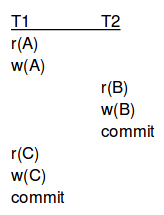

### Anomalies: Reading uncommitted data
Consider the following schedule.
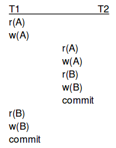

- T1 transfers $100 from A to B
- T2 increments both A and B by 1% (eg. daily interest)
- the problem is with the schedule above, the bank didn't pay interest on the $100 that was being transferred!
- of course, there would be no problem if we executed all of T1 and then T2, or vice versa (serial execution)

### Anomalies: Unrepeatable reads
- suppose A is the number of copies available for a book
- T1 and T2 both place an order for this book. First, they check the availability of the book.
- Consider now the following scenario:
  - T1 checks whether A is greater than 1
    - suppose T1 sees (reads) the value 1
  - T2 also reads A and sees 1
  - T2 decrements A to 0
  - T2 commits
  - T1 tries to decrement A, which is now 0, and gets an error because some check constraint doesn't allow it
- again, this situation would never arise in serial execution

### Anomalies: overwriting uncommitted data
- Suppose Larry and Harry are two employees and their salaries must be kept equal
- T1 sets their salaries to $2000 and
- T2 sets their salaries to $2100
- now consider the following schedule
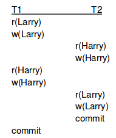

Unfortunately, Larry will be paid more than Harry. Again, there would be no problem is serial execution.

## Summary of terms
- transation (modeL): sequence of _r_ and _w_ actions on database elements
- schedule: sequence of read/write actions performed by a set of transactions
- serial schedule: all actions for each transaction are consecutive
- serializable schedule: a schedule whose "effect" is equivalent to that of some serial schedule

We will introduce a sufficient condition for serializability.

## Swaps and conflicts
Definition:
- a schedule is conflict-serializable if it can be converted into a serializable schedule with the same effect by a series of non-conflicting swaps of adjacent elements

There is a conflict if one of the following conditions hold:
1. A read followed by a write of the same X, or 
2. Two writes of the same X

Such actions conflict in general and may **NOT** be swapped in order. All other events may be swapped.

### Example


Note that after the swapping, all T1 actions come before all T2 actions.

## Serializability / precedence graphs
- non-swappable pairs of actions represent potential conflicts between transactions
  - existence of non-swappable actions enforces an ordering on the transactions that contain these actions
- nodes: transactions {T1, ..., Tk}
- arcs: there is an arc from Ti to Tj if they have conflicting access to the same database element X and Ti is first
  - we write: Ti < Tj
  - note: doesn't make sense to have i=j (arc to self)

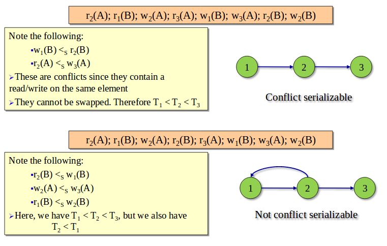

- if there is a cycle in the graph
  - then, there is no serial schedule which is conflict-equivalent to S
- if there is no cycle in the graph
  - then *any* topological order of the graph suggests a conflict equivalent schedule
  - note: a topological ordering of a directed acyclic graph (DAG) is a linear ordering of its nodes in which each node comes before all nodes to which it has outbound edges
  - in our example, there was only 1 topological ordering

## Schedulers
- a scheduler takes requests from transactions for reads and writes and decides if it is "OK" to allow them to operate on the DB or defers them until it is safe to do so
- real: a scheduler forwards a request if it cannot result in a violation of conflict-serializability
  - one approach is to use locks

## Lock actions
- before reading or writing to an element X, a transaction Ti requests a lock on X from the scheduler
- the scheduler can either grant the lock to Ti or make Ti wait for the lock
- if granted, Ti should eventually unlock X
- shorthand:
  - li(X) = "transaction Ti requests a lock on X"
  - ui(x) = "Ti unlocks X"

## Validity of locks
- the user of locks must be proper in 2 senses:
  - consistency of transactions:
    - read or write X only when holding a lock on X
    - ri(x) or wi(x) must be preceded by some li(x) with no intervening ui(x)
    - if Ti locks X, Ti must eventually unlock X
    - every li(x) must be followed by a ui(x)
  - legality of schedules:
    - two transactions may not lock the same element X without one having first released the lock
    - a schedule with li(x) cannot have another lj(x) with j!=i until ui(x) appears in between

Note that a legal schedule does not guarentee serializable!
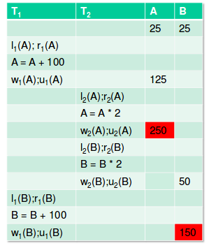

Here we have T1 which is trying to add 100 to both A and B, and T2 which is multiplying both A and B by 2.

As you can see, we get mixed results, which could harm a consistency result such as "A must equal B".

## Two phase locking
- there is a simple condition, which guarantees conflict-serializability:
  - in every transaction, all lock requests (phase 1) have to precede all unlock requests (phase 2)
  - note: this only applies to each transaction (separately)

Here's an example of 2 phase locking working in action.

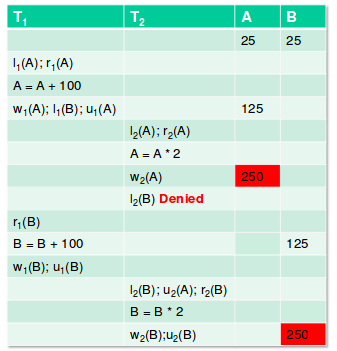

### Why does 2 PL work?
**Theorem**: a legal schedule S of 2PL transactions is conflict-serializable
- proof is an induction on _n_, the number of transactions (which we won't get into)

### What should we lock?
- the whole table or just single rows?

Consider the following transaction.

```sql
SELECT min(year)
FROM Movies;
```

- What happens if we insert a new tuple with the smallest year?
- phantom problem: a transaction retrieves a collection of tuples twice and sees different results, even though it doesn't modify those tuples itself

## Transaction support in SQL
```sql
SET TRANSACTION ISOLATION LEVEL X
```
- in JDBC: `Connection.setTransactionIsolation (X)`
- where X can be
  - `SERIALIZABLE` (default)
  - `REPEATABLE READ`
  - `READ COMMITED`
  - `READ UNCOMMITED`

With a schedule based on locks:
- a `SERIALIZABLE` transaction obtains locks before reading and writing objects, including locks on sets of objects (eg. table) that it requires to be unchangeable and holds them until the end, according to 2PL
- a `REPEATABLE READ` transaction sets the same locks as a `SERIALIZABLE` transaction, except that it doesn't lock sets of objects, but only individual objects
- a `READ COMMITED` transaction T
  - obtains locks before writing objects and keeps them until the end
  - obtains locks before reading values, then immediately releases thems
  - the effect is to ensure that the transaction that last modified the values is complete
  - thus:
    - no value written by T is changed by any other transaction until T is completed
    - T reads only the changes made by committed transations
    - however, a value read by T may well be modified by another transaction (which eventually commits) while T is still in progress
- a `READ UNCOMMITED` transaction doesn't obtain any lock at all, so it can read data that is being modified
  - such transactions are allowed to be READ ONLY only. So, such transactions don't ask for any lock at all.

### In summary...
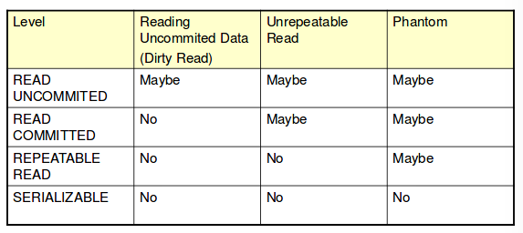

## Conflict-serializability vs serializability
- sufficient condition for serializability but not necessary

Example:
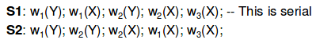

- S2 isn't conflict serializable, but it is serializable. It has the same effect as S1
  - intuitively, the values of X written by T1 and T2 have no effect since T3 overwrites them
- however, databases can only ensure conflict-serializability

## Types of Locks

### Shared/Exclusive locks
- problem: simple locks don't allow two readers to access element X at the same time
  - however, multiple readers is not a problem
- solution: shared locks, sli(x) and exclusive locks xli(x)
  - shared locks allow multiple readers to access same X
  - exclusive locks do not (and so are used for writing)

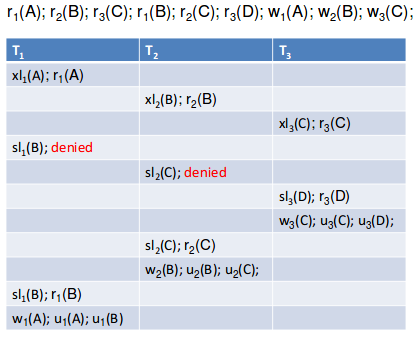

There is a problem with this example however.
  - T1 could have read B without a problem because T2 hadn't written to B yet

### Upgrading locks
- instead of taking an exclusive lock immediately, a transaction can take a shared lock on X, read X, and then upgrade the lock to exclusive so that it can write X

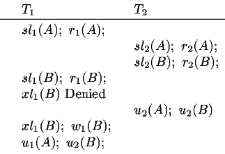

- upgrading locks allows more concurrent operation:
  - had T1 asked for an exclusive lock on B before reading B, the request would have been denied, because T2 already has a shared lock on B

However, upgrading locks allows for the possibility of deadlocks!

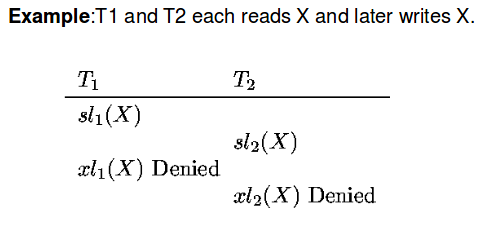

### Solution: update locks
- update lock uli(x)
  - only an update lock (not shared lock) can be upgraded to exclusive lock (if there are no shared locks anymore)
  - a transaction that will read and later on write some element A asks initially for an update lock on A, and then asks for an exclusive lock on A
- legal schedules:
  - read action permitted when there is either a shared or update lock
  - an update lock can be granted while there is a shared lock, but the scheduler will not grant a shared lock when there is an update lock
- 2PL condition: no transaction may have a sl(x), ul(x), or xl(x) after a u(X)

An example with no deadlock
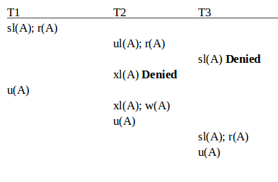

An exercise to try
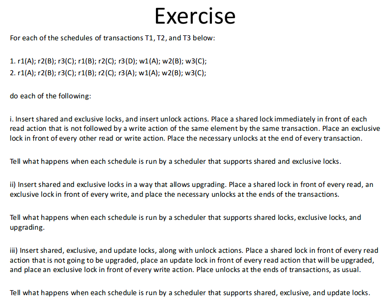

Note that we can STILL get deadlock with update locks:

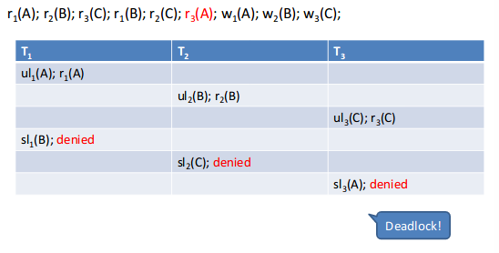
