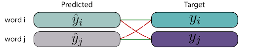

# Brain-Computer Interfaces

## History of BCI
- 1924 first EEG recorded
- 1980s control of robot using EEG
- focus has been primarily on neuroprostheti applications aimed at restoring damaged hearing, sight, and movement
- ex. ochlear implant

## Animal studies for control
- typical procedure operating through brain signals to achieve different levels of control
  - switch
  - cursor
  - robotic arm
- why animals?
  - invasive electrodes can capture more detailed information

## Human BCI
- 1978 - blind mind had electrodes inserted into grey matter and mainframe computer for processing
- 2002 patient's account of artificial vision experiment
- locked-in syndrome after brainstem stroke or spinal injuries can possibly be detected with BCI
  - only way to communicate

## Sensing
- invasive sensing is costly and can create scarring and damage neighboring areas of the brain
  - but it provides better signals
- partially invasive inplants inside the skull but not within grey matter are faster and better quality than non-invasive
- non-invasive sensing requires wearing a skull-cap with an array of electrodes
  - there will be noisy signals, poor frequency resolution, and poor spatial resolution

## Alternatives to EEG
- MEG, fMRI - functional magnetic resonance imaging (very expensive and impractical) but high spatial resolution, haemodynamic responses
- video construction from brain signals
- fNIRs - cheaper, more promising, but still quite expensive
- Elon Musk recently invested in a company that works on brain-to-computer communication

## Brain decoding for Semantics
1. word2vec - semantic representation
2. learn mapping from neural input signal to semantic representation (ridge regression)
3. 2 vs 2 test for hypothesis testing
4. noun decoding example

