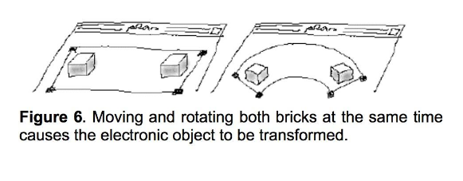
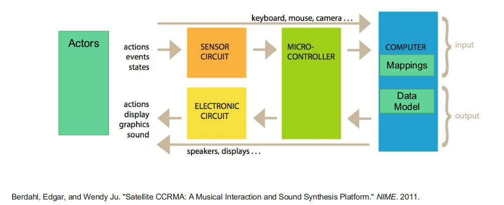

# Tangible User Interfaces

- physical objects with sensor based interactions and digital representations
- physical objects act as both representations and controls

## Origins of tangible user interfaces
- The marble answering machine was created by Durrell Bishop in 1992.
- Bricks by Fitzmaurice, Ishii & buxton 1995

- tangible bits - Ishii & Ulmer 1997
  - appears to be an exhibition

## Designing Tangible User Interfaces

### Components of a TUI
- actors
- sensor circuit
- microcontroller
- computer
- electronic circuit

### Design elements
- physical representation design
  - what physicl artifacts and affordances best represent the information being presented?
- digital representation design
  - what methods for visualizing or sonification best represent the information?
  - where/how should the information be presented?
- coupling (mapping) strategies
  - how is user action mapped to changes in the digital representation of the information

### Mapping digital to physical
6 aspects of natural coupling:
1. time - do action and reaction occur at the same time?
2. location - in the same space?
3. direction - same direction?
4. dynamics - do the action dynamics (position, speed, acceleration) affect the reaction?
5. modality - are the sensory modes of action and reaction similar?
6. expression - do the reactions reflect the emotional expression of the action?

Note that tight coupling leads to increased perception of embodiment in interaction

## New interfaces for musical expression (NIME)
Here is the intersection of human computer interaction and music. Not all NIME are tangibl interfaces, but most have common threads with TUIs.

NIMES include:
- augmented instruments (violins with extra buttons)
- instrument like controllers (piano midi controller)
- instrument inspired controllers - the accordiatron
- alternate controllers (ableton push)

### Digital music instruments
- an instrument that users computer-generated sound
- consists of a controller
- responds in real time

Element of DMIs include:
- the controller: physical representation design
- sound generation: digital representation design
- gesture mapping engine: coupling strategies
  - poor feedback, poor mapping and latency result in increased lack of intimacy

## Implementing TUIs and DMIs

### Design process
1. Requirements gathering
  - what are the users' goals?
  - what types of data are we trying to represent?
  - what constraints are there?
2. Conceptualizing interacion
  - design conceptual model
  - multi-track or single track instrument?
  - identify usability and UX goals
  - pick a cntrol space
  - design interaction gestures
  - sound design
  - design mapping strategy
3. implement
4. evaluate

### Tools for developing NIME and TUIs
- controllers
  - physical objects
  - microcontroller (arduino, raspberr pi, etc.)
  - sensors
- audio (or visual) output
- mapping tools
  - wiknator
  - gesture recognition
  - digital signal processing
- component communication
  - open sound control
  - MIDI

### Open Sound Control
- message based communication protocol
- designed for computers, music controllers, sound synthesizers and other multimedia devices
- message passing using a URL style naming scheme with pattern matching
- /address pattern <optional parameters>

Messages look like:
- address pattern
- osc arguments

Examples:
- /address/pattern <optional arguments>
- /multi/4 200 300
- /multi/\d+ 200 300

OSC Server (Receiver) receives messages from an OSC client and routes the messages to specific OSC methods based on the message's address

The OSC Client (Sender) sends messages to an OSC Server at a specified IP address and port

