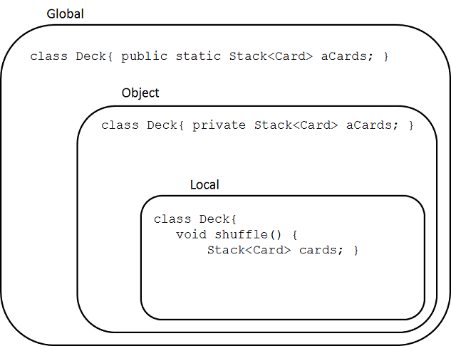

# Encapsulation

## Learning Objectives
- [ ] explain encapsulation and information hiding
- [ ] evaluate the quality of encapsulation implemented by a class
- [ ] understand immutability and how Java implements immutability
- [ ] Design by Contract concept and how to apply to Java programs (hint: `assert`
- [ ] code style + how it contributes to code quality
- [ ] object diagrams

## Definitions
**TERM** | **DEFINITION**
===|===
encapsulation | encapsulate data and computations to protect them from corruption and to simplify design
information hiding | only show a client information that is necessary for the client's task and hide all remaining information
design space | imaginary space where each dimension corresponds to a design quality attribute (eg. understandability, reusability, ease of implementation, etc.)
design trade-off | one design dimension may be better at the cost of another design dimension

## Abstractions
  - clearly map concepts to the problem domain
    - do this so progam is easy to understand
  - keep good encapsulation

### Card example
We could map cards to be an integer.

```Java
int card = 0; /* the ace of clubs */
```

This is bad because:
  - int maps to concept of integers not cards
    - could rename variable to `socialInsuranceNumber` 
    - could assign value 4040402 and break your program
  - int should be used for actual integers or similar concepts
    - currency, for example

So let's make our own type.

```java
class Card{}
```

Now we maybe want
  - suits
  - ranks
 
We can implement them using enums.

```java
public enum Suit {
  CLUBS, DIAMONDS, SPADES, HEARTS
}

public enum Rank {
  ONE, TWO, THREE, FOUR, FIVE, SIX, SEVEN, EIGHT, NINE, TEN, JACK, QUEEN, KING, ACE
}
```

Note:
  - can assign `null` value to enums
  - good practice: never consider `null` values to be legal

```java
Suit suit = Suit.CLUBS;
suit = null;
```

## Encapsulation Guidelines
  - all fields private
    - don't provide setter / getter unless absolutely needed
  - don't mutate and return state of an object in one method
  - use `final` whenever possible
    - remember, this might "finalize" a reference
    - but the what the reference points to could be changed
  - use `immutable` whenver possible
    - an immutable class generates an instance which cannot be changed
    - ex: `String` class is immutable
  - it should never be possible to modify the internal state of an object without going through object's methods
    - don't return references to mutable variables

## Scope
  - global scope
    - class variables
    - anything denoted as `public`
  - object scope
    - instance variables
    - denoted `private`
  - local scope
    - local variables which are only visible in the block which they are in



### Common ways to accidentally escape scope
  - there is no door
    - variable in global scope
  - front door is open
    - we return a reference to a variable
  - the door was not closed
    - given some reference as a parameter and use it
    - caller still has reference to object they passed to the method
    - if caller changes that object, it could change our data too
  - back door is open
    - we add our reference to a reference the caller has passed in
    - often convoluted
    - often can be fixed by creating a better design
    - ex: List of a stack of cards is given as an argument and we add our stack of cards to it

## Design by Contract
- ex. is it legal to pass in a `null` value for `rank` or `suit` for a `Card` constructor?
- maybe not:
  - put it in the Javadoc comments
    - `@pre pRank != null && pSuit != null`
  - even better: use an `assert` statement
    - `assert pRank != null && pSuit != null;`
- this can help prevent "defensive programming"
- you should NOT use and assert and _also_ check for the illegal value and handle it
    - this is poor design

## How to return encapsulated information without exposing encapsulation

  - if the internal objects that we are exposing are _immutable_, then there is no issue
  - if it is mutable, such as a Stack
    - add methods that allow querying of the state of the STack in a safe way (ex. `isEmpty()`, `size()`, `elementAt()`
    - return immutable wrapper, ex. `java.util.Collections.unmodifiableList(...)`
    - return a copy of the collection

### How to copy objects
    - use copy constructors
    - use Java's cloning mechanism
    - use serialization or reflection


### Copy constructors
Definition: a constructor that takes in a parameter of the same type as the class whose objects should be copied and copies the information.

```java
public class Card {
  private Rank aRank;
  private Suit aSuit;
  
  /** Copy contructor */
  public Card (Card pCard) {
    aRank = pCard.aRank;
    aSuit = pCard.aSuit;
  }
}
```

So, I suppose we return: `return new Card(cardWeWantToCopy);`

## UML (Unified Modeling Language
- should focus on illustrating a _single main idea_
- discard irrelevant infrmation

### Object Diagrams
- represent class instances
  - ie. in Java, whenever `new` keyword is executed
- rectangle: object `name:type`
- objects contain fields
  - field contain primitive value or reference to another object
  - references denoted by arrows
- represent a snapshot in time of the execution of the program


