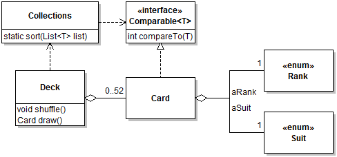
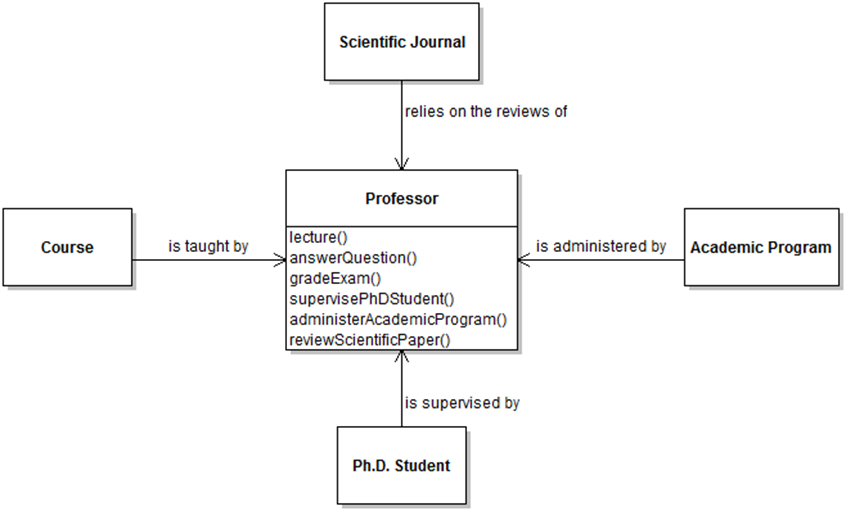
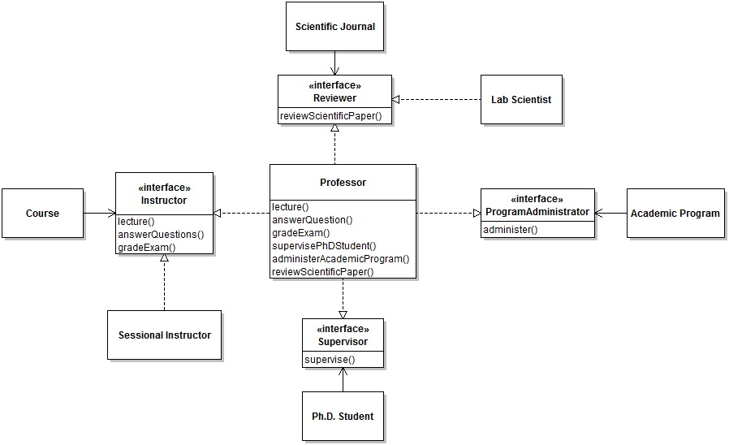

# Types and Polymorphism

## Learning Objectives
- [ ] be able to explain subtype polymorphism in OO programming
- [ ] understand Interface Segregation Principle
- [ ] UML class diagrams
- [ ] interface type vs. a class's interface
- [ ] implement interfaces
  - comparable
  - comparator
- [ ] anonymous classes
- [ ] design paterns
  - iterator
  - strategy


## Interfaces
- the methods of a class that are accessible to another class or object
- this means interface of a class may be the class definition
  - but we may want to separate class interface from implementation
  - have interfaces without tying to a specific class
  - solution: use Java interfaces!

### Java interfaces
- provide the methods that you can call
- document their expected behaviour
- write method signatures
  - no implementation!

To tie an interface to a class, use `implements` keyword.

```java
public class ImageIcon implements Icon
```

`implements` has two related meanings:
  - guarentees that class will implement **all** methods in interface
  - establishes **subtype** relationship
    - `ImageIcon` is a `Icon`

### Polymorphism
- can use a _subtype_ wherever the supertype is expected
- supports loose coupling: methods not tied to specific implementation
- supports extensibility: adding a new implementation of the interface is easy


## List vs ArrayList
Consider the following:

```java
List<String> list = new ArrayList<>();
```

- `List` is an interface
  - specifies `add`, `remove`, etc.
- `ArrayList` is a concrete implementation
- but could replace `ArrayList` with `LinkedList`


## Comparable Interface
- define `int compareTo(T)` method
- then we can use `Collections.sort`

```java
public class Card implements Comparable<Card> {
  @Override
  public int compareTo(Card pCard) {
    return pCard.getRank() - this.getRank();
  }
}
```

## UML Class Diagrams
- represent a static / compile-time view of a software system
- class definitions and relations

Examples:


And a class diagram of a card game:



Note:
- rectangle representing `Card` class doesn't have fields `aRank` and `aSuit` because these are represented as aggregations
  - don't have both a field and an aggregation!
- `Card` methods not shown because not insightful information
  - if you want to show that a class does NOT have certain methods (like setters/getters), add a note
- for generics: sometimes it makes more sense to use &lt;T&gt;, sometimes it makes more sense to use &lt;Card&gt;, your call
- cardinalities included for aggregate relationships

## Comparator Interface
- implement `int compare(T pObj1, T pObj2)`
- use `sort(List<T> list, Comparator<? super T> c)`

Now we can have a "rank first" comparator:

```java
public class RankFirstComparator implements Comparator<Card> {
  @Override
  public int compare(Card pCard1, Card pCard2) {
    /*... */
  }
}
```

_and_ a "suit first" comparator:


```java
public class SuitFirstComparator implements Comparator<Card> {
  @Override
  public int compare(Card pCard1, Card pCard2) {
    /* ... */
  }
}
```

Can sort with desired comparator:
```java
Collections.sort(aCards, new RankFirstComparator());
```

### Tradeoffs and solutions
- Comparators are standalone classes
  - but may need to access private information about the objects it is comparing
  - solution: nest Comparator in object's class

```java
public class Card {
  static class CompareBySuitFirst implements Comparator<Card> {
    @Override
    public int compare(Card pCard1, Card pCard2) {
      /* ... */
    }
  }
  /* ... */
}
```

but this makes client code:
```java
Collections.sort(aCards, new Card.CompareBySuitFirst());
```

  - another solution: create the comparator as an anonymous class
    - this means the comparator can only be used once, though

```java
public class Deck {
  public void sort() {
    Collections.sort(aCards, new Comparator<Card>() {
      @Override
      public int compare(Card pCard1, Card pCard2) {
        ...
      }
    });
  }
  ...
}
```

- this also brings back the encapsulation problem
  - code in anonymous class is defined outside of the `Card` class
  - so we can't use private object variables unless we make them public
  - use a factory method to fix this
    - simply creates and returns a comparator of the desired type

```java
public class Card {
  ...
  public static Comparator<Card> createByRankComparator() {
    return new Comparator<Card>() {
      @Override
      public int compare(Card pCard1, Card pCard2) {
        ...
      }
    };
  }
}
```


## Iterating Over Aggregations
- return a copy of an ArrayList to keep encapsulation (instead of returning reference to ArrayList itself)
- but this means clients might start relying on the fact that you use an ArrayList
  - maybe they will guess that you use an ArrayList internally as well
- to avoid this, we use the Iterable interface

Example:
```java
Iterator<Card> iterator = deck.getCards();
while(iterator.hasNext()) {
  System.out.println(iterator.next());
}
```

### Iterable interface
- implement `public Iterator<T> iterator() {...}`
- now can use `T.iterator()` to get the iterator

Example:
```java
public class Desk implements Iterable<Card> {
  public Iterator<Card> iterator() { ... }
}

- iterator can be used in java `forall` loops
- this is `for(String s : list)` syntax


Here is the final Cards example:
```java
public class Desk implements Iterable<Card> {
  
  private Stack<Card> aCards ...

  public Iterator<Card> iterator() { 
    return aCards.iterator();
  }
 
  ...
}
```

## Design Patterns
- reusable instances / solution templates for common design problems
- a pattern has four elements:
  - pattern name
  - problem description
  - solution
  - consequences (trade-offs + results)

### Iterator Design Pattern
- "provide a way to access elements of an aggregate object sequentially without exposing its underlying representation"
- use an iterator!

### Strategy Design Pattern
- similar to polymorphism
- is the concept of having both `rankFirstComparator` and `suitFirstComparator` and being able to interchange them
- "define algorithms, encapsulate hem, and make them interchangeable"

## Interface Segregation Principle
- encourage loose coupling by separating methods which belong to specific interfaces
- cliens should not be forced to depend on interfaces they do not need

Before example (does not respect ISP):


After example (respects ISP):



- clients now depend on interfaces instead of professor class
- now possible for other classes to implement parts of what a professor can do

