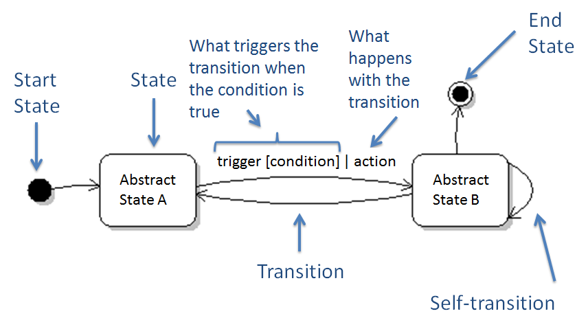
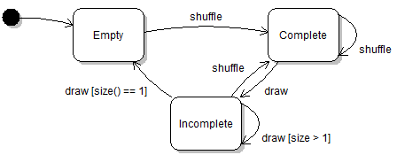

# Object State

## Learning Objectives
- [ ] understand difference between static and dynamic software perspectives
- [ ] shared state vs unique objects
- [ ] object identity vs object equality
- [ ] `Object` class methods
- [ ] Singleton design pattern
- [ ] Flyweight design patern
- [ ] UML state diagrams
- [ ] Java's cloning mechanism

## Static vs Dynamic
- static view of system: like source code or UML diagram
  - look at system in terms of elements in source code and relations between them
- dynamic (run-time) view: look at values and objects at a specific time in program execution
  - what we see in a debugger while stepping through the program
  - use object diagrams, state diagrams, and sequence diagrams

## Concrete vs Abstract State
- concrete state: any state which could exist for the object
  - for example: for a Deck object, there are 52! possible permutations of cards
  - each permutation is a concrete state
  - the list of all permutations makes up the object state space
- abstract state: arbitrarily-defined subset of concrete state space
  - example: "even balance" for `BankAccount` object
  - or "three Kings" to signify a card hand that has 3 kings

## UML State Diagrams
- similar to finite automata
- represent dynamic view of software system
- how objects transition from one abstract state to another

Example:


And a more concrete example using the Card example again:


- note that empty is the start state
  - we can assume that Desk constructor returns an empty deck
- an absence of a transition usually means that transition is invalid
  - in example, cannot draw from an empty deck
- can have conditions (see two transitions out of incomplete state)
- note there is no end state
  - end state is technically when the deck is garbage collected
  - deck can be garbage collected during any state, so end state does not apply

### Watch out for...
- using arrows to denote "data-flow" and states to represent "processing"
  - names of states should generally be nouns, not verbs or actions

## Object Identity, Equality and Uniqueness
- identity: we are referring to a particular object
  - usually refers to where object is stored in memory
  - now it's more like the object ID
- equality: `==` in Java
  - `==` returns `true` if two operands have same vlue
  - for reference types, this means same ID
  - actual object equality must be defined by the programmer
  - override `public booldean equals(Object pObject)` and `hashCode()` methods to define equality
  - can use the following code as a template

```java
public boolean equals(Object pObject) {
  if (pObject == null) return false;
  else if (pObject == this) return true;
  else if (pObject.getClass() != this.getClass()) return false;
  else return aRank == ((Card)pObject.aRank && ((Card)pObject).aSuit == aSuit;
}
```

- if you override `equals()` in Java, you **must** also override `hashcode()`
  - this satisfies: "If two objects are equal according to the `equals(Object)` method, then calling the `hashCode` method on each of the two objects must produce the same integer result" (as written in the Javadocs)

Lastly:
- uniqueness: objects of a class are unique if it is not possible for two objects to be equal
  - think of snowflakes; "no two snowflakes are alike", thus all snowflakes are unique. (this is actually false, but for the purposes of studying...)

## Flyweight Design Pattern
- problem: instances of a class are heavily shared throughout software system
- solution: manage creation of objects with `Flyweight` class using a factory method
  - private constructor for the Flyweight, so clients cannot contrl creation of objects
  - data structure that keeps a list of Flyweight instances, stored in static field
  - static factory method that returns unique Flyweight object that corresponds to input parameter
- note: flyweight objects must be _immutable_ so they can be shared throughout the program

## Singleton Design Pattern
- problem: there should only be one instance of an object at any given time
  - think: only one person named Bob at any given time. Should not allow any other instances of people named Bob.
- solution:
  - use a private constructor so clients cannot create duplicate objects
  - static final field keeping a reference to the single instance of the singleton object
  - static accessor method (usually called `instance()` that returns the instance of the Singleton
