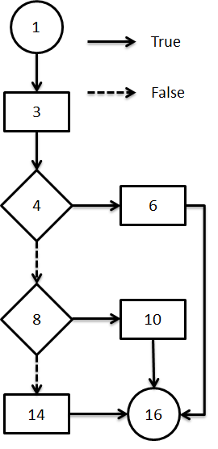

# Unit Testing 

## Learning Objectives
- [ ] type annontations
- [ ] program reflection
- [ ] write unit tests with JUnit
- [ ] mock objects
- [ ] understand output of test coverage tool (eg. EclEmma)
- [ ] basic test suite adequacy criteria

## Unit Testing
- test a small part of the program in isolation
- if a test fails, easier to know where to look for problems
- test: give some input, compare the output with your expected value
- unit testing often done automatically
  - can use a unit testinf framework like JUnit
  - you write the tests, but JUnit collects them, runs them, and reports results

### JUnit
Here are some tests using JUnit.

```java
public class AbsTest {
  @Test
  public void testAbsPositive() {
    assertEquals(5, Math.abs(5));
  }

  @Test
  public void testAbsNegative() {
    assertEquals(5, Math.abs(-5));
  }

  @Test
  public void testAbsMax() {
    assertEquals(Integer.MAX_VALUE, Math.abs(Integer.MIN_VALUE));
  }
}
```

- `@Test` to signify this is a unit test
- `assertEquals()` special assert for JUnit library

### Test Suite
- a collection of tests for a project
- question: how do we organize our tests?
  - java solution: one test class per project class
  - test class contains all tests for that class
  - locate all tests in a separate "tests" folder (instead of "src" folder) that has same project package structure

### Test Fixtures
- "default" or initial objects made to help run tests
  - for example, make a person named "Bob" to test if other people have Bob as a friend
  - or create an answer ArrayList and compare a test output ArrayList to the correct answer ArrayList that you made for multiple tests
- **important**: JUnit procdes no ordering for execution of unit tests
  - unit tests must be independent of each other
- but what if you need a fixture in a specific state before you call a test?
  - solution: use `@Before` annotation
  - this will run this code before JUnit runs each test method

```java
@Before
public void setup() {
  /* initialization code */
  /* to be run before each test! */
}
```

### Exceptional Conditions
- you should only be testing things where there is specified output
  - for example, don't test the `Card` copy-constructor with `null` as input
  - unLESS something specific is supposed to happen when you give the constructor null: for example, it throws a "NullCardException"
  - but how do we test this using JUnit?

#### Way 1
- used JUnit's `expected` and `@Test` keywords

```java
@Test(expected = EmptyStackException.class)
public void testPeekEmpty1() {
  Stack<String> stack = new Stack<>();
  stack.peek();
}
```
- JUnit fails test if no `EmptyStackException` is thrown
- however, exception has to be the last thing to happen in the test
- what if we want to do something else after the exception has been thrown in the test?

#### Way 2
```java
@Test
public void testPeekEmpty2() {
  Stack<String> stack = new Stack<>();
  try {
    stack.peek();
    fail();
  } catch (EmptyStackException e) {
    ...
  }
}
```

- if `stack.peek` does not generate an exception, we immediately fail the test
- else we catch the exception and execute some other code
  - the `fail()` is never executed in this case

### Encapsulation
- how do we test private methods?
  - different answers: private methods are private for a reason! thus, you aren't supposed to test them directly
  - private methods are for clients, so we should be able to test private methods ourselves
- we must use "metaprogramming" to test private things
- i'm willing to bet i don't need to know this

### Testing with Stubs
- unit testing tests small part of program
- but what happens if what we test triggers execution of a large part of the program?

Example: say we want to test the `automove()` function for a Solitaire game.
- this possible depends on many other parts of the code
- does not align well with the concept of unit testing
- many different moves could be executed based on strategy chosen

Solution
- look at the scope of `automove()`
- it does not compute the next best move
- it simply chooses a strategy 
  - the strategy then chooses the next move
- we only need to know that it chooses a strategy
  - we can do this by using mock objects (aka stub)

What is an object stub?
- simplified version of an object
- mimics object's behaviour so we can write unit tests
- ex: instead of sending a database query and waiting for the response, create a mock database object that returns the same fake reponse for testing purposes

```java
@Test
public void testAutoPlay() throws Exception {
  class StubStrategy implements Playing Strategy {
    private boolean aExecuted = false;

    public boolean hasExecuted() { return aExecuted; }

    @Override
    public void executeMove(GameEngin pGameEngine) {
      aExecuted = true;
    }
  }

  ...
  StubStrategy strat = new StubStrategy();
  GameEngine eng = GameEngine.instance();
  ...
  eng.autoMove();
  assertTrue(strategy.hasExecuted());
}
```

## Selecting Test Inputs
- it is not possible to test every single possible input

Two basic ways to select test cases
- functional testing (black bock)
  - looks at program _specification_
- structural testing (white box)
  - looks at _implementation_

### Control flow graph (CFG)
- model of the unit that represent all possible paths of execution
- two types of nodes:
  - basic: single entry and exit point
  - branching statements: single entry, multiple exit points



## Test adequacy criteria
- statement covrage
  - how many statements are executed in the program
  - number of statements executed / number of statements in program
  - ex. 3/6 = 50% coverage
  - idea: bugs can't be detected if statement is not executed
- branch coverage
  - number of branches executed / number of branches in program
  - all branches in a control flow graph
- path coverage
  - number of paths executed / number of paths in program
  - all possible paths in a control flow graph
  - theoretical since it is impossible to figure out all possible paths
- basic conditions coverage
  - each basic condition must have a True and a False outcome at least once during the execution of the test suite
- branch and conditions coverage
  - satisfy both branch and basic conditions coverage
- compound conditions
  - evaluate all possible compound conditions
  - also considered theoretical because large number of combinations
- subsumption relation
  - A _subsumes_ B means if A is achieved, B is implicitly achieved
    - branch subsumes statement
    - path subsumes branch
    - branch and conditions subsumes both branch and basic conditions
    - compound conditions subsumes branch and conditions


