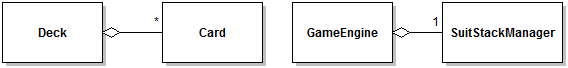
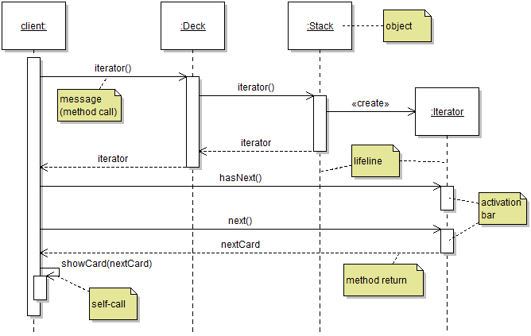
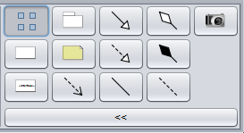
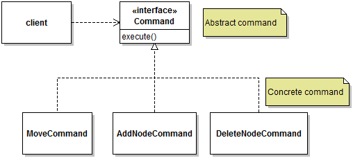

# Composition
- assemble large programs from smaller parts
- one object holds a reference to another object and delegates some tasks to it

## Learning Objectives
- [ ] object composition
- [ ] Composite design pattern
- [ ] Decorator design pattern
- [ ] Command design pattern 
- [ ] Prototype design pattern
- [ ] polymorphic copying
- [ ] Law of Demeter
- [ ] object graphs

## Object Composition
- one object stores a reference to one or more other objects
- can aggregate other objects this way
  - ex. Deck class aggregates Cards
- can also **delagate**
  - container object delegates some services to the objects it holds
- UML class diagrams show this using the "aggregation" arrow



## UML Sequence Diagrams
- model the dynamic perpective of a software system

Example


- rectangles at top of diagram represent objects
- dashed lines represent "lifelines"
  - objects placed at top of diagram are assumed to have already existed
  - objects not at top come into existence when created
- messages == method calls
  - typicaly labeled with method that is called
  - constructors are modeled as special `create` messages
- white box on linelines are **activation boxes**
  - represents time when a method is on the execution stack (not necessarily at the top, though)
- return of control can be used to show return values

## Composite Design Pattern
- would like to have groups of objects behave like single objects
- create a Composite class which
  - aggregates the objects desired (eg. `CompositeFigure` aggregates objects of type `Figure`.
  - implements the Primitive interface (eg. `CompositeFigure` implements `Figure`). This allows composite figures to be treated like normal figures


## Decorator Design Pattern
- want to add some "features" to an object, but not to all objects
  - adding features to all objects makes the code exponentially more complicated, as can have a large combination of features
- Decorator pattern does
  - aggregates ONE OBJECT (ex. `BorderDecorator` contains one object of type `Figure`, the one which is going to have a border now)
  - implements the primitive interface (ex. `BorderDecorator` is still a `Figure`, just a `Figure` with a border)
    - for each method in the primitive interface:
      - delegate original request to the decorated object
      - implement the decoration


```java
public void draw(Graphic pGraphics) {
  /* 1. Delegate the original request to the decorated object
  aDecorated.draw(pGraphics);

  /* Implmenet the decoration */
  /* Draw border around figure */
}
```

- no order to the two steps
- both decorator and composites can coexist
- good idea to use `final` keyword on the field that stores the reference to the decorated object
  - also should initialize the decorated object in the constructor of the decorator

## Polymorphic Object Copying
- what if we have a `Drawing` which contains a list of the `Figures` it is composed of, and then we want to copy all the figures? 
  - this is not possible using copy constructors because we don't know what each of the `Figures` is! (ie. is it a `RectangleFigure`? A `CircleFigure`?)
- can solve this problem by using cloning
  - first tag the class by using `implements Cloneable`
  - then override the `clone()` method

```java
@Override
public Card clone() {
  try {
    Card clone = super.clonse();
  } catch (CloneNotSupportedException e) {
    ...
  }
}
```
- call to `super.clone()` requires you to catch the `CloneNotSupportedException`
  - this is raised if object is not `Cloneable`


## Prototype Design Pattern


- buttons on the panel all put an object on the diagram
- just need to know _which_ object
- so just have a class `Toolbar` which manages what "tool" is selected

```java
public Tool getSelectedTool()
```

- when the user clicks on a button on the toolbar, we clone the shape needed and draw it on the screen
- the shape we clone is the **prototype object**

## Command Design Pattern
- maybe we want to represent a command as an object
  - eg. "MoveCommand" class
- can have an abstract interface Command that each child Command implements
- `execute()` method overridden for each child command



## Law of Demeter
- code of a method should only access
  - instance variables of its implicit parameter
  - arguments passed to the method
  - any new object created within the method
  - globally available objects (only if needed)
