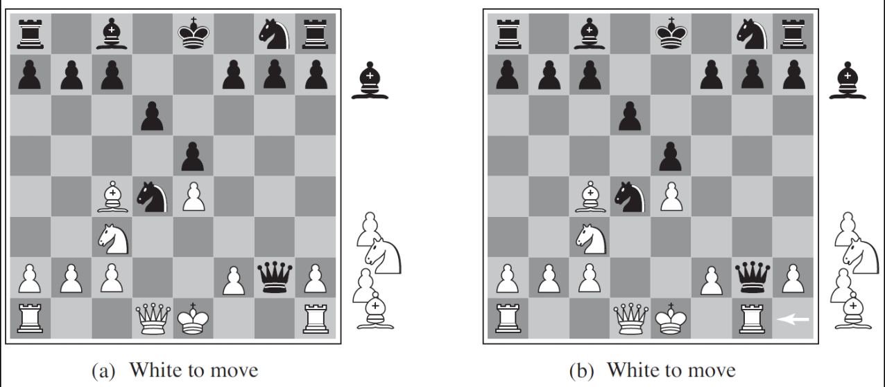

# Adversarial Search (Games)

- two (or more) players
- take turns to move (take action, make a choice)
- opposite goals - competition
- zero-sum: how much one player gains, the opponent loses exactly the same amount
- examples of 2-player games:
  - tic-tac-toe, checkers, chess, go...

## Limited look ahead + scoring
- the key idea that underlies game playing programs is that of
  - limited look ahead and
  - min-max algorithm
- imagine we are going to look ahead in the game-tree to a depth of 2 (or 2 ply)
- we can use our scoring function to see what the values are at the leaves of this tree
  - these values are called the "static evaluations"
- we compute a value for each of the nodes above this one in the tree by "backing up" these static evaluations in the tree
- the player who is building the tree is trying to maximize his score; the opponent is trying to minimize the score
- so, each layer of the tree can be classified into either a maximizing layer or a minimizing layer

### Scoring function
- a crucial component of any game playing program
  - assigns a numerical value to a board position
- we can think of this value as capturing the likelihood of winning from that position
- since in these games, one person's win is another person's loss, we will use the same scoring function for both players, simply negating the values to represent the opponent's scores

### Static evaluations
- for chess, we typcally use linear weighted sum of features
  - eg. w1 = 9 with f1(s) = (number of white queens) - (number of black queens)
  - ie, queens get a high weight (9), and the number of white queens vs black queens tells which side is more likely to win

The key idea is that the more lookahead we can do, that is, the deeper in the tree we can look, the better our evaluation of a position will be, even with a simple evaluation function.

For example:
- MacHack6 had a ranking of 1200 and an average depth of 4
- Belle had a ranking of 2000 and an average depth of 8
- Deep Blue had a ranking of 2900 and an average depth of 13

## Alpha beta pruning
- optimization of the min-max search
- if alpha >= beta, cutoff!
- guaranteed to return exactly the same value as the  min-max algorithm
  - it is a pure optimization without any approximations or tradeoffs
- in a perfectly ordered tree, with the best moves on the left, alpha beta reduces the cost of the search from order b^d to order b^(d/2)
  - that is, we can now search twice as deep!
  - now, this analysis is optimistic, since if we could order moves perfectly, we would not need alpha-beta. but in practice, performance is close to the optimistic limit

### Problem 1: non quiescent states

Description: two chess positions that differ only in the positions of the rook at lower right. In (a), Black has an advantange of a knight and two pawns, which should be enough to win the game. In (b), White will capture the queen, giving it an advantage that should be strong enough to win.

- suppose the program searches to a depth limit, reaching the position in figure(b), where Black is ahead by a knight and two pawns. It would report this as the heuristic value of the state, thereby declaring that the state is a probable win by Black.
- but White's next move captures Black's queen with no compensation. Hence, the position is really won for White, but this can be seen only by looking ahead one more ply.
- ie. there are wild swings in value for some state path in the near future

Solution
- apply evaluation function only to positions that are quiescent
- expand nonquiescent positions further until quiescent positions are searched
  - this extra search is called a quiescence search
  - restricted to consider only certain types of moves, such as capture moves, that will quickly resolve the uncertainties in the position

### Problem 2: Horizon effect
- arises when the program is facing an opponent's move that causes serious damage and is ultimately unavoidable, but can be temporarily avoided by delaying tactics.
- with black to move, the black bishop is surely doomed. but black can forestall that event by checking the white king with its pawns, forcing the king to capture the pawns. this pushes the inevitable loss of the bishop over the horizon, and thus the pawn sacrifices are seen by the search algorithm as good moves rather than bad ones.
- solution: design a smarter cutoff function; one that would discount "in this example" the existence of the black bishop

## Search vs lookup
- many game-playing programs use table lookup rather than search fort eh opening and ending of games
- usually after ten moves we end up in a rarely seen position, and the program must switch from table lookup to search
- near the end of the game, there are fewer possible positions again, and thus more chance to revert to table lookup
- but here it is the computer that has the expertise: the computer analysis of endgames goes far beyond anything achieved by humans

### Endgames
- a human can tell you the general strategy for playing a king-and-rook-versus-king (KRK) endgame:
  - reduce the opposing king's mobility by squeezing it toward one edge of the board, using your king to prevent the opponent from escaping the squeeze
- other endings, such as king, bishop, and knight versus king (KBNK) are difficult to master and have no succinct strategy description
- a computer, on the other hand, can completely solve the endgame by producing a policy, which is a mapping from every possible state to the best move in that state. then we can look up the best move rather than recompute it anew.

## Stochastic games
- in real life, unpredictable external events can put us into unforeseen situations
- many games mirror this unpredictability by including a random element, such as the throwing of dice
  - we call these stochastic games
- backgammon is a typical example; a game that combines luck and skill
  - dice are rolled at the beginning of a player's turn to determine the legal moves

### Expectiminimax
- as with minimax, the obvious approximation to make with expectiminimax is to cut the search off at some point and apply an evaluation function to each leaf
- we might think that evaluation functions for games such as backgammon should be just like evaluation functions for chess - they just need to give higher scores to better positions
- in fact, the presence of chance nodes means that one has to be more careful about what the evaluation values mean

## Partially observable games
- chess described as war in miniatrue, but lacks one major characteristic of real wars, namely, partial observability
- in the "fog of war", the existence and disposition of enemy units is often unknown until revealed by direct contact
- partially observable games share these characteristics
  - main examples: card games (out of the scope for this course)
