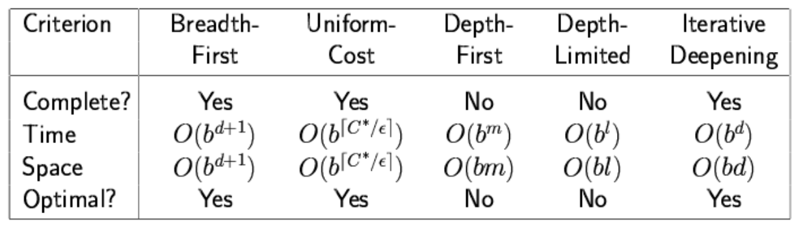

# Solving problems by searching

## Uninformed searches

These include
- state-space graph
- tree/graph search
- BFS
- uniform-cost search (UCS)
- DFS
- depth-limited search
- iterative deepening search

The idea is to reduce any problem into the problem of searching a graph.

### Classes of search
- uninformed
  - don't use any background knowledge of the domain
- informed
  - use background knowledge (heuristics) of the domain the make search faster
- solutions
  - any solutions
  - the optimal solution(s)

### State-space graph
- the state space forms a directed graph where
  - graph nodes are the states
  - graph edges are the actions (which may or may not be implicit)

### Formally defining problems

A problem is defined by four items:
1. an initial state (eg. "at Arad")
2. actions and successor function S: = set of action-state tuples
  - eg. S(Arad) = {(goZerind, Zerind), (goTimisoara, Timisoara), (goSilbiu, Silbiu)}
  - as mentioned, you can ignore actions in most problems since the successor states already describe the action being taken
3. goal test, which can be
  - explicit: eg. x = "at Bucharest"
  - implicit: eg. Checkmake(x)
4. step cost
  - c(x, a, y) is the step cost, assumed to be >= 0.
  - here, x is the fromState, y is the toState, and a is the action taken

A solution is a sequence of actions leading from the initial state to a goal state.

#### Example: the 8-puzzle
- states: location of the tiles (ie. board configurations)
- actions: move \_\_ left, right, up, down
- goal test: explicit goal state
- path cost: 1 per move

#### Example: the 8-queens problem
- states: all possible arrangements of 0 to 8 queens, one per column in the leftmost n columns, with no queen attacking another
- actions: add a queen to any square in the leftmost empty column such that is is not attacked by any other queen
- goal test: 8 queens are on the board and none are attacked
- path cost: 1 per move

Questions to think about
- why not have all possible board configurations where all the 8 queens are on the board?

### Tree search
- we think about starting with a root node and expanding each node one by one with possible moves
- this will form a frontier at every step of tree expansion

#### Implementation
- a state is a representation of a physical configuration
- a node is a bookkeeping data structure constituting of state, parent node, action, path cost (g), and depth

#### Frontier
- the collection of nodes that have been generated but not yet expanded is called the frontier
- we will implement collection of nodes as queues of a certain strategy (FIFO, LIFO, Priority)
- in Java, has methods:
  - isEmpty()
  - removeNode()
  - insertNode()
  - insertAll(Set of nodes)

#### Tree search vs Graph search
- graph search also keeps a set of states that were explored
  - "the difference is that graph-search checks to see if a state has been explored before and if so it does not expand it again

### Search strategies
- a search strategy is defined by picking the order of node expansion (ie. the queue strategy)
- strategies are evaluated along the following dimensions:
  - completeness: does it always find a solution if one exists?
  - time complexity: number of nodes generated
  - space complexity: maximum number of nodes in memory
  - optimality: does it always find a least-cost solution?
- time a space complexity are measured in terms of:
  - b: maximum branching factor of the search tree
  - d: deapth of the least-cost solution
  - m: maximum depth of the state space

We will go over 5 search strategies:
  - BFS
  - UCS
  - DFS
  - depth-limited search
  - iterative deepening search

#### BFS
- FIFO queue used
- puts all newly generated successors at the end of the queue, which means that shallow nodes are always expanded before deeper nodes
- basically, expand each node in order of BFS traversal

Properties:
- complete: yes, if b is finite
- time: O(b^(d+1)) is the total number of nodes generated
- space: O(b^(d+1)) since it keeps every node in memory
- optimal: yes, if the cost is a non-decreasing function of depth (eg. when we have 1 cost per step)

#### Uniform cost search (UCS)
- expand least-cost unexpanded node
- the algorithm expands nodes in order of increasing path cost
- thus, the first goal node selected for expansion is the optimal solution
- implementation: frontier with queue ordered by path cost (priority queue)
- equivalent to BFS if all step costs are equal

Properties:
- complete: yes, if step cose is not zero
- time: number of nodes with g <= cost of optimal solution (O(b^(C\*/e))) where C\* is the cost of the optimal solution, and some of their children
- space: same as time complexity
- optimal: yes, since nodes are expanded in increasing order of g(n)

#### DFS
- expand deepest unexpanded node
- implementation with a LIFO queue (or a stack)

Properties:
- complete: no, fails in infinite-depth spaces, spaces with loops
  - modify to avoid repeated states along path (graph search)
  - complete in finite spaces
- time: O(b^m), terrible is m is much larger than d
- space: O(bm), linear space!
- optimal: no
- this is the only algorithm running in linear space so far
  - on the other hand, depth-first graph-search doesn't have linear space

#### Depth limited search
- DFS but with a limited depth
  - only expand nodes that have a depth **less** than the limit

#### Iterative deepening search
- a mixture of BFS and DFS
- do depth limited search from limit = 0 to infinity

Properties:
- complete: yes
- time: O(b^d)
- space: O(bd)
- optimal: yes, if step cost = 1

### Summary of algorithms

## Informed searches

These include:
- greedy best-first search
- A\* search
- heuristics
- local search algorithms
- hill-climbing search

### Best first search
- idea: use an evaluation function f(n) for each node (based on state)
  - estimate the "desirability" of a given state
  - expand the most desirable unexpanded node
- implementation:
  - frontier: priority queue based on f(n)
- special cases:
  - greedy best-first search
  - A\* search

### Greedy best first search
- evaluation function f(n) = h(n)
  - estimate cost from n to goal
  - eg. the straight line distance from some city to Bucharest
- greedy best first search expands the node that appears to be the closest to the goal

Properties:
- complete: no, can get stuck in loops
- time: O(b^m), but a good heuristic can dramatically improve this
- space: same as time, keeps all nodes in memory
- optimal: no

### A\* search
- idea: avoid expanding paths that are already expensive
- evaluation function is f(n) = g(n) + h(n) where
  - g(n) = cost so far to reach n
  - h(n) = estimated cost from n to goal
  - f(n) = estimated total cost of path through n to goal

Properties:
- complete: yes
- optimal: yes
- time and space discussion
  - let C\* be the cost of the optimal solution
  - A\* expands all nodes with f(n) < C\*
  - A\* expands some nodes with f(n) = C\*
  - A\* expands no nodes with f(n) > C\*
- the choice of the heuristic function is very important. it can cut the search space significantly

#### A\* using graph search
- A\* using graph search can produce sub-optimal solutions, even if the heuristic function is admissible
- sub-optimal solutions can be returned because Graph search can discard the optimal path to a repeated state if it is not the first one generated
- we can still use graph search if we discard the longer path. we store in a map pairs (state, pathcost)
- then we only expand nodes which have a pathcost smaller than if we visited it previously

### Admissible heuristics
- a heuristic h(n) is admissible if for every node n, h(n) <= h\*(n), where h\*(n) is the true cost to reach the goal state from n
- an admissible heuristic **never overestimates** the cost to reach the goal (ie. it is optimistic)
- ex. straight line distance is an admissible heuristic since it never overestimates the actual road distance
- if h(n) is admissible, then A\* using tree-search is optimal

### Dominance
- if some heuristic h2 has values that are always >= values of some heuristic function h1, then we say that h2 dominates h1, and thus h2 is the better heuristic for the search
- we want f(n) = g(n) + h(n) to be as big as possible
  - since we can't do anything about g(n), we are interested in making h(n) as big as possible

### The max of heuristics
- i a collection of admissible heuristics h1, ..., hm is available for a problem, and none of them dominates any of the others, we can create a compound heuristic as:
  - h(h) = max{h1(n), ..., hm(n)}
- is it admissible? yes, because each component is admissible!

### Relaxed problems
- a problem with fewer restrictions on the actions is called a relaxed problem
- the cost of an optimal solution to a relaxed problem is an admissible heuristic for the original problem
- if the rules of the 8-puzzle are relaxed so that a tile can move anywhere, then h1(n) (number of misplaced tiles) gives the shortest solution
- if the rules are relaxed so that a tile can move to any adjacent square, then h2(n) (the manhattan distance) gives the shortest solution

### Subproblems
- a subproblem of the 8-puzzle problem is getting just tiles 1, 2, 3, and 4 into their correct positions without worring about what happens to the other tiles

### Pattern databases
- admissible heuristics can also be derived from the solution cost of a subproblem of a given problem
  - ex. the subproblem of getting tiles 1, 2, 3, and 4 into their correct positions
  - the cost of the optimal solution of this subproblem is a lower bound on the cost of the complete problem
  - this is more accurate than the Manhattan distance
- pattern databases store these exact solution costs for every possible subproblem instance
  - in our example, every possible configuration of the four tiles (1, 2, 3, 4) and the blank
  - then they compute an admissible heuristic for each complete state encountered during a search simply by looking up the corresponding subproblem configuration in the database

### Local search algorithms
- in many optimization problems, the path to the goal is irrelevant; the goal state itself is the solution
  - eg. n-queens
- the state is the "complete" configuration
- in such cases, we can use local search algorithms which keep a single "current" state and try to improve upon it

### Hill climbing search
- returns a state that is a local maximum (or minimum, in the case of the 8-queens problem)
- hill-climbing chooses randomly among the set of best successors, if there is more than one
- problem: depending on the initial state, it can get stuck in local maxima (/ minima)

#### Local minima
- starting from a randomly generated state of the 8-queens problem, hill climbing gets stuck 86% of the time, solving only 14% of problems
- it works quickly, taking just 4 steps on average when it succeeds, and 3 when it gets stuck
  - not bad for a state space with approx. 17 million states
  - and, memory is constant, since we only keep on state!
- since it is so attractive, what can we do in order to not get stuck?

#### Random restart hill climbing
- well known adage: "if at first you don't succeed, try, try again.
- it conducts a series of hill-climbing searches from randomly generated initial states, stopping when a goal is found
- if each hill-climbing search has a probability p of success, then the expected number of restarts is 1/p
- for 8-queens, p=0.14, so we need roughly 7 iterations to find a goal (ie. about 22 steps, 3 steps for each failure and 4 for success).

#### Genetic algorithms
- the initial population is ranked by the fitness function, resulting in pairs for mating
- they produce offspring which are subject to mutation
- each state is rated by the **fitness function**, which returns higher values for better states
- for the 8-queens, use the number of nonattacking pairs of queens, which has a value of 28 for a solution
- the values of the four states shown are 24, 23, 20, and 11
- the probability of being chosen for reproducing is directly proportional to the fitness score

