# Decision Trees

The idea here is to use attributes to split classify items. Attributes can be categorical (yes, no) or continuous (eg. salary).

## Entropy

What's the smallest possible number of bits, on average, per symbol, needed to code a stream of symbols?

```
entropy(p1, ..., pm) = -p1 log(p1) - ... - pm log(pm)
```

For two vlues, the closer p1 and p2 are two each other, the bigger the entropy. THe farther p1 and p2 are from each other, the smaller the entropy (eg. if there are mostly records having the first value, then the entropy is small).

Entropy is also known as a measure of information. The greater the entropy, the more information there is. The smaller the entropy, the less information there is (we say the dataset is "dull).

### ID3
- procedure: top down in a recursive divide-and-conquer fashion
  - first: an attribute is selected for the root node and abranch is created for each possible attribute value
  - then: instances are split into subsets (one for each branch extending from the node)
  - lastly: the same procedure is repeated recursively for each branch, using only instances that reach the branch
- the process stops if all instances have the same class

#### Attribute selection
- which is the best attribute to select, say, for the root?
- the one which will result in the smallest tree
- the lower the entropy, the purer the node
- thus, our strategy is to choose the attribute that results in the lowest entropy of the children nodes

#### How to calculate entropy

Let's calculate the entropy for `outlook = sunny`. Here, there are 5 instances where the outlook was sunny.
  - 5 instances where outlook = sunny
  - 2 instances where outlook = sunny and play = yes
  - 3 instances where outlook = sunny and play = no

The, the entropy equation is:
```
entropy( 2/5, 3/5) = -2/5*log(2/5) - 3/5*log(3/5) = 0.971
```

However, we also need to calculate the entropy for when `outlook = overcast` and `outlook = rainy`. Let's assume they are 0 and 0.971 respectively. Lastly, we take the average entropy.
  - there are 14 instances in all of our data set
  - 5 where outlook = sunny
  - 4 where outlook = overcast
  - 5 where outlook = rainy

So our average entropy is:
```
AE = 0.971 * (5/14) + 0*(4/14) + 0.971*(5/14) = 0.693
```

You will need to computer the average entropies for:
- temperature
- humidity
- windy

as well, and then select the one with the lowest entropy as the root.

Assume outlook has the lowest entropy, and thus we select it as the root. Now we will have three branches, one for "sunny", "overcast" and "rainy" each.

Using only the instances where outlook=sunny, we will repeat the procedure, calculating the average entropies for temperature, humidity, and windy.

Note: not all leaves need to be pure; sometimes identical instances have different classes. The splitting stops when data can't be split any further.

#### Fun facts
- ID3 stands for Iterative Dichotomiser 3
- ID3 led to the development of C4.5 which can deal with
  - numeric attributes
  - missing values
  - noisy data

##### Noisy data
- not all leaves need to be pure; sometimes identical tuples have different class values
  - splitting stops when data can't be split any further

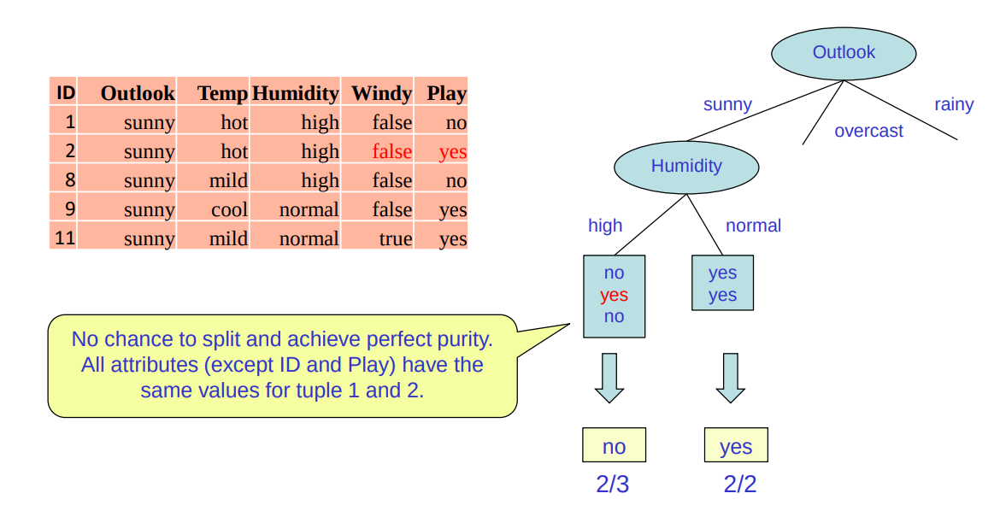

##### Missing data
- sometimes, some attributes of tuples have missing values
- in this case, we create two instances: one where the attribute is true and one where the attribute is false

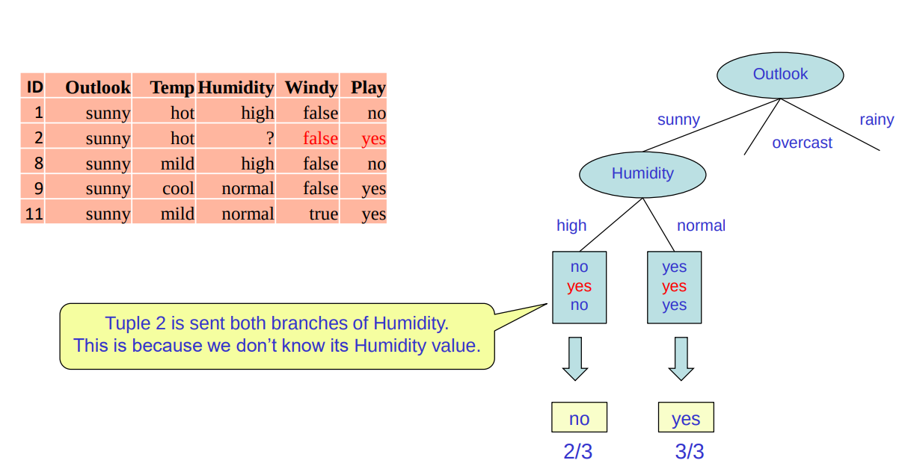

##### Numeric attributes
- some attributes can be numeric
- this, we use binary splits (still using Entropy)


#### Pruning the tree
- it's not always a good idea to just keep splitting and making the tree longer and longer until you exhaust all possibilities
  - this could lead to overfitting the training data
- solutions:
  - pre-pruning
  - post-pruning

##### Pre-pruning
- don't split beyond a certain point, say 80%.

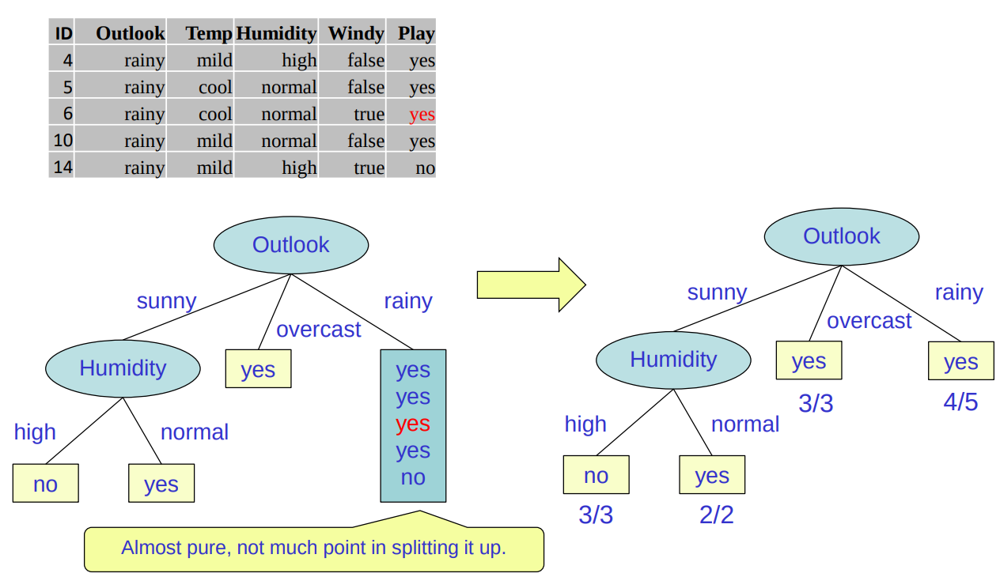

##### Post-pruning
- grow the tree exhaustively, then prune
- remove sub-trees that don't cause significant decrease in accuracy


## Random Forest Construction

Grow many decision trees. Each tree is constructed using the following algorithm:

Input:
- N training cases with M attributes each
- number m (\<M) attributes to be used to determine the decision at a node of the tree
- number n (\<N) of training cases to be used for one tree

Algorithm:
- choose a training set for this tree by choosing n times with replacement from all N available training cases
- for each node of the tree, randomly choose m attributes on which to base the decision at that node. Calculate the best split based on these m attributes
- fully grow the tree

## Random Forest Prediction
- the new sample is pushed down a tree
- it is assigned the label of the terminal node it ends up in
- this procedure is iterated over all trees in the ensemble (forest), and the majority of all trees is reported as random forest prediction

## Numerical attributes
- tests in nodes are of the form is attribute x > some constant ?
- this essentially divides the training space into rectangles


## Considering splits
- consider splitting between each data point in each dimension
  - consider 9 splits in the R dimension
  - consider 6 splits in the L dimension

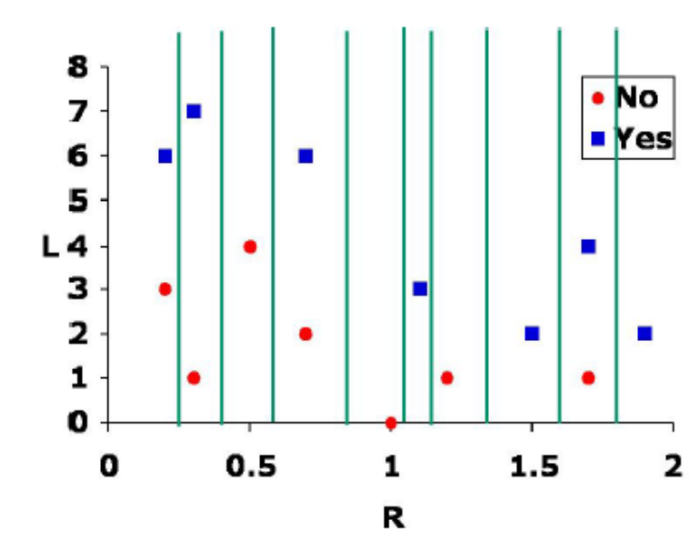
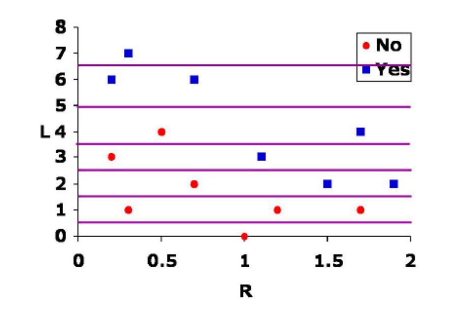

So now, we end up with a grid of splits.

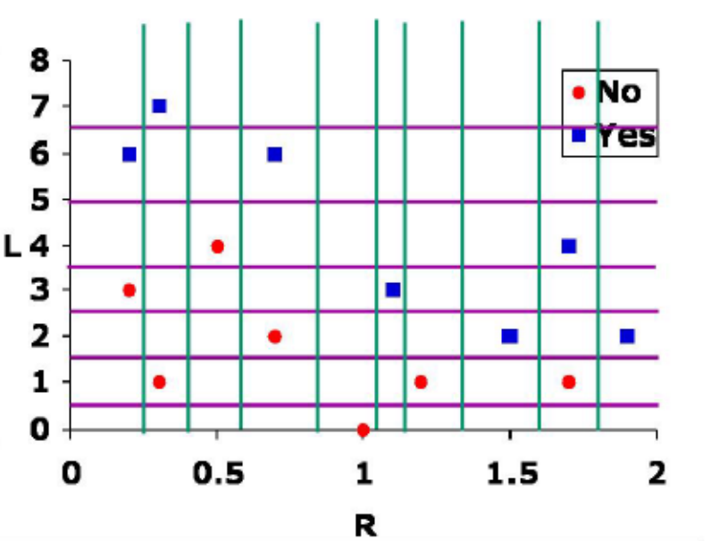

- we consider all the possible splits in each dimension, and computer the average entropies of the children
- we also see that all the points with L not greater than 1.5 are of class 0 (No), so we can make a rectangle / leaf there

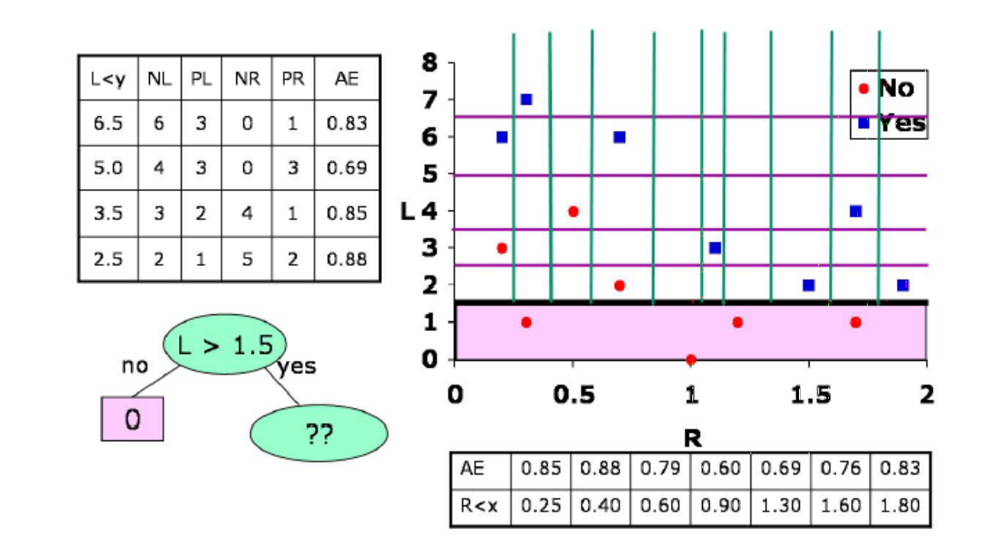

- the next best split is at R > 0.9.

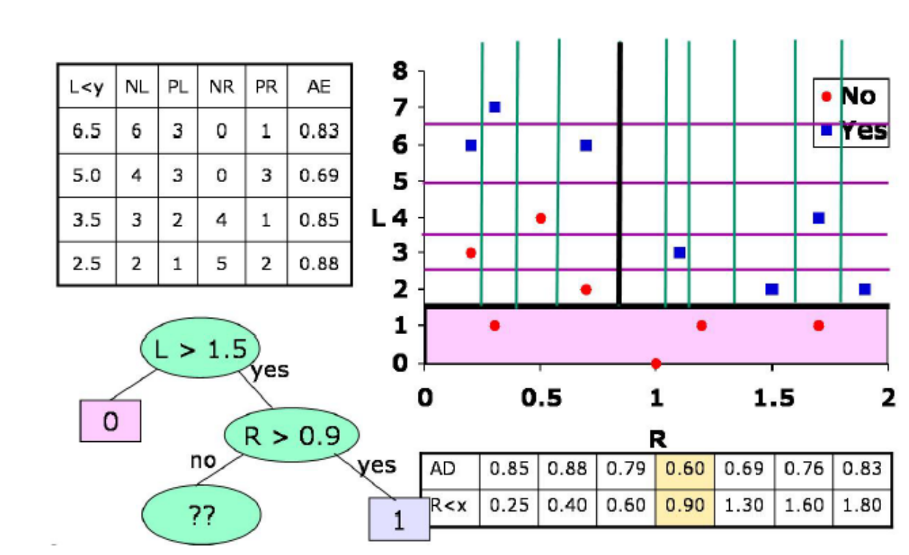

We continue on in this fashion until we can no longer split or everything has been classified.

## GINI
- so far, we have split based on entropy
- but you can also split based on GINI
- both have:
  - maximum when records are equally distributed among all classes, implying least purity
  - minimum attained at p equal to 0 or 1. ie. when all records belong to one class, implying most purity

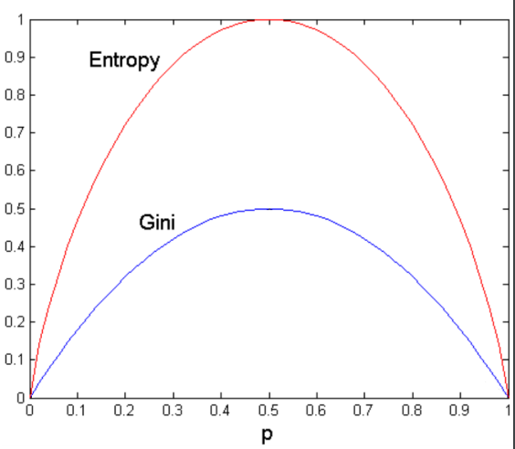

# Regression Trees
- like decision trees, but with real-valued constant outputs at the leaves

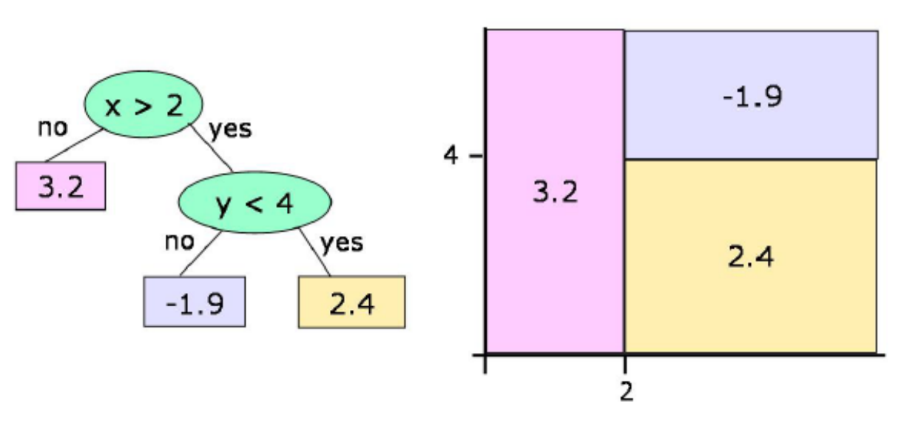

## Leaf values
- assume that multiple training points are in the leaf and we have decided, for whatever reason, to stop splitting
  - in the boolean case, we use the majority output value as the value for the leaf
  - in the numeric case, we'll use the average output value
- if we're going to use the average value at a leaf as is output, we'd like to split up the data so that the leaf averages are not too far away from the actual items in the leaf
- statistics has a good measure of how spread out a set of numbers is
  - and, therefore, how different the individuals are from the average
  - it's the variance of a set
  - thus, we will use variance instead of entropy

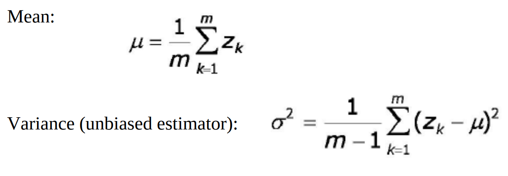

The idea is the following:
- choose a value to split by
- the value will become the root
- split the training instances according to whether they are greater than or less than the value
- calculate the variance for both of the groups (the greater than group and the less than group)
- take the weighted average of those to variances
- repeat for all possible groupings
- choose the split value which results in the lowest average variance

When to stop?
- stop when the variance at the leaf is small enough or when few instances are at the leaf
- then set the value at the leaf to be the mean of the y values of the elements

