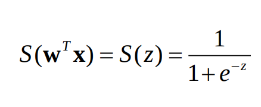
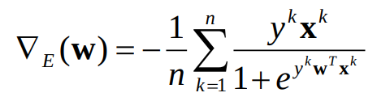
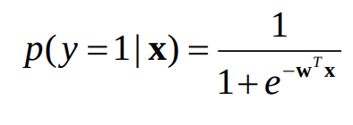
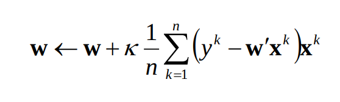
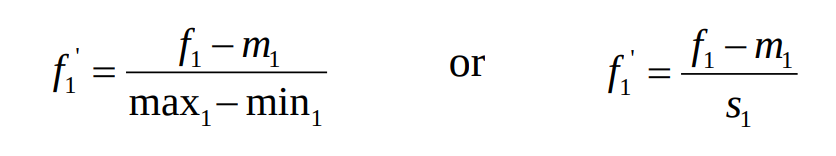

# Perceptron

## Linear hypothesis class
- line equation (assume 2D first):
  - w2x2 + w1x1 + b = 0
- fact 1: all points (x1, x2) lying on the line make the equation true
- fact 2: the line separates the plane in two half-plane
- fact 3: the points (x1, x2) in one half-plane give us an inequality with respect to 0, which has the same direction for each of the points in the half-plane
- fact 4: the points (x1, x2) in the other half-plane give us the reverse inequlity with respect to 0

## Linear classifier

h(x, w, b) = sign(w@x + b)

This outputs either +1 or -1, depending on whether x is above or below the line w.

We make some small changes though.
- first, we add a dummy 1 as the first value in x
- second, we let w0 = b.
- thus h(x,w) = sign(w@x) = sign(w.T @ x)

### Learning algorithm
- start with a random w
- for each misclassified training tuple (ie. sign(wx) != y), update w
  - w = w + kappa * y * x

# Gradient and optimization

- the gradient is a vector of partial derivatives
- our new method:
  - start at some w0; take a step down the steepest slope
  - w <- w - kv
    - v is a vector in the direction of the steepest slope
    - steepest slope at a point is the gradient vector at that point
  - our step size will be kappa

### Algorithm
- initialize w=0
- for each iteration
  - computer the gradient
  - update the weights
  - iterate with the next step until w doesn't change too much
- return the final w

# Logistic regression
- a similar idea to perceptron, but using the sisgmoid function applied to linearity



## Probability interpretation
- w defined a line
  - to classify a point x, we plug x into the function of the line (ie. compute w.T @ x)
- if x is on the line, w.T @ x = 0, and we are not confident at all about the class of the point
  - probability is 0.5 for each class
- if x is ffar from the line on a half-plane, we are much more confident it belongs to the class of that half-plane
  - ie. w.T @ x will be far from 0, either positive or negative
  - if big positive, probability will be close to 1
  - if big negative, probability will be close to 0

In this case, the gradient:



### Making predictions



# Linear regression
- suppose we'd like to predict salary based on number of years of experience
- this is a different prediction problem since the class is a continuous attribute
  - called "regression"
- thus, linear regression: build a prediction line
- goal: fine a line (hypothesis) h(w,x) that gives numbers close to each training tuple's y's.
  - ie. for each training tuple, the line gives that tuple's y value (or something close to it)
- in other words, we want to minimize the error over possible w's.



```python
X = np.array([[1,...],[1,...]])  #n by m+1
y = np.array([[...]]) # 1 by n
w = np.array([[...]]) # 1 by m+1
kappa = 0.1

E = (1/(2*n))*(np.sum((y-w@X.T)**2))

w = w + kappa * ((1/n)*(np.sum((y-w@X.T).T*X, axis=0, keepdims=True)))
```

## Attribute scaling
- in order for the gradient descent to converge quickly, scale the attributes



