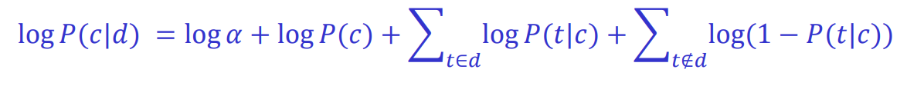
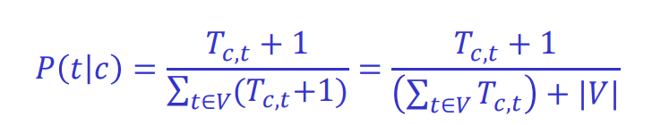

# Naive Bayes classifier

## Conditional probability
Example: P(sunny | windy) = 0.8
- interpreted as the probability that it is sunny given it is windy
- also the same as P(if Windy=windy then Weather=sunny)

The definition of conditional probability:
  - P(a|b) = P(a^b)/P(b), if P(b) > 0
  - which also derives: P(a|b) = P(b|a)P(a)/P(b)

Multivariable Bayes:
- P(c|e1,e2,...,en) = a\*P(e1|c)...P(en|c)P(c)
- assumption: attributes are conditionally independent (given the class value)
- althrough based on assumption that is almost never correct, this scheme works well in practice!

## Naive Bayes for classification
- classification learning: what's the probability of the class given an instance?
- instance (evidence): E1=e1, E2=e2, ... , En=en
- class: C = {c, ...}
- Naive Bayes assumption: evidence can be split into independent parts (ie. attributes of an instance)

```
P(c|E) = P(c|e1, e2, ..., en)
       = P(e1|c) P(e2|c) ... P(en|c) P(c) / P(e1,e2,...,en)
```

**Example** Say you have the following instance.

Outlook | Temp | Humidity | Windy | Play
| --- | --- | --- | --- | --- |
Sunny | Cool | High | True | ? |

We can calculate the probability that Play = yes for this instance given the other known attributes like so:

```
P(Play=yes|E) = 
  P(Outlook=Sunny | play=yes) *
  P(Temp=Cool | play=yes) *
  P(Humidity=High | play=yes) *
  P(Windy=True | play=yes) *
  P(play=yes) / P(E)

= ( # of instances where outlook=sunny and play=yes /
    # of instances where play=yes ) ...
  * ( number of instances where play = yes /
      total number of instances )

= 0.0053 / P(E) 
```

Don't worry about 1/P(E); this is alpha, the normalization constant.

Next, we calculate the probability that Play = no for this instance given the other known attributes. Then, we are able to solve for P(E) using the relationship that:

```
P(play=yes | E) + P(play=no | E) = 1
```

## The zero-frequency problem
- what if an attribute value doesn't occur with every class value?
  - example: maybe there are no instances where play=yes and humidity=high. then, we when try to calculate P(Humidity=high|play=yes), it will be zero!
  - this means that P(Play=yes | E) will also be zero, no matter how likely the other values are
- solution:
  - add 1 to the count for every attribute value-class combination (Laplace estimator)
  - add k (number of possible attribute values) to the denominator


## Missing values
- **Training:** instance is not included in the frequency count for attribute value-class combination
- **Classification:** attribute will be omitted from calculation
- simply put: just don't put the missing attribute in your calculation!

Example:
- if we didn't know the outlook of a certain instance that we wanted to classify, we would compute:
  - P(play=yes | E) = 
    - P(Temp=cool | play=yes) *
    - P(Humidity=high | play=yes) *
    - P(Windy=true | play=yes) *
    - P(play=yes)
    - 1/P(E)

## Dealing with numeric attributes
- usual assumption: attributes have a normal or Gaussian probability distribution (given the class)

probability density function for the normal distribution is:


We approximate mu (u) by the sample mean:


We approximate s^2 by the sample variance:


## Discussion of Naive Bayes
- naive bayes works surpringly well, even if independence assumption is clearly violated
- this is because classification doesn't require accurate probability estimates as long as maximum probability is assigned to the correct class

# Naive Bayes for text classification

## Text classification
- the task of assigning a given document to one of a fixed set of classes, on the basis of the text it contains
- naive bayes models are often used for this task
  - query variable is the document category, and the evidence variables are the presence or absence of each word in the language
- how can such a model be constructed, given as training data a set of documents that have been assigned to categories?

## Bernoulli model
- for each class c, P(c) is estimated as the fraction of all the training documents that are of the class c.
  - ie. # training documents of class c / total # of training documents
- P(t|c) is estimated as the fraction of documents of class c hat contain term t
  - ie. P(t|c) = # documents where class = c and contains term t / total # of documents where class = c
- now we can use Naive Bayes for classifying a new document


- to avoid number overflow, we operate on the logs of probabilities



- and to avoid the zero frequency problem, we do:


### Bernoulli model problem
- when classifying a test document, the Bernoulli model uses binary occurrence information, ignoring the number of occurrences
- as a result, the Bernoulli model typically makes many mistakes when classifying long documents

## Multinomial model
- priors are calculated the same as the Bernoulli model
  - ie. P(c) = # documents of class C / total # of documents
- P(t|c) is estimated as:


where
- V is the voabulary
- T_c,t is the number of occurences of t in the training documents of class c (including multiple occurrences!)

Now we can use Naive Bayes for classifying a new document d:


And again, to avoid number overflow, we operate on the logs of probabilities


And to avoid the zero frequency problem, we do:



## Feature selection
- feature selection is the process of selecting a subset of the terms occurring in the training set and using only this subset as features in text classification
- there are two main purposes to this:
  - first, it makes training and applying a classifier more efficient by decreasing the size of the effective vocabulary
  - second, feature selection often increases classification accuracy by eliminating noise features

A noise feature is one that, when added to the document represenation, increases the classification error on new data.

Ex. Suppose a rare term, say arachnocentric, has no information about a class, say China, but all instances (say two) of arachnocentric happen to occur in China documents in our training set. THen the learning method might produce a classifier that misassigns test documents containing arachnocentric to China. Such an incorrect generalization from an accidental propertz of the training set is called 'overfitting'.

